# JioNews DE-DS — Master AS-IS Architecture

> **Document Type:** Canonical AS-IS Architecture — Master Overview
> **Scope:** All data engineering ingestion pipelines and data science workflows
> **GCP Project ID:** `jiox-328108` | **Project Number:** `266686822828`
> **Status:** Production — reflects current deployed state
> **Detailed Docs:** See `pipelines/<name>/` for per-pipeline specifications

---

## 1. System Overview

### 1.1 Platform Summary

JioNews DE-DS is a production data engineering platform running on GCP that ingests, processes, transforms, and distributes multi-format news content. It processes 7 content types through 11 independent pipelines.

### 1.2 Content Types & Pipelines

| # | Pipeline | Content Type | Sources | Deployment | Docs |
|---|---|---|---|---|---|
| 1 | Headlines Ingestion | News headlines | RSS/JSON feeds | 5 Cloud Functions | `pipelines/headlines-ingestion/` |
| 2 | Summaries Ingestion | Article summaries | RSS/JSON feeds + LLM | 5 CF + 1 Cloud Run | `pipelines/summaries-ingestion/` |
| 3 | YouTube Videos | Full-length videos | YT scraping + API | 3 Cloud Functions | `pipelines/youtube-videos-ingestion/` |
| 4 | Native Videos | Full-length videos | Partner API, Manual, MRSS | 7 CF + 2 REST services | `pipelines/native-videos-ingestion/` |
| 5 | Video Transcoder | HLS transcoding | SFTP + CPP/SAAS API | 3 Cloud Functions | `pipelines/video-transcoder-workflow/` |
| 6 | YouTube Shorts | Short-form videos | YT scraping + API | 2 Cloud Functions | `pipelines/youtube-shorts-ingestion/` |
| 7 | Native Shorts | Short-form videos | Partner API, Manual, MRSS | 3 CF + shared services | `pipelines/native-shorts-ingestion/` |
| 8 | Webstories | Web stories | Publisher APIs + RSS | 2 Cloud Functions | `pipelines/webstories-ingestion/` |
| 9 | JioBharat Summaries | Video summaries | PROD MongoDB + TTS + SFTP | 2 CF + 1 FastAPI | `pipelines/jiobharat-video-summaries/` |
| 10 | Auto Summarization | CMS summaries | HTTP API + Gemini LLM | 1 FastAPI service | `pipelines/auto-summarization/` |
| 11 | RSS Feed Generation | RSS XML feeds | MongoDB aggregation + GCS | 4 Cloud Functions | `pipelines/rss-feed-generation/` |

### 1.3 GCP Services Consumed

| GCP Service | Usage |
|---|---|
| Cloud Functions (Gen 1 + Gen 2) | Primary compute for pipeline stages |
| Cloud Run | Long-running REST/API services, persistent Pub/Sub subscribers |
| Cloud Pub/Sub | Inter-stage messaging, event-driven triggers (23 topics) |
| Cloud Storage (GCS) | Config storage, image CDN, video storage, RSS feeds (5 buckets) |
| Secret Manager | MongoDB URIs, API keys, service accounts, SFTP credentials (5 secrets) |
| Cloud Scheduler | Cron triggers for pipeline initiation |
| Compute Engine | Redis instance hosting |

---

## 2. Complete System Data Flow

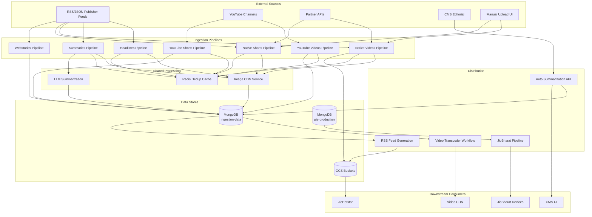

---

## 3. Pipeline Architectures (Mermaid)

### 3.1 Headlines Ingestion

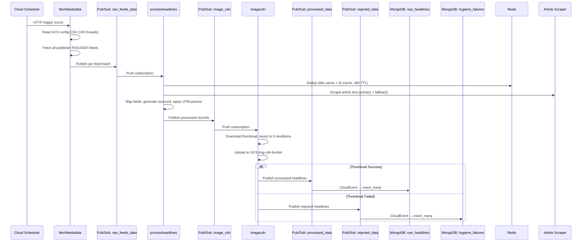

### 3.2 Summaries Ingestion

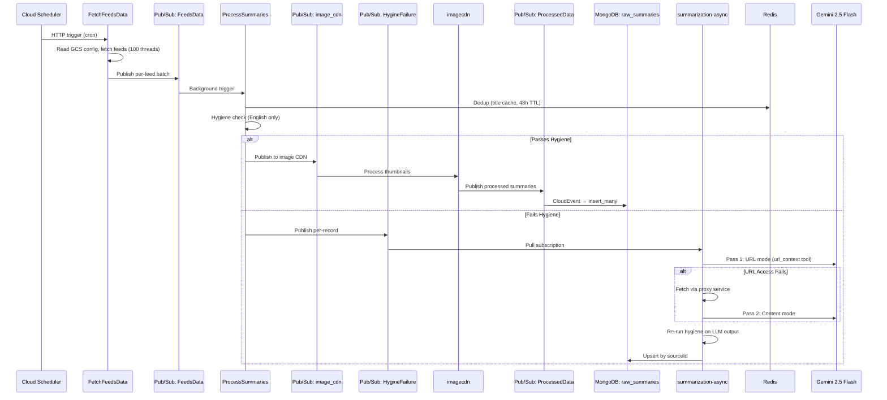

### 3.3 YouTube Videos Ingestion

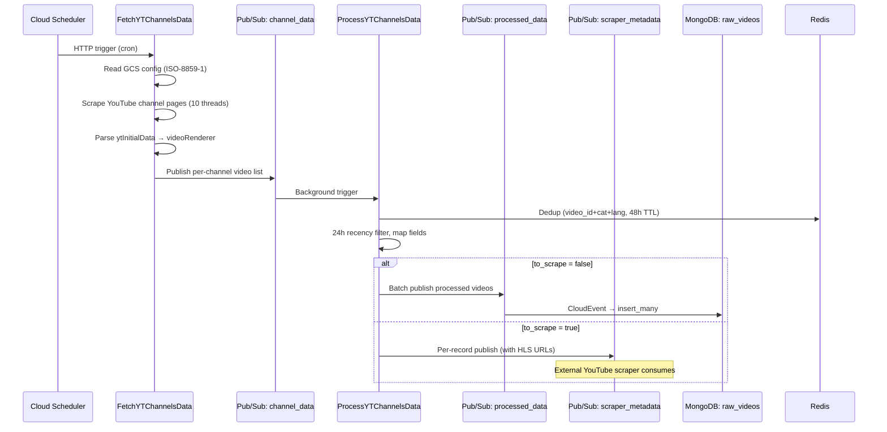

### 3.4 Native Videos Ingestion

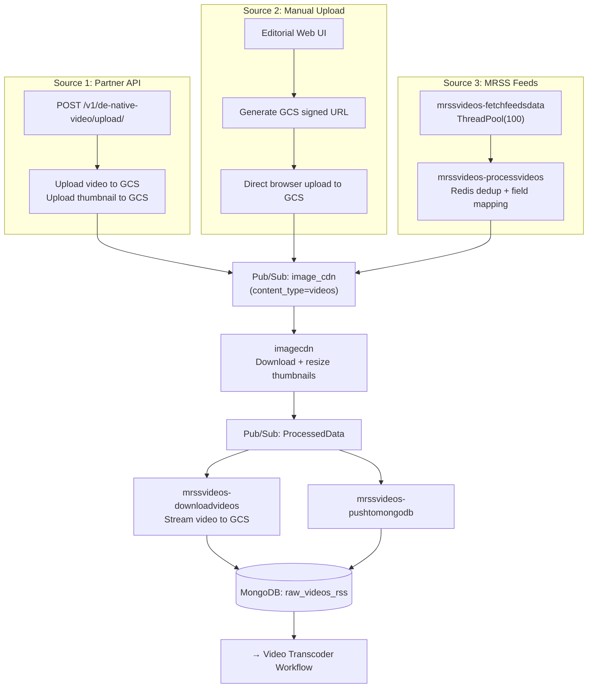

### 3.5 Video Transcoder Workflow

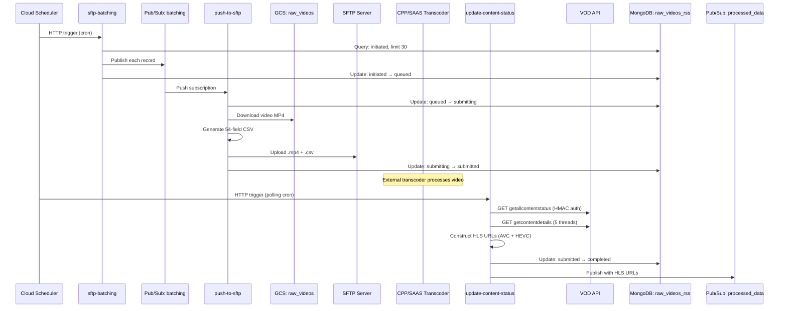

### 3.6 YouTube Shorts Ingestion

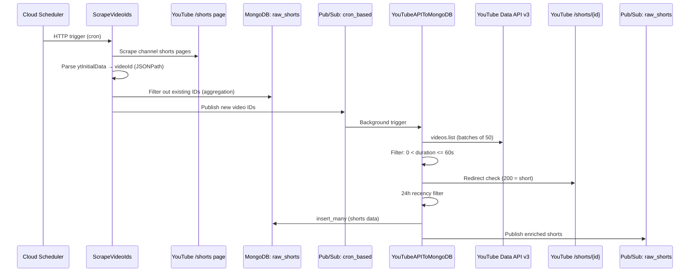

### 3.7 Native Shorts Ingestion

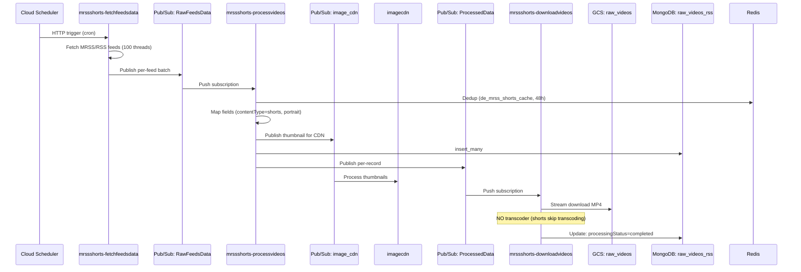

### 3.8 Webstories Ingestion

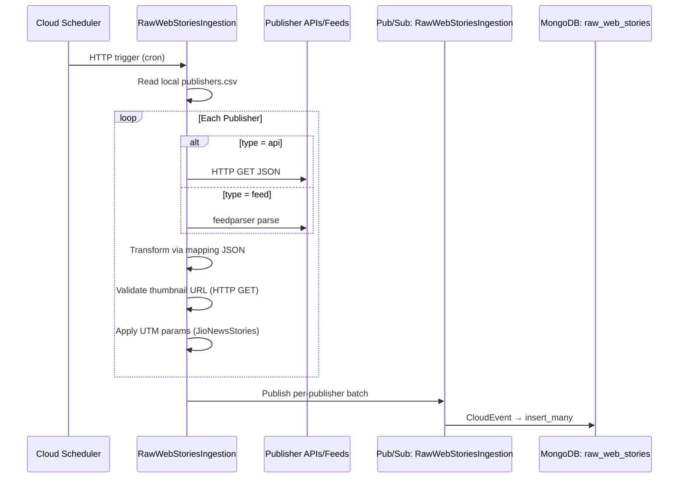

### 3.9 JioBharat Video Summaries

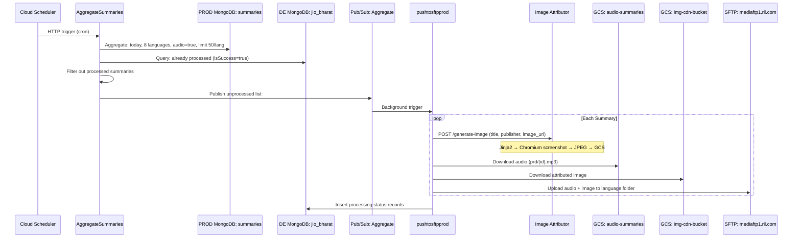

### 3.10 Auto Summarization

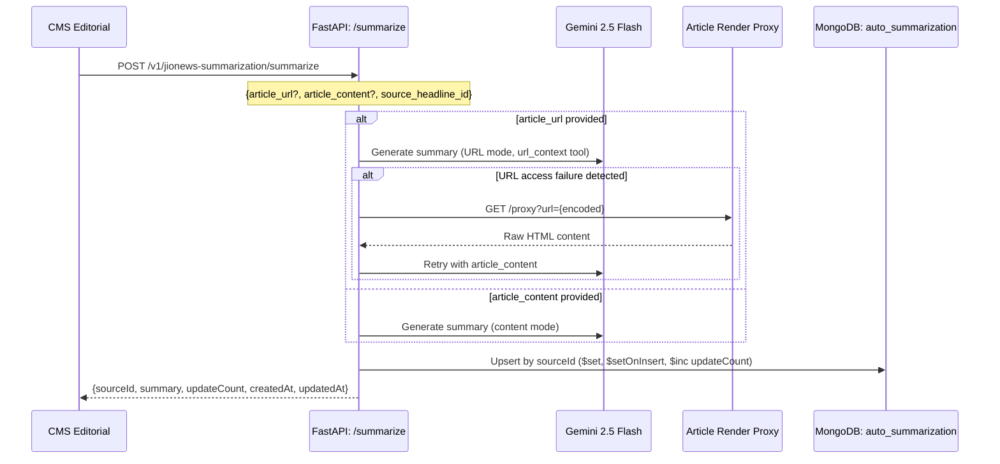

### 3.11 RSS Feed Generation

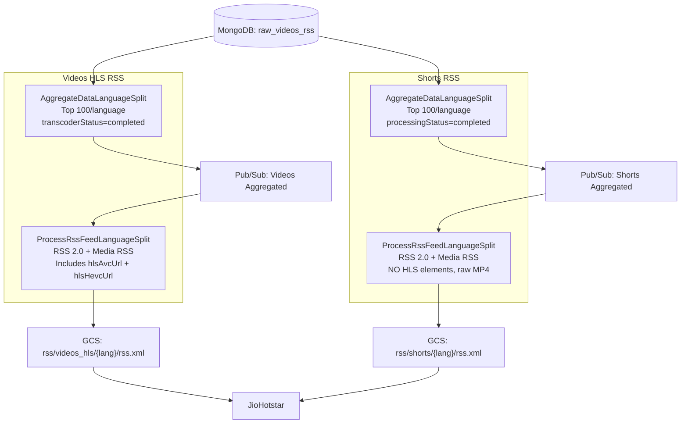

---

## 4. Shared Infrastructure Overview

### 4.1 Image CDN (Shared Function)

Central image processing hub consuming from `NewRawHeadlinesIngestion_image_cdn` topic. Routes by `content_type` field. Resizes to 5 renditions, uploads to `img-cdn-bucket`. CDN domain: `icdn.jionews.com`.

**Details:** `shared/image-cdn/`

### 4.2 LLM Integration

Two Gemini 2.5 Flash-powered services: async (Pub/Sub subscriber for hygiene failures) and sync (FastAPI for CMS shortlisting). Both use two-pass strategy with proxy fallback.

**Details:** `shared/llm-integration/`

### 4.3 Redis Deduplication

6 sorted sets across 4 pipelines, all 48h TTL, ZADD/ZSCORE pattern with time-based expiration scores.

**Details:** `shared/redis-caching/`

---

## 5. Infrastructure Registries (Quick Reference)

### 5.1 MongoDB Collections

| Collection | Pipeline | DB | Details |
|---|---|---|---|
| `raw_headlines_ingestion_data` | Headlines | ingestion-data | `shared/infrastructure/MONGODB-REGISTRY.md` |
| `headlines_hygiene_failures` | Headlines (rejected) | ingestion-data | |
| `raw_summaries_insgestion_data` | Summaries | ingestion-data | **Note: typo in prod** |
| `raw_videos_ingestion_data` | YouTube Videos | ingestion-data | |
| `raw_videos_rss` | Native Videos + Shorts | ingestion-data | Shared, differentiated by contentType |
| `raw_short_videos_ingestion_data` | YouTube Shorts | ingestion-data | |
| `raw_web_stories_ingestion_data` | Webstories | ingestion-data | |
| `jio_bharat_summaries` | JioBharat | ingestion-data | |
| `auto_summarization` | Auto Summarization | ingestion-data | |
| `summaries` | JioBharat (read-only) | pie-production | Cross-cluster |

**Full details:** `shared/infrastructure/MONGODB-REGISTRY.md`

### 5.2 Pub/Sub Topics (23 total)

**Full registry:** `shared/infrastructure/PUBSUB-REGISTRY.md`

### 5.3 GCS Buckets (5 total)

| Bucket | Purpose |
|---|---|
| `de-raw-ingestion` | Pipeline config CSVs |
| `img-cdn-bucket` | Image CDN (5 renditions + defaults) |
| `hls_video_transcoder_storage_output_files` | Raw videos + RSS feeds |
| `de_video_transcoder_input` | Transcoder input staging |
| `audio-summaries-bucket` | TTS audio for JioBharat |

**Full details:** `shared/infrastructure/GCS-REGISTRY.md`

### 5.4 Secrets (5 total)

| Secret | Purpose |
|---|---|
| `mongosh_de_uri` | MongoDB DE cluster URI |
| `GEMINI_API_KEY` | Google Gemini API key |
| `yt_api_access_token` | YouTube Data API v3 key |
| `compute_engine_service_account_private_key` | GCS/Pub/Sub service account |
| `de_trascoder_sftp` | SFTP credentials (JSON) |

**Full details:** `shared/infrastructure/SECRETS-REGISTRY.md`

### 5.5 External Dependencies

| Service | Type |
|---|---|
| Article Scraper (Primary + Fallback) | HTTP API |
| Article Render Proxy | Cloud Run service |
| CPP/SAAS Transcoder API | HTTP API (HMAC auth) |
| YouTube Data API v3 | Google API |
| Google Gemini API | LLM API |
| Redis (`34.93.131.211:6379`) | Cache |
| SFTP (Transcoder + JioBharat) | File transfer |
| CDN: `icdn.jionews.com`, `vcdn.jionews.com`, `videos.jionews.com` | Content delivery |

**Full details:** `shared/infrastructure/EXTERNAL-DEPENDENCIES.md`

---

## 6. Deployment Models

| Model | Services | Trigger |
|---|---|---|
| Cloud Functions Gen 1 | Processing stages | Pub/Sub background (`message, context`) |
| Cloud Functions Gen 2 | All PushToMongoDB | CloudEvent (`@functions_framework.cloud_event`) |
| Cloud Functions (HTTP) | Fetch stages, some processors | HTTP (Cloud Scheduler / Pub/Sub push) |
| Cloud Run (Flask) | JioNewsDENativeVideos, yt-manual-upload | REST API (port 8080) |
| Cloud Run (FastAPI) | Image Attributor, Auto Summarization | REST API |
| Cloud Run (Subscriber) | summarization-async | Pub/Sub pull subscriber |

---

## 7. Common Architectural Pattern

All ingestion pipelines follow this pattern with per-pipeline variations:

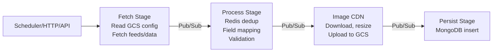

---

## 8. Known Gaps & Ambiguities

See `pipelines/*/AS-IS.md` for pipeline-specific gaps. Cross-cutting gaps:

| Gap | Description |
|---|---|
| No CI/CD configs | Deployment mechanism undocumented |
| No requirements.txt | Python dependency versions not pinned |
| No Cloud Scheduler configs | Cron frequencies unknown |
| No Pub/Sub subscription configs | Push/pull modes, ack deadlines undocumented |
| No Cloud Function deployment configs | Memory, timeout, instances undocumented |
| No structured logging | Only basic `print()` statements |
| Hardcoded credentials | Redis password, PROD MongoDB URI, transcoder API keys in source |
| Collection name typo | `raw_summaries_insgestion_data` in production |

---

*For detailed pipeline specifications, navigate to `pipelines/<pipeline-name>/`. For infrastructure registries, see `shared/infrastructure/`. For skill definitions, see `skills/`.*
