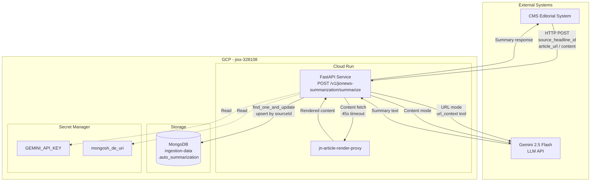
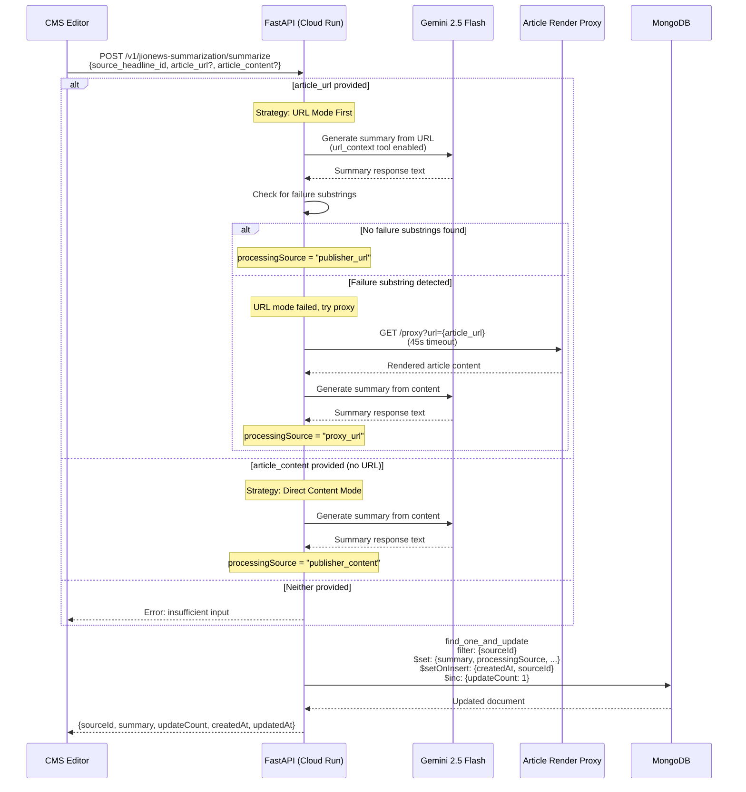
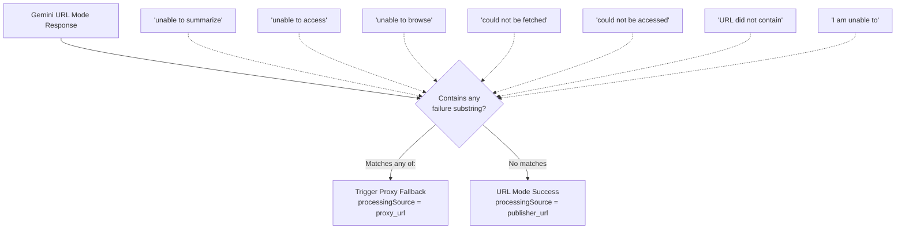
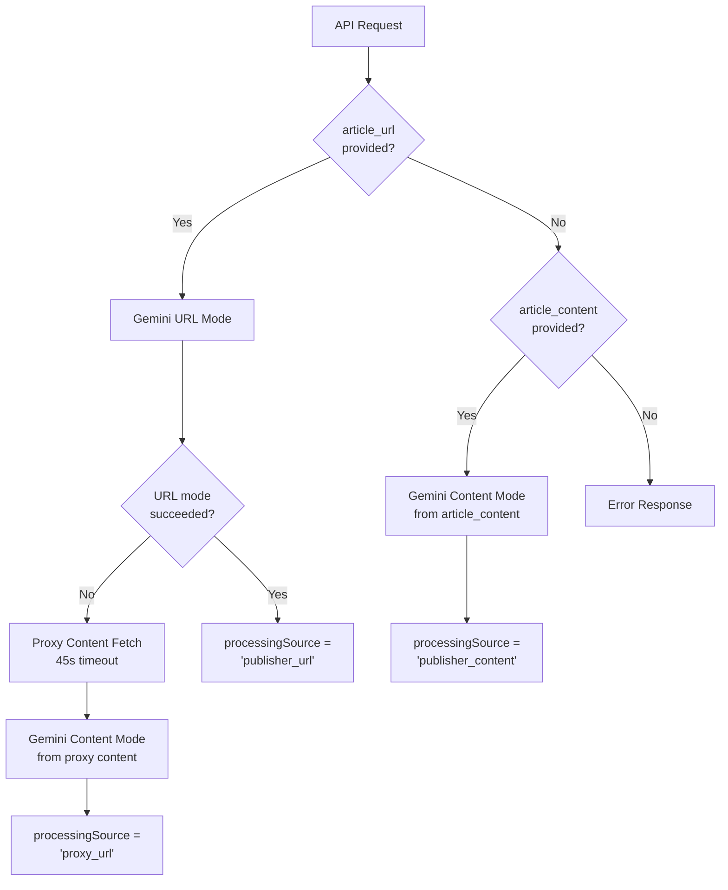
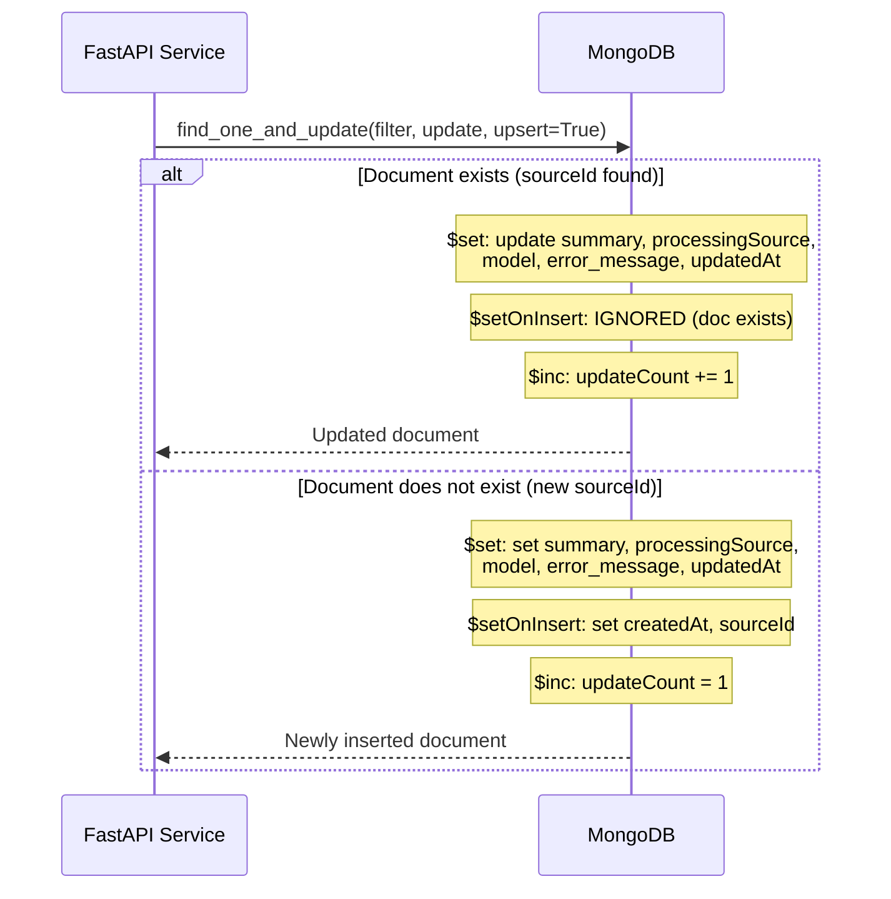
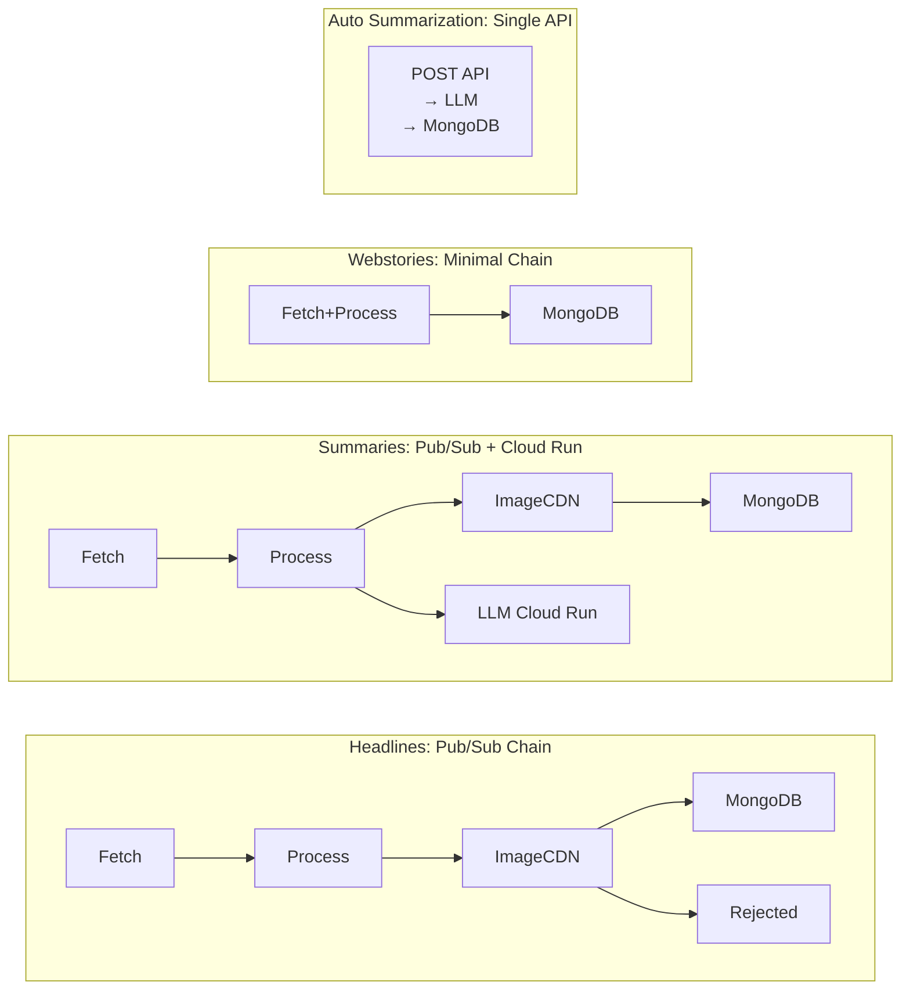

# Auto Summarization - Architecture

## Overview

The Auto Summarization pipeline is a single FastAPI service deployed on Cloud Run. Unlike the other ingestion pipelines (which are multi-function Pub/Sub chains), this is a synchronous request-response API triggered by the CMS editorial workflow. It uses Gemini 2.5 Flash for LLM-based summarization with a two-pass strategy (URL mode first, proxy content fallback).

## System Context Diagram

## Request Processing Sequence Diagram

## URL Failure Detection Flow

## Processing Source Decision Flow

## MongoDB Upsert Flow

## Infrastructure Summary

| Component              | GCP Service        | Configuration                        |
|------------------------|--------------------|--------------------------------------|
| FastAPI Service        | Cloud Run          | Single container, auto-scaling       |
| Article Render Proxy   | Cloud Run          | Internal service, 45s timeout        |
| Persistence            | MongoDB Atlas      | `ingestion-data.auto_summarization`  |
| LLM                    | Gemini API         | gemini-2.5-flash, temp 0             |
| Secrets                | Secret Manager     | GEMINI_API_KEY, mongosh_de_uri       |

## Comparison: Pipeline Architecture Patterns

## Network and Security

| Connection                | Protocol | Authentication                |
|---------------------------|----------|-------------------------------|
| CMS -> Cloud Run          | HTTPS    | Service auth (IAM / token)    |
| Cloud Run -> Gemini       | HTTPS    | API Key (Secret Manager)      |
| Cloud Run -> Proxy        | HTTPS    | IAM (Cloud Run to Cloud Run)  |
| Cloud Run -> MongoDB      | TLS      | URI with credentials (Secret) |
