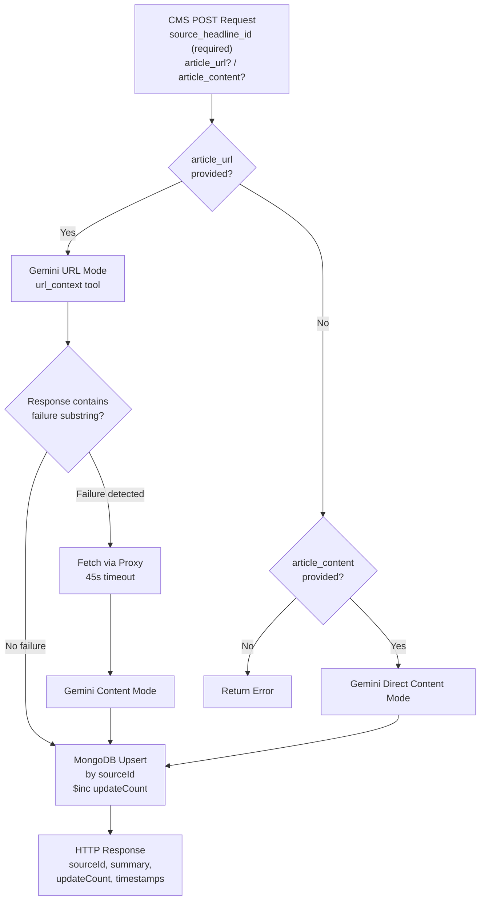

# Auto Summarization - Data Specification

## Overview

This document defines all data schemas, field definitions, and transformation rules for the Auto Summarization pipeline, including the HTTP API request/response formats and the MongoDB upsert document structure.

## API Request Schema

**Endpoint**: `POST /v1/jionews-summarization/summarize`

### Request Body

```json
{
  "article_content": "string (optional)",
  "article_url": "string (optional)",
  "source_headline_id": "string (required)",
  "prompt": "string (optional)",
  "model": "string (optional)"
}
```

### Field Details

| Field                 | Type   | Required | Default           | Description                                          |
|-----------------------|--------|----------|-------------------|------------------------------------------------------|
| `source_headline_id`  | string | Yes      | N/A               | Unique identifier from the source headline record    |
| `article_url`         | string | No       | null              | Publisher article URL for URL-based summarization    |
| `article_content`     | string | No       | null              | Pre-fetched article content for direct summarization |
| `prompt`              | string | No       | System default     | Custom summarization prompt (overrides system instruction) |
| `model`               | string | No       | `gemini-2.5-flash` | LLM model to use for summarization                   |

### Input Priority Logic

The service determines the summarization strategy based on which optional fields are provided:

| `article_url` | `article_content` | Strategy                                         |
|----------------|--------------------|--------------------------------------------------|
| Provided       | Any                | URL mode first, proxy fallback on failure        |
| Not provided   | Provided           | Direct content summarization                     |
| Not provided   | Not provided       | Error: insufficient input                        |

## API Response Schema

### Success Response

```json
{
  "sourceId": "string (source_headline_id from request)",
  "summary": "string (350-360 characters)",
  "updateCount": "integer (number of times this sourceId has been summarized)",
  "createdAt": "integer (Unix epoch, first creation time)",
  "updatedAt": "integer (Unix epoch, last update time)"
}
```

### Field Details

| Field         | Type   | Description                                                |
|---------------|--------|------------------------------------------------------------|
| `sourceId`    | string | Echoes `source_headline_id` from the request               |
| `summary`     | string | Generated summary text (target: 350-360 characters)        |
| `updateCount` | int    | Cumulative count of summarization attempts for this ID     |
| `createdAt`   | int    | Epoch timestamp of first summarization for this sourceId   |
| `updatedAt`   | int    | Epoch timestamp of this summarization attempt              |

## LLM Configuration

| Parameter            | Value                                                                  |
|----------------------|------------------------------------------------------------------------|
| Model                | `gemini-2.5-flash` (default, overridable via request)                  |
| Temperature          | `0`                                                                    |
| Tools                | `[{"url_context": {}}]`                                               |
| System Instruction   | News editor/writer role, output ONLY 350-360 character summary        |

## URL Failure Detection Substrings

When the LLM response from URL mode contains any of these substrings (case-insensitive), the system falls through to proxy-based content fetching:

| # | Substring                    |
|---|------------------------------|
| 1 | `"unable to summarize"`      |
| 2 | `"unable to access"`         |
| 3 | `"unable to browse"`         |
| 4 | `"could not be fetched"`     |
| 5 | `"could not be accessed"`    |
| 6 | `"URL did not contain"`      |
| 7 | `"I am unable to"`           |

## Processing Source Values

The `processingSource` field in the MongoDB record indicates the data path used:

| Value                | Trigger Condition                                            |
|----------------------|--------------------------------------------------------------|
| `"publisher_url"`    | Gemini successfully summarized via URL mode (url_context)    |
| `"publisher_content"`| Summarized from `article_content` provided in the request    |
| `"proxy_url"`        | URL mode failed; content fetched via proxy then summarized   |

## MongoDB Upsert Document

### Filter

```json
{
  "sourceId": "<source_headline_id from request>"
}
```

### Update Operations

```json
{
  "$set": {
    "articleContent": "string (article_content from request, if provided)",
    "articleUrl": "string (article_url from request, if provided)",
    "summary": "string (LLM-generated summary)",
    "processingSource": "string (publisher_url | publisher_content | proxy_url)",
    "model": "string (LLM model used)",
    "error_message": "string or null (error description if any step failed)",
    "updatedAt": "integer (current epoch)"
  },
  "$setOnInsert": {
    "createdAt": "integer (current epoch)",
    "sourceId": "string (source_headline_id)"
  },
  "$inc": {
    "updateCount": 1
  }
}
```

### Upsert Behavior

| Scenario             | `$set` Fields         | `$setOnInsert` Fields | `$inc`          |
|----------------------|-----------------------|-----------------------|-----------------|
| New record (insert)  | Applied               | Applied               | `updateCount: 1`|
| Existing record (update) | Applied           | Ignored               | `updateCount: +1`|

This ensures:
- `createdAt` is set only on first insert and never overwritten.
- `updatedAt` reflects the most recent summarization attempt.
- `updateCount` tracks total summarization attempts for this sourceId.

## Proxy Service

| Attribute    | Value                                                             |
|--------------|-------------------------------------------------------------------|
| URL          | `https://jn-article-render-proxy-266686822828.asia-south1.run.app/proxy` |
| Method       | GET                                                               |
| Parameter    | `url` (article URL)                                               |
| Timeout      | 45 seconds                                                        |
| Output       | Rendered article text content                                     |

## Data Flow Summary


