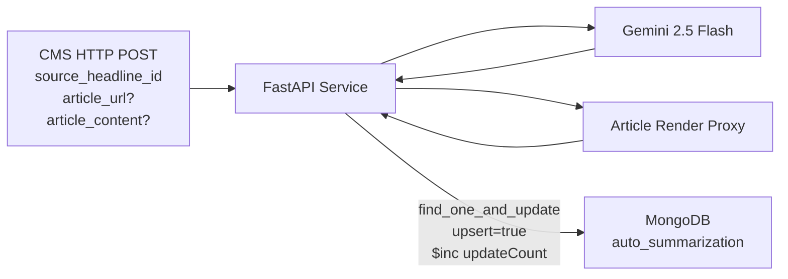

# Auto Summarization - Database Schema

## Overview

The Auto Summarization pipeline uses a single MongoDB collection as its sole persistence layer. There is no Redis cache (no deduplication needed for on-demand requests) and no GCS storage (no image processing).

---

## MongoDB

### Connection

| Attribute       | Value                                    |
|-----------------|------------------------------------------|
| Secret Name     | `mongosh_de_uri`                         |
| Database        | `ingestion-data`                         |
| Auth Method     | URI-embedded credentials                 |
| Protocol        | `mongodb+srv://` (TLS)                   |

### Collection: `auto_summarization`

**Purpose**: Stores LLM-generated summaries triggered by CMS editorial shortlist actions. Each document corresponds to a single source article identified by `sourceId`.

**Write Pattern**: Upsert via `find_one_and_update` with `upsert=True`. The same `sourceId` may be updated multiple times as editors re-trigger summarization. The `updateCount` field tracks the total number of summarization attempts.

**Written By**: FastAPI Cloud Run service.

#### Document Schema

```json
{
  "_id": "ObjectId (auto-generated by MongoDB)",
  "sourceId": "string",
  "articleContent": "string or null",
  "articleUrl": "string or null",
  "summary": "string",
  "processingSource": "string",
  "model": "string",
  "error_message": "string or null",
  "updateCount": "integer",
  "createdAt": "integer (epoch)",
  "updatedAt": "integer (epoch)"
}
```

#### Field Details

| Field              | Type     | Indexed  | Write Op         | Description                                         |
|--------------------|----------|----------|------------------|-----------------------------------------------------|
| `_id`              | ObjectId | Yes (PK) | Auto             | MongoDB auto-generated primary key                  |
| `sourceId`         | string   | Yes      | `$setOnInsert`   | Unique article ID (from `source_headline_id` in request). Set only on first insert. |
| `articleContent`   | string   | No       | `$set`           | Article content from request (if provided)          |
| `articleUrl`       | string   | No       | `$set`           | Article URL from request (if provided)              |
| `summary`          | string   | No       | `$set`           | LLM-generated summary (350-360 character target)    |
| `processingSource` | string   | No       | `$set`           | How summary was generated (see values below)        |
| `model`            | string   | No       | `$set`           | LLM model used (default: `gemini-2.5-flash`)        |
| `error_message`    | string   | No       | `$set`           | Error description if summarization failed; null on success |
| `updateCount`      | int      | No       | `$inc`           | Cumulative count of summarization attempts           |
| `createdAt`        | int      | No       | `$setOnInsert`   | Epoch timestamp of first document creation          |
| `updatedAt`        | int      | No       | `$set`           | Epoch timestamp of most recent update               |

#### processingSource Values

| Value                | Description                                              |
|----------------------|----------------------------------------------------------|
| `"publisher_url"`    | Gemini summarized directly from the article URL          |
| `"publisher_content"`| Gemini summarized from `article_content` in the request  |
| `"proxy_url"`        | URL mode failed; content fetched via proxy then summarized |

#### MongoDB Write Operation

```javascript
db.auto_summarization.findOneAndUpdate(
  // Filter
  { "sourceId": "<source_headline_id>" },

  // Update
  {
    "$set": {
      "articleContent": "<article_content or null>",
      "articleUrl": "<article_url or null>",
      "summary": "<LLM-generated summary>",
      "processingSource": "<publisher_url | publisher_content | proxy_url>",
      "model": "<gemini-2.5-flash>",
      "error_message": "<error string or null>",
      "updatedAt": "<current epoch>"
    },
    "$setOnInsert": {
      "createdAt": "<current epoch>",
      "sourceId": "<source_headline_id>"
    },
    "$inc": {
      "updateCount": 1
    }
  },

  // Options
  { "upsert": true, "returnDocument": "after" }
)
```

#### Upsert Behavior Matrix

| Scenario          | `$set` Fields     | `$setOnInsert`    | `$inc`           | `updateCount` Result |
|-------------------|-------------------|-------------------|------------------|----------------------|
| First call (insert)| All fields updated | `createdAt`, `sourceId` set | +1         | 1                    |
| Second call (update)| All fields updated | Ignored          | +1               | 2                    |
| Nth call (update) | All fields updated | Ignored           | +1               | N                    |

#### Update Lifecycle Example

```
Call 1: sourceId="abc123" → INSERT
  createdAt: 1710000000, updatedAt: 1710000000, updateCount: 1

Call 2: sourceId="abc123" → UPDATE
  createdAt: 1710000000 (unchanged), updatedAt: 1710003600, updateCount: 2

Call 3: sourceId="abc123" → UPDATE
  createdAt: 1710000000 (unchanged), updatedAt: 1710007200, updateCount: 3
```

---

## No Redis Cache

This pipeline does not use Redis. Deduplication is not required because:
- Requests are triggered by explicit CMS editorial actions (not bulk feed processing).
- Re-summarization of the same article is expected and tracked via `updateCount`.
- The MongoDB upsert pattern is inherently idempotent.

## No GCS Storage

This pipeline does not use Google Cloud Storage. There is no image processing or file storage requirement.

---

## Collection Comparison Across Pipelines

| Aspect              | `raw_headlines_ingestion_data` | `raw_summaries_insgestion_data` | `raw_web_stories_ingestion_data` | `auto_summarization` |
|---------------------|-------------------------------|----------------------------------|----------------------------------|----------------------|
| Write operation     | insert_one                    | insert_one + upsert             | insert_one                       | upsert only          |
| Upsert key          | N/A                           | sourceId                         | N/A                              | sourceId             |
| Update tracking     | No                            | No                               | No                               | Yes (updateCount)    |
| Error tracking      | No                            | No                               | No                               | Yes (error_message)  |
| Processing source   | No                            | No                               | No                               | Yes                  |
| Image CDN URLs      | Yes (5 renditions)            | Yes (5 renditions)               | No                               | No                   |
| Article body        | Yes                           | No                               | No                               | Optional (input)     |
| Collection name typo| No                            | Yes (insgestion)                 | No                               | No                   |

---

## Data Flow Summary


