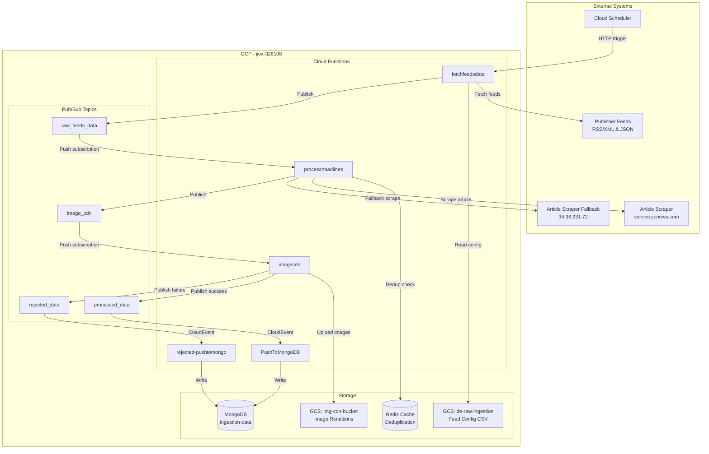
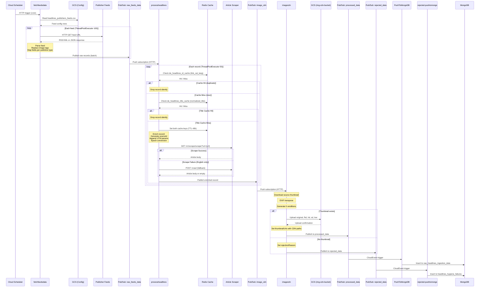
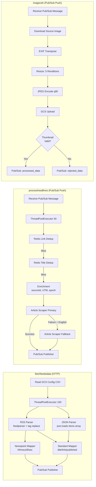
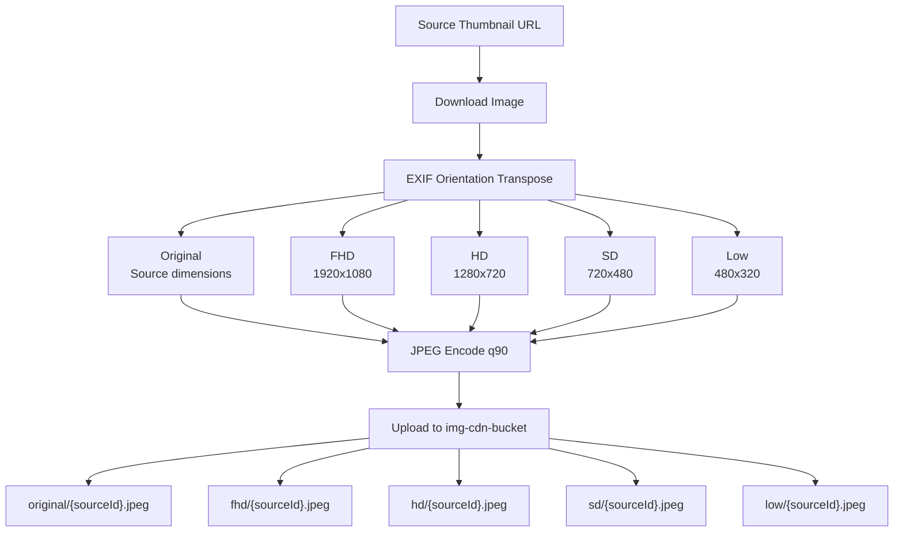
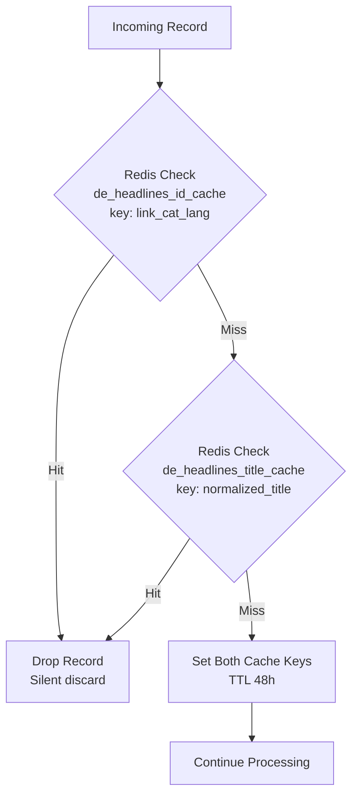

# Headlines Ingestion - Architecture

## Overview

The Headlines Ingestion pipeline is a 5-function serverless architecture on Google Cloud Platform. It follows a linear Pub/Sub-chained execution model with a terminal branch that separates successful records from rejected records into distinct MongoDB collections.

## System Context Diagram

## Pipeline Sequence Diagram

## Component Architecture

## Image CDN Rendition Flow

## Deduplication Flow

## Infrastructure Summary

| Component           | GCP Service        | Configuration                      |
|---------------------|--------------------|------------------------------------|
| `fetchfeedsdata`    | Cloud Functions    | HTTP trigger, Gen 2                |
| `processheadlines`  | Cloud Functions    | Pub/Sub push (HTTP), Gen 2        |
| `imagecdn`          | Cloud Functions    | Pub/Sub push (HTTP), Gen 2        |
| `PushToMongoDB`     | Cloud Functions    | CloudEvent trigger, Gen 2         |
| `rejected-pushtomongo` | Cloud Functions | CloudEvent trigger, Gen 2         |
| Feed Config         | Cloud Storage      | `de-raw-ingestion` bucket         |
| Image CDN           | Cloud Storage      | `img-cdn-bucket` bucket           |
| Dedup Cache         | Redis              | Two cache instances, 48h TTL      |
| Persistence         | MongoDB Atlas      | `ingestion-data` database         |
| Messaging           | Pub/Sub            | 4 topics, push + CloudEvent subs  |
| Scheduling          | Cloud Scheduler    | Cron-based HTTP trigger           |

## Network and Security

| Connection                | Protocol | Authentication                |
|---------------------------|----------|-------------------------------|
| Cloud Scheduler -> CF     | HTTPS    | IAM service account           |
| CF -> Publisher Feeds     | HTTP/S   | None (public feeds)           |
| CF -> Article Scraper     | HTTPS    | None (internal service)       |
| CF -> Article Scraper FB  | HTTP     | None (IP-based)               |
| CF -> Redis               | TCP      | Redis AUTH                    |
| CF -> MongoDB             | TLS      | URI with credentials (Secret) |
| CF -> GCS                 | HTTPS    | IAM service account           |
| CF -> Pub/Sub             | HTTPS    | IAM service account           |
