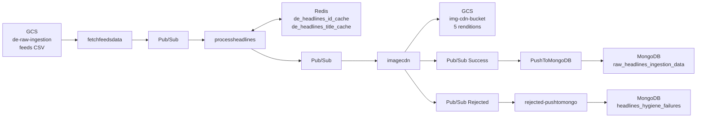

# Headlines Ingestion - Database Schema

## Overview

The Headlines Ingestion pipeline uses three persistence layers: MongoDB for document storage, Redis for deduplication caching, and Google Cloud Storage for feed configuration and image assets.

---

## MongoDB

### Connection

| Attribute       | Value                                    |
|-----------------|------------------------------------------|
| Secret Name     | `mongosh_de_uri`                         |
| Database        | `ingestion-data`                         |
| Auth Method     | URI-embedded credentials                 |
| Protocol        | `mongodb+srv://` (TLS)                   |

### Collection: `raw_headlines_ingestion_data`

**Purpose**: Stores successfully processed headline records that have passed all hygiene checks and image CDN processing.

**Write Pattern**: Insert-only (no updates or upserts). Each record is a unique article identified by `sourceId`.

**Written By**: `PushToMongoDB` Cloud Function.

#### Document Schema

```json
{
  "_id": "ObjectId (auto-generated by MongoDB)",
  "title": "string",
  "sourceDescription": "string",
  "url": "string",
  "sourcePublishDate": "int (epoch)",
  "sourceThumbnailURL": "string",
  "thumbnailUrls": {
    "original": "string (CDN URL)",
    "fhd": "string (CDN URL)",
    "hd": "string (CDN URL)",
    "sd": "string (CDN URL)",
    "low": "string (CDN URL)"
  },
  "sourceId": "string (bson.ObjectId as string)",
  "createdAt": "int (epoch)",
  "sourceLanguageId": "string",
  "sourceLanguageName": "string",
  "sourceCategoryId": "string",
  "sourceCategoryName": "string",
  "sourcePublisherId": "string",
  "sourcePublisherName": "string",
  "sourceFeedUrl": "string",
  "sourceFeedId": "string",
  "briefWordCount": "int",
  "publisherArticleBody": "string",
  "articleBody": "string",
  "articleHtml": "string"
}
```

#### Field Details

| Field                  | Type   | Indexed | Required | Description                                       |
|------------------------|--------|---------|----------|---------------------------------------------------|
| `_id`                  | ObjectId | Yes (PK) | Auto  | MongoDB auto-generated primary key                |
| `title`                | string | No      | Yes      | Article headline text                             |
| `sourceDescription`    | string | No      | No       | Article summary from feed                         |
| `url`                  | string | No      | Yes      | Full article URL with UTM parameters              |
| `sourcePublishDate`    | int    | No      | Yes      | Publisher's original date as Unix epoch            |
| `sourceThumbnailURL`   | string | No      | Yes      | Original thumbnail URL from publisher             |
| `thumbnailUrls`        | object | No      | Yes      | Nested object with 5 CDN rendition URLs           |
| `thumbnailUrls.original` | string | No   | Yes      | `https://icdn.jionews.com/original/{sourceId}.jpeg` |
| `thumbnailUrls.fhd`   | string | No      | Yes      | `https://icdn.jionews.com/fhd/{sourceId}.jpeg`   |
| `thumbnailUrls.hd`    | string | No      | Yes      | `https://icdn.jionews.com/hd/{sourceId}.jpeg`    |
| `thumbnailUrls.sd`    | string | No      | Yes      | `https://icdn.jionews.com/sd/{sourceId}.jpeg`    |
| `thumbnailUrls.low`   | string | No      | Yes      | `https://icdn.jionews.com/low/{sourceId}.jpeg`   |
| `sourceId`             | string | Yes     | Yes      | Unique article ID (bson.ObjectId string)          |
| `createdAt`            | int    | No      | Yes      | Processing timestamp as Unix epoch                |
| `sourceLanguageId`     | string | No      | Yes      | Language code from feed config                    |
| `sourceLanguageName`   | string | No      | Yes      | Language name from feed config                    |
| `sourceCategoryId`     | string | No      | Yes      | Category code from feed config                    |
| `sourceCategoryName`   | string | No      | Yes      | Category name from feed config                    |
| `sourcePublisherId`    | string | No      | Yes      | Publisher code from feed config                   |
| `sourcePublisherName`  | string | No      | Yes      | Publisher name from feed config                   |
| `sourceFeedUrl`        | string | No      | Yes      | Feed endpoint URL                                 |
| `sourceFeedId`         | string | No      | Yes      | Feed identifier from config                       |
| `briefWordCount`       | int    | No      | No       | Word count of article body                        |
| `publisherArticleBody` | string | No      | No       | Raw scraped article body                          |
| `articleBody`          | string | No      | No       | Cleaned plain text article body                   |
| `articleHtml`          | string | No      | No       | HTML-formatted article body                       |

### Collection: `headlines_hygiene_failures`

**Purpose**: Stores headline records that failed hygiene validation (primarily missing thumbnails).

**Write Pattern**: Insert-only.

**Written By**: `rejected-pushtomongo` Cloud Function.

#### Document Schema

Identical to `raw_headlines_ingestion_data` with the following additional fields:

| Field             | Type   | Description                                     |
|-------------------|--------|-------------------------------------------------|
| `rejectionReason` | string | Human-readable reason for rejection             |
| `rejectedAt`      | int    | Unix epoch timestamp when rejection occurred    |

#### Known Rejection Reasons

| Reason                              | Trigger                                          |
|-------------------------------------|--------------------------------------------------|
| `"No thumbnail image url found"`    | All 12 thumbnail extraction steps returned empty |

---

## Redis

### Connection

Redis is used exclusively for deduplication. Two logical caches are maintained.

### Cache: `de_headlines_id_cache`

| Attribute    | Value                                             |
|--------------|---------------------------------------------------|
| Cache Name   | `de_headlines_id_cache`                           |
| Key Pattern  | `link_cat_lang` (composite: article URL + category + language) |
| Value        | `1` (presence flag)                               |
| TTL          | 48 hours (172800 seconds)                         |
| Purpose      | Prevent re-ingestion of the same article URL within a category-language pair |

#### Key Construction

```
key = f"{article_url}_{category_id}_{language_id}"
```

### Cache: `de_headlines_title_cache`

| Attribute    | Value                                             |
|--------------|---------------------------------------------------|
| Cache Name   | `de_headlines_title_cache`                        |
| Key Pattern  | Normalized article title                          |
| Value        | `1` (presence flag)                               |
| TTL          | 48 hours (172800 seconds)                         |
| Purpose      | Prevent ingestion of articles with duplicate titles |

#### Key Construction

```
key = normalize(title)
# normalize: lowercase, strip whitespace
```

### Deduplication Logic

Both caches are checked sequentially. A record is dropped (silently) if either cache returns a hit. On a double miss, both keys are set with 48h TTL before proceeding.

```
CHECK de_headlines_id_cache[link_cat_lang]
  -> HIT: DROP
  -> MISS: CHECK de_headlines_title_cache[normalized_title]
    -> HIT: DROP
    -> MISS: SET both keys (TTL 48h), CONTINUE
```

---

## Google Cloud Storage

### Bucket: `de-raw-ingestion`

| Attribute    | Value                                              |
|--------------|----------------------------------------------------|
| Bucket Name  | `de-raw-ingestion`                                 |
| Region       | `asia-south1`                                      |
| Access       | IAM (service account)                              |

#### Objects

| Path                                          | Type | Purpose                                  |
|-----------------------------------------------|------|------------------------------------------|
| `headlines/headlines_publishers_feeds.csv`     | CSV  | Publisher feed configuration             |

### Bucket: `img-cdn-bucket`

| Attribute    | Value                                              |
|--------------|----------------------------------------------------|
| Bucket Name  | `img-cdn-bucket`                                   |
| Region       | `asia-south1`                                      |
| Access       | IAM (service account), public read via CDN         |
| CDN Domain   | `icdn.jionews.com`                                 |

#### Object Path Pattern

```
{rendition}/{sourceId}.jpeg
```

#### Rendition Directories

| Directory    | Dimensions  | Description            |
|--------------|-------------|------------------------|
| `original/`  | Source dims | Full resolution        |
| `fhd/`       | 1920x1080  | Full HD                |
| `hd/`        | 1280x720   | HD                     |
| `sd/`        | 720x480    | Standard definition    |
| `low/`       | 480x320    | Low resolution / thumb |

#### CDN URL Mapping

```
GCS: gs://img-cdn-bucket/{rendition}/{sourceId}.jpeg
CDN: https://icdn.jionews.com/{rendition}/{sourceId}.jpeg
```

---

## Data Flow Summary


