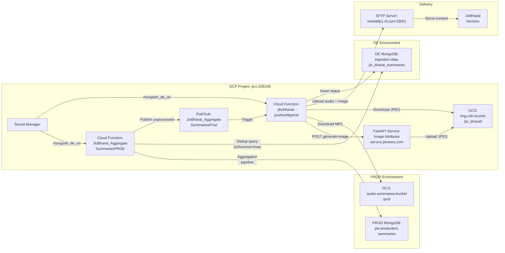
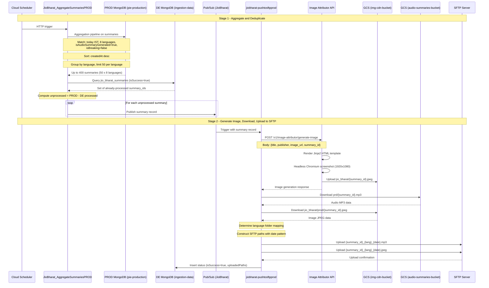
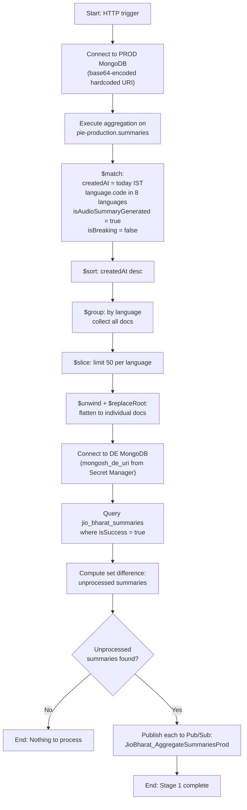
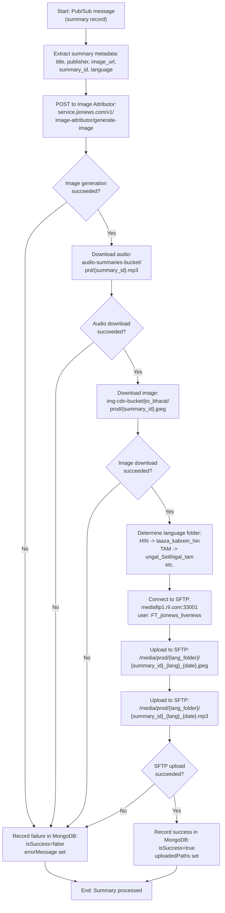
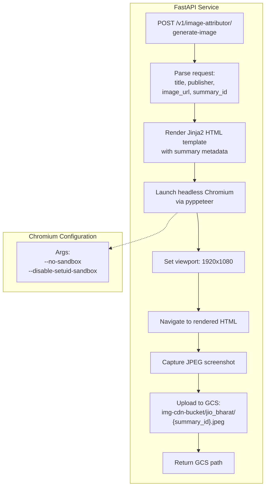
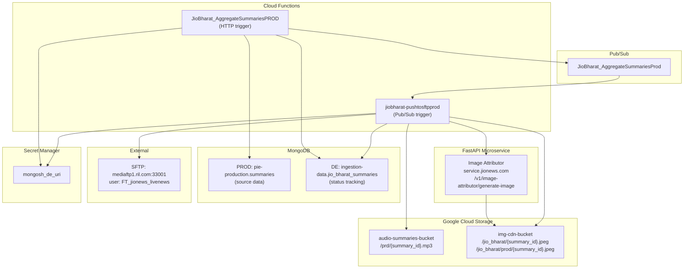
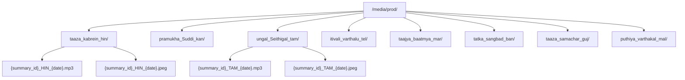

# JioBharat Video Summaries - Architecture

## System Context Diagram

## Detailed Pipeline Flow

## Stage 1: Aggregation Flow

## Stage 2: SFTP Push Flow

## Image Attributor Service Architecture

## Infrastructure Topology

## SFTP Directory Structure

## Networking and Security

- **PROD MongoDB:** Accessed via a base64-encoded hardcoded connection URI (not Secret Manager). This is a known deviation from standard security practices.
- **DE MongoDB:** Accessed via `mongosh_de_uri` from GCP Secret Manager.
- **Image Attributor:** Internal service at `service.jionews.com`, accessed over HTTPS.
- **GCS Buckets:** Accessed using default service account credentials.
- **SFTP:** Accessed via SSH on port 33001 with user `FT_jionews_livenews`. Credentials are stored in the function configuration.
- **Chromium:** Runs with `--no-sandbox` flag for container compatibility. This disables the Chromium sandbox security model.
