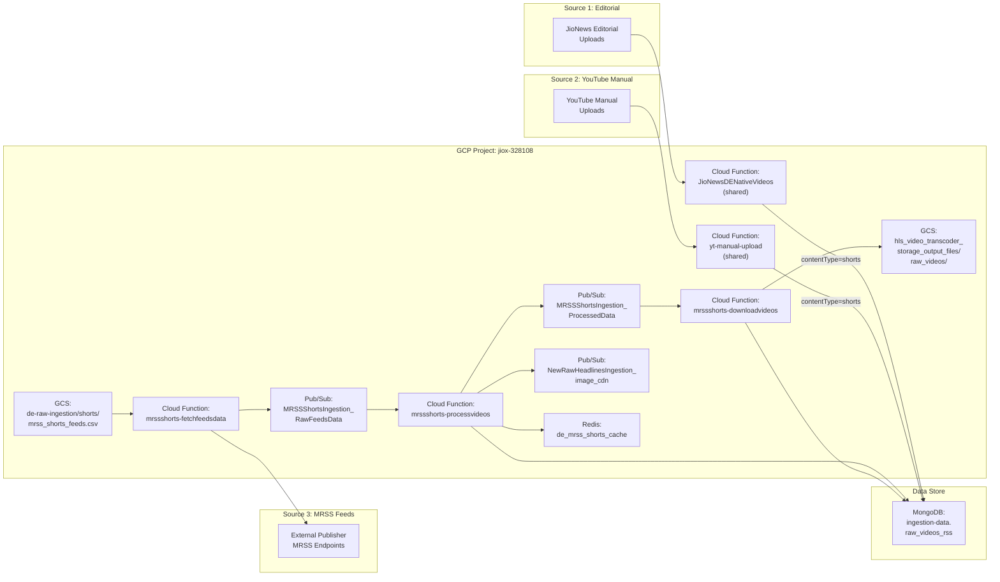
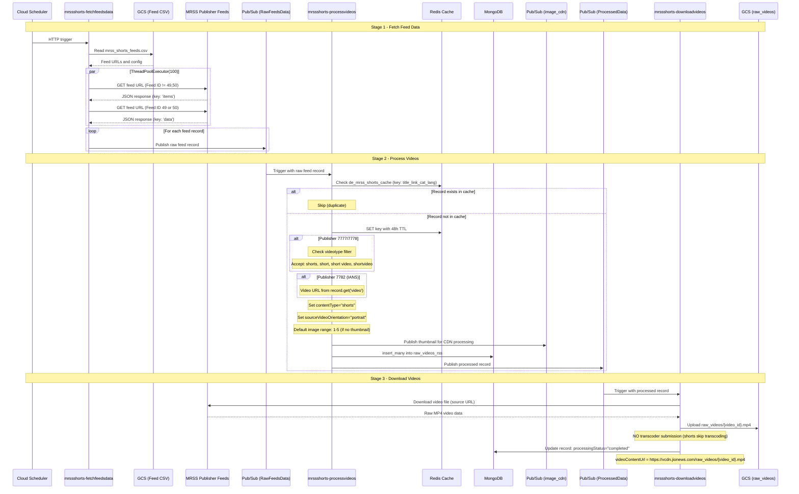
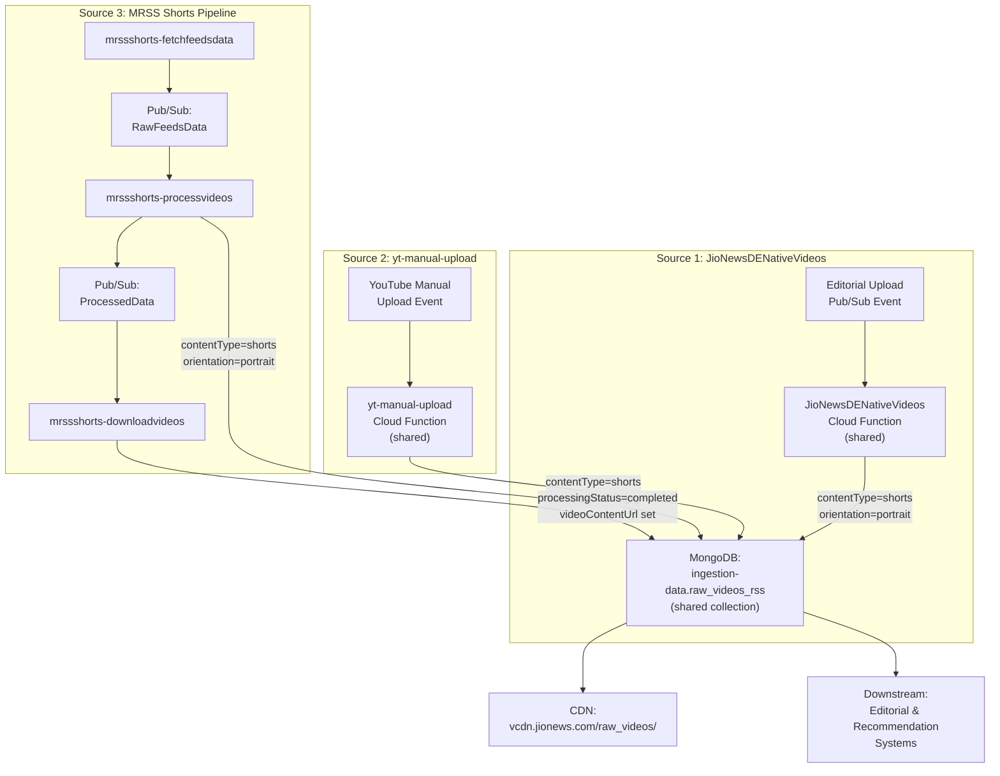
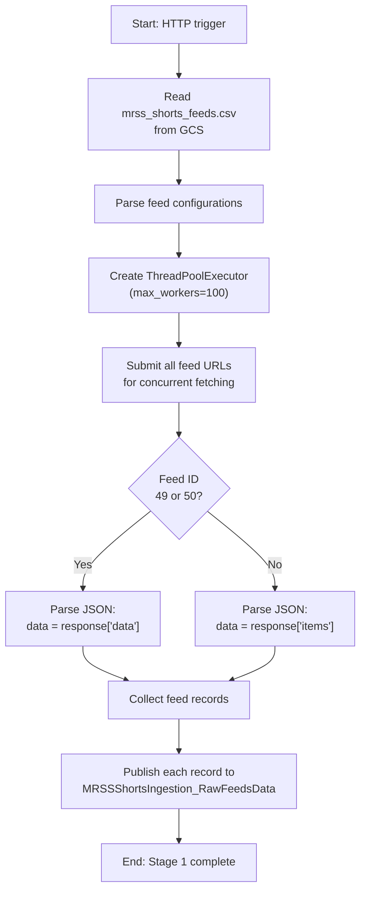
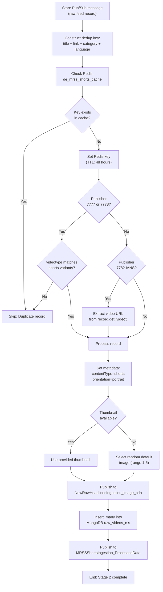
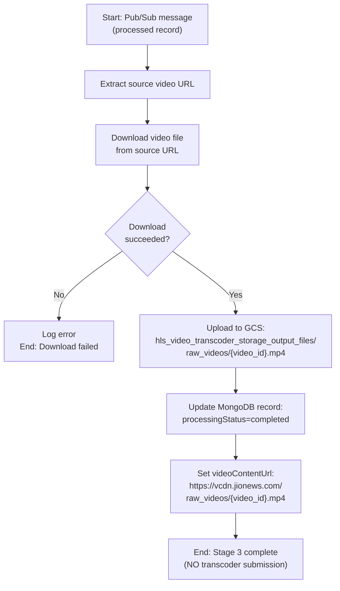
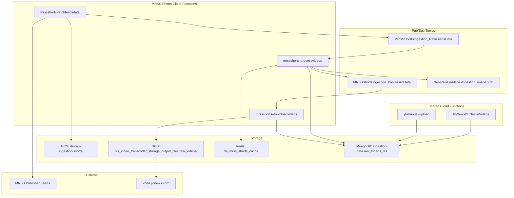

# Native Shorts Ingestion - Architecture

## System Context Diagram

## MRSS Shorts Pipeline - Detailed Sequence

## Three-Source Convergence Diagram

## MRSS Stage 1: Feed Fetching - Internal Flow

## MRSS Stage 2: Processing - Internal Flow

## MRSS Stage 3: Download - Internal Flow

## Infrastructure Topology

## Networking and Security

- **Shared Cloud Functions** (JioNewsDENativeVideos, yt-manual-upload) are triggered by internal Pub/Sub events and share the same codebase with the Native Videos pipeline.
- **MRSS Cloud Functions** execute within the GCP default VPC and access external MRSS feeds over the public internet.
- **Redis** is accessed over a private network connection for deduplication.
- **MongoDB** is accessed via the connection URI from Secret Manager (`mongosh_de_uri`).
- **GCS** access uses default service account credentials.
- **CDN** (`vcdn.jionews.com`) serves raw MP4 files from the GCS bucket via a CDN layer.
