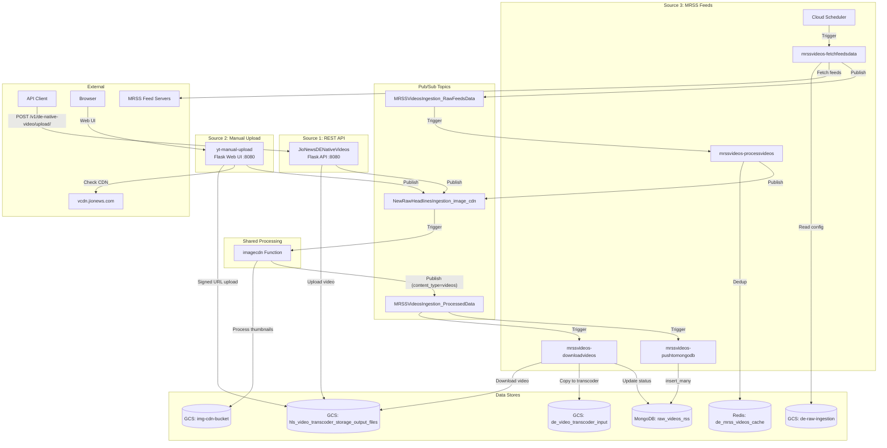
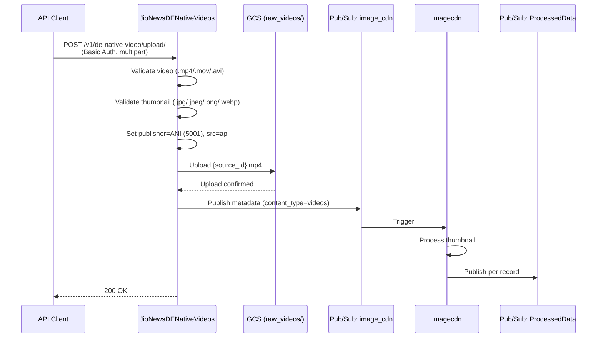
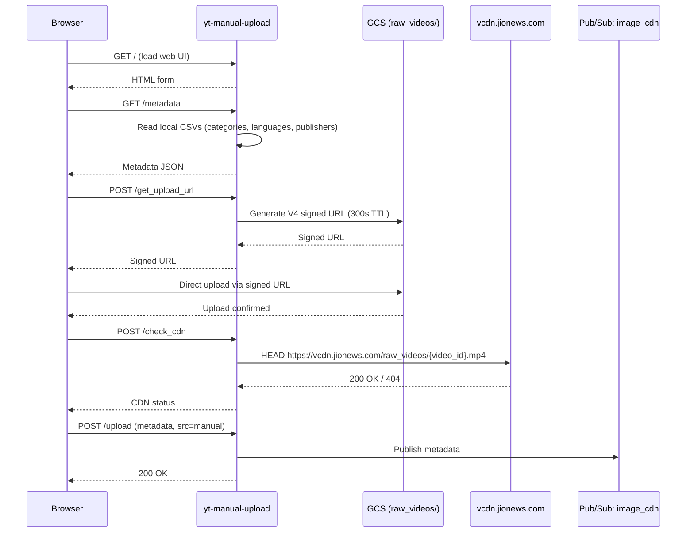
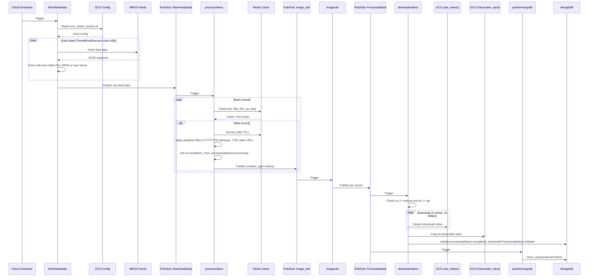
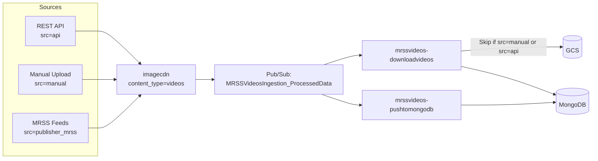

# Native Videos Ingestion -- Architecture Document

## System Context

The Native Videos Ingestion pipeline consists of three independent ingestion sources that converge at a shared image CDN processing step. It runs on Google Cloud Platform (project: `jiox-328108`) using a combination of Cloud Functions, Cloud Run/App Engine services, and event-driven Pub/Sub messaging.

## High-Level Architecture

## Source 1: REST API Sequence

## Source 2: Manual Upload Sequence

## Source 3: MRSS Feeds Sequence

## Source Convergence Diagram

## Infrastructure Dependencies

| Resource | Type | Identifier |
|---|---|---|
| GCP Project | Project | `jiox-328108` (266686822828) |
| GCS Bucket | Storage | `de-raw-ingestion` |
| GCS Bucket | Storage | `hls_video_transcoder_storage_output_files` |
| GCS Bucket | Storage | `de_video_transcoder_input` |
| GCS Bucket | Storage | `img-cdn-bucket` |
| Pub/Sub Topic | Messaging | `NewRawHeadlinesIngestion_image_cdn` |
| Pub/Sub Topic | Messaging | `MRSSVideosIngestion_RawFeedsData` |
| Pub/Sub Topic | Messaging | `MRSSVideosIngestion_ProcessedData` |
| Redis Instance | Cache | `de_mrss_videos_cache` |
| MongoDB Collection | Database | `ingestion-data.raw_videos_rss` |
| Secret Manager | Secrets | `mongosh_de_uri` |
| Secret Manager | Secrets | `compute_engine_service_account_private_key` |

## Security Architecture

| Component | Auth Mechanism |
|---|---|
| REST API (Source 1) | HTTP Basic Authentication |
| Manual Upload (Source 2) | GCS V4 signed URLs (300s expiry) |
| MRSS Feeds (Source 3) | None (public feeds) |
| MongoDB | Connection URI from Secret Manager (`mongosh_de_uri`) |
| GCS Signed URLs | Service account key from Secret Manager |
| Inter-function | GCP IAM (Pub/Sub push/pull permissions) |
