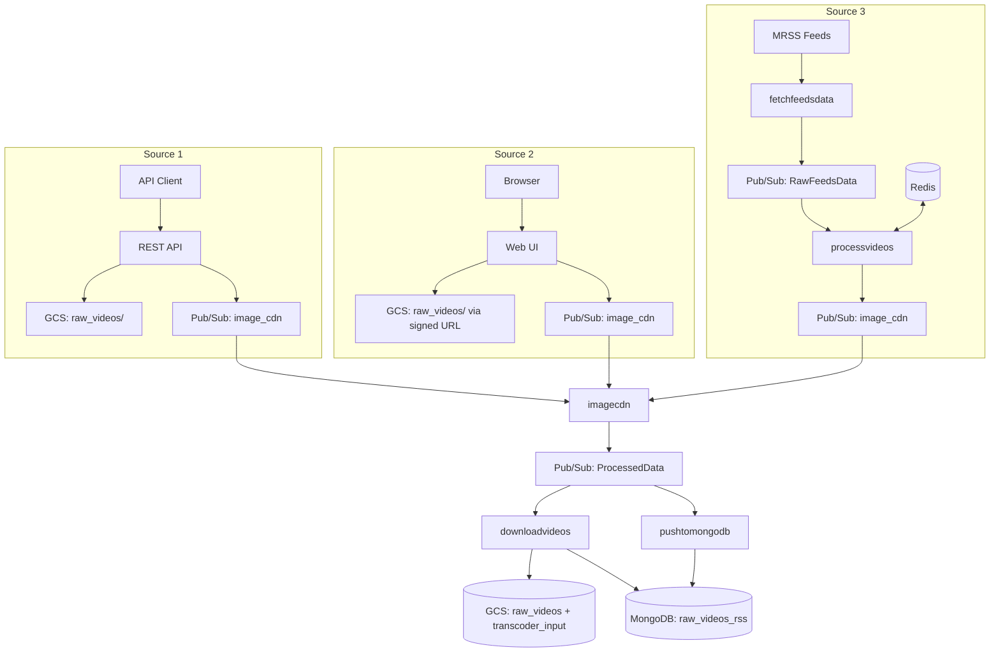

# Native Videos Ingestion -- Database Schema

## MongoDB

### Collection: `ingestion-data.raw_videos_rss`

| Field | Type | Required | Source(s) | Description |
|---|---|---|---|---|
| `_id` | ObjectId | Yes | Auto | MongoDB document ID |
| `source_id` | string | Yes | All | Unique video identifier |
| `title` | string | Yes | All | Video title |
| `description` | string | No | MRSS, API | Video description |
| `video_url` | string | Yes | All | URL or GCS path to video file |
| `thumbnail_url` | string | No | All | Original thumbnail URL |
| `cdn_thumbnail_url` | string | No | All | CDN-processed thumbnail URL |
| `category` | string | Yes | All | Content category name |
| `category_id` | integer | No | All | Category numeric ID |
| `language` | string | Yes | All | Content language name |
| `language_id` | integer | No | All | Language numeric ID |
| `publisher_id` | string | Yes | All | Publisher identifier |
| `publisher_name` | string | Yes | All | Publisher display name |
| `src` | string | Yes | All | Source marker: `"api"`, `"manual"`, `"publisher_mrss"` |
| `content_type` | string | Yes | All | `"videos"` |
| `processingStatus` | string | Yes | MRSS | Processing state: `"processing"` -> `"completed"` |
| `transcoderProcessingStatus` | string | No | MRSS | Transcoder state: `"initiated"` -> (managed by transcoder pipeline) |
| `isVideoMerged` | boolean | No | MRSS | Video merge flag (default: `false`) |
| `duration` | string/number | No | Varies | Video duration |
| `published_date` | datetime | No | MRSS | Original publication date |
| `ingestion_timestamp` | datetime | Yes | All | Time of ingestion |
| `videotype` | string | No | MRSS (7777/7778) | Video type from feed |
| `feed_id` | integer | No | MRSS | Source feed configuration ID |

### Write Strategy

- **MRSS source**: `insert_many(ordered=False)` -- Bulk insert; duplicate key errors are silently skipped.
- **API source**: Individual inserts via downstream processing.
- **Manual source**: Individual inserts via downstream processing.

### Indexes (Recommended)

| Index | Fields | Type | Purpose |
|---|---|---|---|
| Primary | `_id` | Unique | Default |
| Source ID | `source_id` | Unique | Fast lookup, deduplication |
| Processing status | `processingStatus`, `transcoderProcessingStatus` | Compound | Transcoder workflow queries |
| Content type + Language | `content_type`, `language` | Compound | RSS feed generation queries |
| Source | `src` | Single | Filter by ingestion source |
| Ingestion time | `ingestion_timestamp` | Descending | Recency queries |

## Redis

### Cache: `de_mrss_videos_cache`

| Attribute | Value |
|---|---|
| Purpose | MRSS record deduplication |
| Key format | `{title}_{link}_{category}_{language}` |
| Value | Existence flag |
| TTL | 48 hours (172,800 seconds) |
| Used by | `mrssvideos-processvideos` |

### Key Construction

The composite key is formed by concatenating four fields with underscore delimiters:

```
{video_title}_{video_link}_{category}_{language}
```

This ensures the same video from the same feed (same title and link) in the same category and language is not re-processed within the 48-hour window.

## GCS Storage Schema

### Bucket: `hls_video_transcoder_storage_output_files`

| Path | Content | Written by |
|---|---|---|
| `raw_videos/{source_id}.mp4` | Raw video files | API upload, Manual upload, MRSS download |

### Bucket: `de_video_transcoder_input`

| Path | Content | Written by |
|---|---|---|
| `{source_id}.mp4` | Video files staged for transcoding | `mrssvideos-downloadvideos` (copy from raw_videos) |

### Bucket: `de-raw-ingestion`

| Path | Content | Read by |
|---|---|---|
| `videos/mrss_videos_feeds.csv` | MRSS feed configuration | `mrssvideos-fetchfeedsdata` |

### Bucket: `img-cdn-bucket`

| Path | Content | Written by |
|---|---|---|
| Various paths | CDN-processed thumbnails | imagecdn function |

## Secret Manager

| Secret Name | Type | Used by | Purpose |
|---|---|---|---|
| `mongosh_de_uri` | Connection string | All MongoDB-accessing functions | MongoDB Atlas connection URI |
| `compute_engine_service_account_private_key` | JSON key | yt-manual-upload | GCS V4 signed URL generation |

## Category Reference Table

| ID | Name | Notes |
|---|---|---|
| 3 | entertainment | |
| 5 | fashion | |
| 8 | health | |
| 9 | food | |
| 10 | automotive | |
| 11 | travel | |
| 12 | sports | |
| 13 | news | |
| 14 | technology | |
| 17 | business | |
| 18 | cricket | |
| 20 | spiritual | |
| 22 | astrology | |
| 26 | Career | Note: capitalized |

## Language Reference Table

| ID | Name | Notes |
|---|---|---|
| 1 | English | |
| 2 | Hindi | |
| 3 | Marathi | |
| 4 | Gujarati | |
| 6 | Malayalam | ID 5 not assigned |
| 7 | Tamil | |
| 8 | Urdu | |
| 9 | Kannada | |
| 10 | Punjabi | |
| 11 | Telugu | |
| 13 | Bangla | IDs 12, 14-17 not assigned |
| 18 | Odia | |
| 19 | Assamese | |

## Data Lineage


