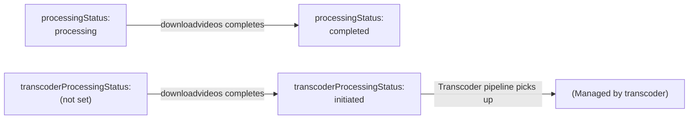

# Native Videos Ingestion -- Technical Specification

## Runtime Environment

| Attribute | Value |
|---|---|
| Platform | Google Cloud Functions + Cloud Run / App Engine |
| GCP Project | `jiox-328108` (Project Number: `266686822828`) |
| Language | Python (Flask) |
| Port | 8080 (API and Manual Upload services) |

## Source 1: JioNewsDENativeVideos -- Technical Details

### Service Configuration

| Attribute | Value |
|---|---|
| Framework | Flask |
| Port | 8080 |
| Auth | HTTP Basic Authentication |
| Entry point | Flask application |

### Endpoint: POST /v1/de-native-video/upload/

**Request format:** `multipart/form-data`

| Part | Field name | Type | Validation |
|---|---|---|---|
| Video | `video` | File | Extensions: `.mp4`, `.mov`, `.avi` |
| Thumbnail | `thumbnail` | File | Extensions: `.jpg`, `.jpeg`, `.png`, `.webp` |
| Metadata | `metadata` | JSON string | Required fields |

**Processing logic:**

1. Validate HTTP Basic Auth credentials.
2. Extract and validate uploaded files by extension.
3. Parse metadata JSON from the multipart request.
4. Set hardcoded publisher: `"ANI"` (ID: `"5001"`).
5. Set `src` field to `"api"`.
6. Generate `source_id` for the video.
7. Upload video to GCS: `hls_video_transcoder_storage_output_files/raw_videos/{source_id}.mp4`.
8. Publish message to Pub/Sub topic `NewRawHeadlinesIngestion_image_cdn`.

**Error responses:**

| Code | Condition |
|---|---|
| 401 | Invalid or missing Basic Auth credentials |
| 400 | Invalid file extension or missing required fields |
| 500 | GCS upload failure or Pub/Sub publish failure |

## Source 2: yt-manual-upload -- Technical Details

### Service Configuration

| Attribute | Value |
|---|---|
| Framework | Flask |
| Port | 8080 |
| Auth | None (internal access assumed) |

### Endpoints

#### GET /
Returns the HTML web UI for manual video upload.

#### GET /metadata
Returns category, language, and publisher lists read from local CSV files.

**CSV sources:**
- `data/categories.csv`
- `data/languages.csv`
- `data/publishers.csv`

#### POST /get_upload_url

Generates a GCS V4 signed URL for direct browser-to-GCS upload.

| Parameter | Description |
|---|---|
| `video_id` | Video identifier for the upload path |
| Return | GCS V4 signed URL |
| TTL | 300 seconds |

**Signed URL generation** uses the service account private key retrieved from Secret Manager (`compute_engine_service_account_private_key`).

#### POST /check_cdn

Issues an HTTP HEAD request to verify video availability on CDN.

```
HEAD https://vcdn.jionews.com/raw_videos/{video_id}.mp4
```

Returns CDN availability status (200 = available, 404 = not found).

#### POST /upload

Finalizes the upload by publishing video metadata. Sets `src` to `"manual"`.

## Source 3: MRSS Feeds -- Technical Details

### mrssvideos-fetchfeedsdata

| Attribute | Value |
|---|---|
| Trigger | Cloud Scheduler |
| Concurrency | `ThreadPoolExecutor(max_workers=100)` |
| Config | GCS: `de-raw-ingestion/videos/mrss_videos_feeds.csv` |

**Processing logic:**

1. Read feed configuration CSV from GCS.
2. For each feed, submit a fetch task to the thread pool (100 workers).
3. Fetch the feed URL via HTTP GET.
4. Parse JSON response:
   - Feed IDs 49, 50 (IANS): Use `response_json['data']` as the items list.
   - All other feed IDs: Use `response_json['items']` as the items list.
5. Publish raw feed data to `MRSSVideosIngestion_RawFeedsData`.

### mrssvideos-processvideos

| Attribute | Value |
|---|---|
| Trigger | Pub/Sub (from `MRSSVideosIngestion_RawFeedsData`) |
| Dedup | Redis `de_mrss_videos_cache` |

**Processing logic:**

1. Decode Pub/Sub message containing raw feed items.
2. For each item:
   a. Construct Redis key: `{title}_{link}_{category}_{language}`.
   b. Check Redis for key existence.
   c. If key exists, skip (duplicate).
   d. If key does not exist, set key with 48h TTL.
3. Apply publisher-specific filters:
   - **Publisher 7777/7778**: Check `videotype` field. Only accept values in the set: `{"vod", "long video", "video", "videos", "longvideo"}`. Reject all others.
   - **Publisher 7782 (IANS)**: Extract video URL from `record.get('video')` instead of the standard video URL field.
4. Set default fields:
   - `src`: `"publisher_mrss"`
   - `processingStatus`: `"processing"`
   - `isVideoMerged`: `false`
5. Publish to `NewRawHeadlinesIngestion_image_cdn` with `content_type="videos"`.

### mrssvideos-downloadvideos

| Attribute | Value |
|---|---|
| Trigger | Pub/Sub (from `MRSSVideosIngestion_ProcessedData`) |
| Retries | 3 attempts, 2-second delay between retries |

**Processing logic:**

1. Decode Pub/Sub message.
2. Check `src` field: if `"manual"` or `"api"`, skip processing (those sources handle their own uploads).
3. Download video via HTTP streaming to GCS bucket `hls_video_transcoder_storage_output_files/raw_videos/`.
4. Copy downloaded file to `de_video_transcoder_input` bucket for transcoder processing.
5. On successful download:
   - Update MongoDB: `processingStatus` = `"completed"`.
   - Update MongoDB: `transcoderProcessingStatus` = `"initiated"`.
6. On failure after 3 retries: Record remains in `"processing"` state.

**Retry logic:**
```
for attempt in range(3):
    try:
        download_and_upload()
        break
    except Exception:
        if attempt < 2:
            time.sleep(2)
        else:
            raise
```

### mrssvideos-pushtomongodb

| Attribute | Value |
|---|---|
| Trigger | Pub/Sub |
| Write strategy | `insert_many(ordered=False)` |

**Processing logic:**

1. Decode Pub/Sub message containing processed video records.
2. Insert all records into `ingestion-data.raw_videos_rss` using `insert_many(ordered=False)`.
3. `ordered=False` ensures that individual document failures (e.g., duplicate key) do not halt the batch insert. Successfully inserted documents are retained regardless of individual failures.

## Pub/Sub Topic Configuration

| Topic | Publisher | Subscriber | Mode |
|---|---|---|---|
| `NewRawHeadlinesIngestion_image_cdn` | All sources | imagecdn function | Per-record |
| `MRSSVideosIngestion_RawFeedsData` | mrssvideos-fetchfeedsdata | mrssvideos-processvideos | Per-feed |
| `MRSSVideosIngestion_ProcessedData` | imagecdn | mrssvideos-downloadvideos, mrssvideos-pushtomongodb | Per-record |

## Key Libraries and Dependencies

| Library | Purpose | Used by |
|---|---|---|
| `flask` | Web framework | Source 1 (API), Source 2 (Manual) |
| `google-cloud-storage` | GCS operations | All |
| `google-cloud-pubsub` | Pub/Sub messaging | All |
| `google-cloud-secret-manager` | Secrets access | MongoDB URI, service account key |
| `pymongo` | MongoDB client | MRSS functions |
| `redis` | Redis cache client | mrssvideos-processvideos |
| `requests` | HTTP client | MRSS feed fetching, CDN checks |
| `concurrent.futures` | Thread pool | mrssvideos-fetchfeedsdata |

## Status Transitions (MRSS Source)



## Error Handling

| Component | Error | Handling |
|---|---|---|
| REST API | Auth failure | Return 401 |
| REST API | Invalid file type | Return 400 |
| REST API | GCS upload failure | Return 500 |
| Manual Upload | Signed URL expired | Client must request new URL |
| MRSS Fetch | Feed unavailable | Thread reports error, other feeds continue |
| MRSS Process | Redis unavailable | Function fails, Pub/Sub retries |
| MRSS Download | Download failure (3 retries) | Record stuck in `processing` state |
| MRSS Download | GCS copy failure | Exception raised, Pub/Sub retries |
| MRSS MongoDB | Duplicate key on insert | Silently skipped (`ordered=False`) |
| MRSS MongoDB | Connection failure | Function fails, Pub/Sub retries |
