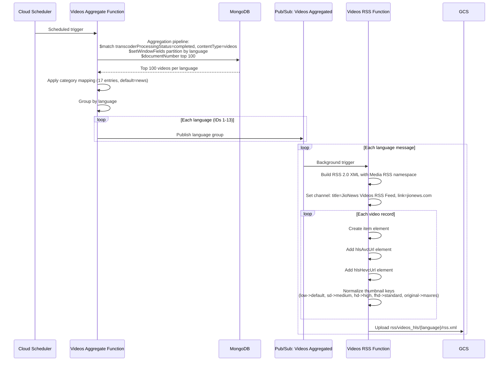
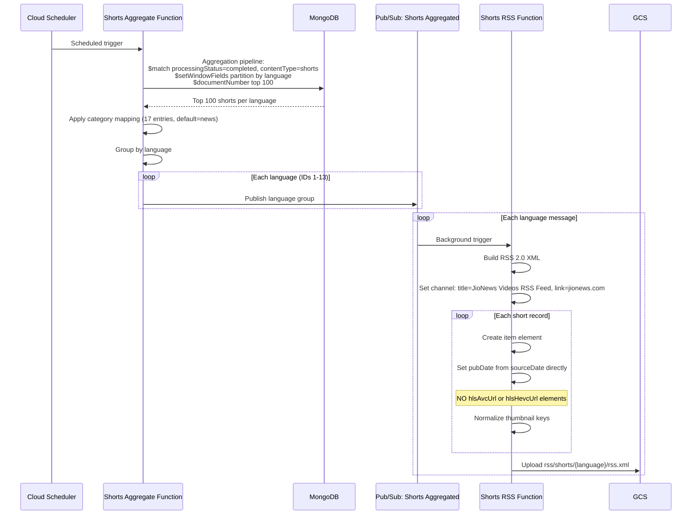
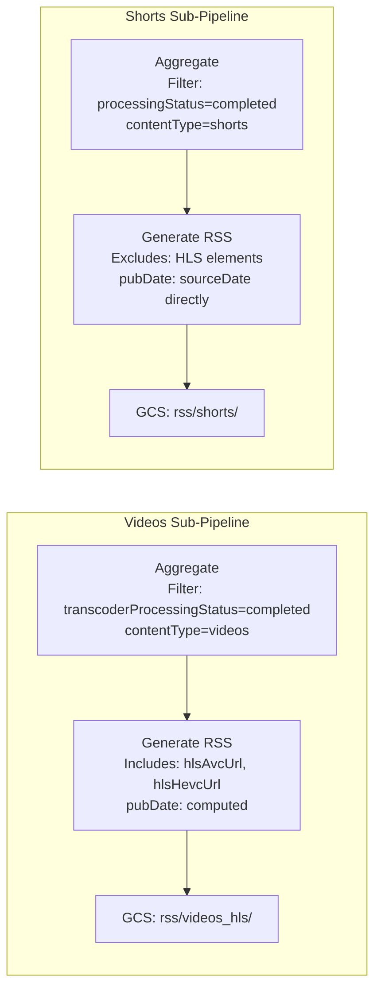
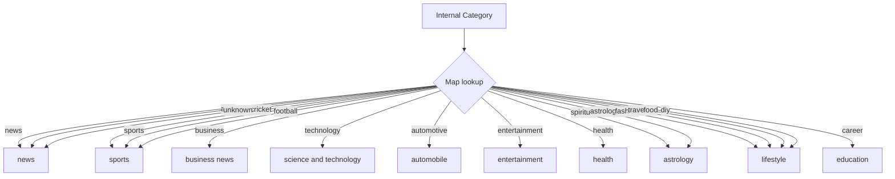

# RSS Feed Generation -- Architecture Document

## System Context

The RSS Feed Generation pipeline reads aggregated content from MongoDB and produces RSS 2.0 XML feeds for downstream consumption by JioHotstar. It operates as two parallel sub-pipelines (Videos and Shorts), each with an aggregation function and an XML generation function, running on Google Cloud Platform (project: `jiox-328108`).

## High-Level Architecture

```mermaid
flowchart TB
    subgraph "Schedulers"
        CS1[Cloud Scheduler<br>Videos]
        CS2[Cloud Scheduler<br>Shorts]
    end

    subgraph "Videos RSS Sub-Pipeline"
        VA[AggregateDataLanguageSplit<br>Videos HLS]
        VP[ProcessRssFeedLanguageSplit<br>Videos HLS]
    end

    subgraph "Shorts RSS Sub-Pipeline"
        SA[AggregateDataLanguageSplit<br>Shorts]
        SP[ProcessRssFeedLanguageSplit<br>Shorts]
    end

    subgraph "Pub/Sub Topics"
        PV[RawVideosHLSContentPrepareRss_AggregatedDataLanguageSplit]
        PS[RawShortsContentPrepareRss_AggregatedDataLanguageSplit]
    end

    subgraph "Data Stores"
        MongoDB[(MongoDB:<br>raw_videos_rss)]
        GCS[(GCS:<br>hls_video_transcoder_storage_output_files)]
    end

    subgraph "Consumer"
        JH[JioHotstar]
    end

    CS1 -->|Trigger| VA
    CS2 -->|Trigger| SA

    VA -->|Query top 100 per lang<br>transcoderProcessingStatus=completed| MongoDB
    SA -->|Query top 100 per lang<br>processingStatus=completed| MongoDB

    VA -->|Publish per language| PV
    SA -->|Publish per language| PS

    PV -->|Background trigger| VP
    PS -->|Background trigger| SP

    VP -->|Write rss/videos_hls/{lang}/rss.xml| GCS
    SP -->|Write rss/shorts/{lang}/rss.xml| GCS

    GCS -->|Read RSS feeds| JH
```

## Videos RSS Sequence



## Shorts RSS Sequence



## Parallel Sub-Pipeline Comparison



## Category Mapping Flow



## Component Details

### RawVideosHLSContentPrepareRss_AggregateDataLanguageSplit

| Attribute | Value |
|---|---|
| Trigger | Cloud Scheduler |
| Input | MongoDB aggregation |
| Filter | `transcoderProcessingStatus=completed`, `contentType=videos` |
| Aggregation | `$setWindowFields` + `$documentNumber`, top 100 per language |
| Output | Pub/Sub: `RawVideosHLSContentPrepareRss_AggregatedDataLanguageSplit` |

### RawVideosHLSContentPrepareRss_ProcessRssFeedLanguageSplit

| Attribute | Value |
|---|---|
| Trigger | Pub/Sub background |
| Input | Language-grouped video records |
| Processing | RSS 2.0 XML generation with HLS elements |
| Output | GCS: `rss/videos_hls/{language}/rss.xml` |

### RawShortsContentPrepareRss_AggregateDataLanguageSplit

| Attribute | Value |
|---|---|
| Trigger | Cloud Scheduler |
| Input | MongoDB aggregation |
| Filter | `processingStatus=completed`, `contentType=shorts` |
| Aggregation | `$setWindowFields` + `$documentNumber`, top 100 per language |
| Output | Pub/Sub: `RawShortsContentPrepareRss_AggregatedDataLanguageSplit` |

### RawShortsContentPrepareRss_ProcessRssFeedLanguageSplit

| Attribute | Value |
|---|---|
| Trigger | Pub/Sub background |
| Input | Language-grouped shorts records |
| Processing | RSS 2.0 XML generation WITHOUT HLS elements |
| Output | GCS: `rss/shorts/{language}/rss.xml` |

## Infrastructure Dependencies

| Resource | Type | Identifier |
|---|---|---|
| GCP Project | Project | `jiox-328108` (266686822828) |
| GCS Bucket | Storage | `hls_video_transcoder_storage_output_files` |
| Pub/Sub Topic | Messaging | `RawVideosHLSContentPrepareRss_AggregatedDataLanguageSplit` |
| Pub/Sub Topic | Messaging | `RawShortsContentPrepareRss_AggregatedDataLanguageSplit` |
| MongoDB Collection | Database | `ingestion-data.raw_videos_rss` |
| Cloud Scheduler Jobs | Trigger | 2 jobs (Videos + Shorts aggregation) |

## GCS Output Structure

```
hls_video_transcoder_storage_output_files/
  rss/
    videos_hls/
      English/rss.xml
      Hindi/rss.xml
      Marathi/rss.xml
      Gujarati/rss.xml
      Malayalam/rss.xml
      Tamil/rss.xml
      Urdu/rss.xml
      Kannada/rss.xml
      Punjabi/rss.xml
      Telugu/rss.xml
      Bangla/rss.xml
      ...
    shorts/
      English/rss.xml
      Hindi/rss.xml
      Marathi/rss.xml
      ...
```
