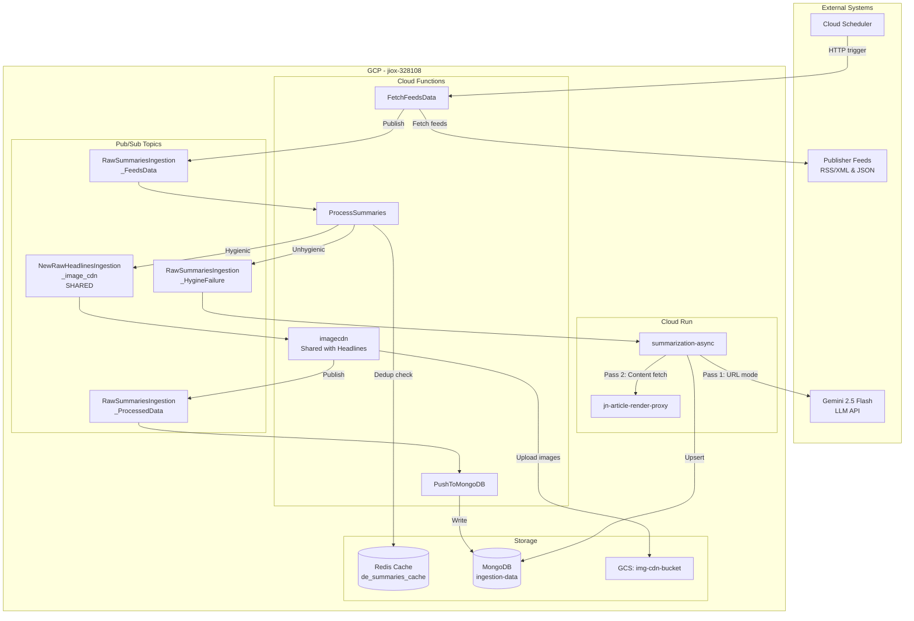
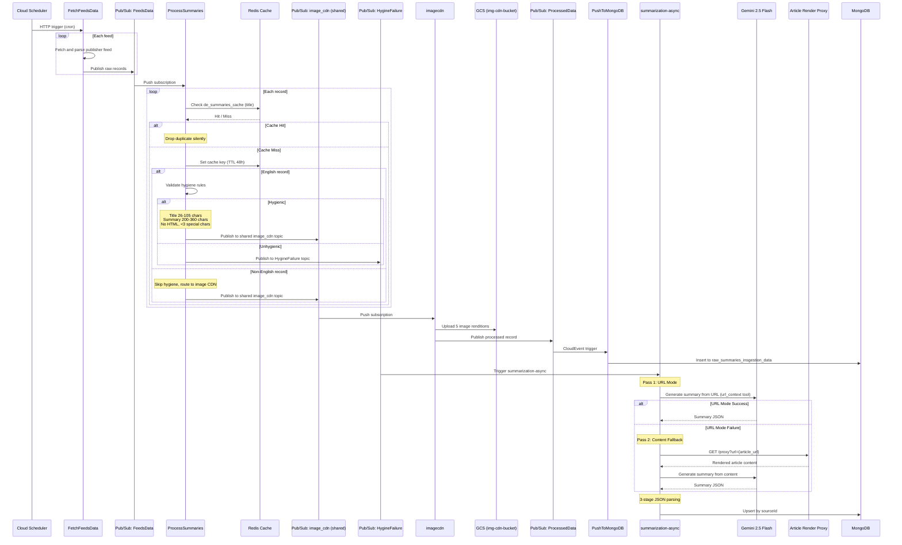
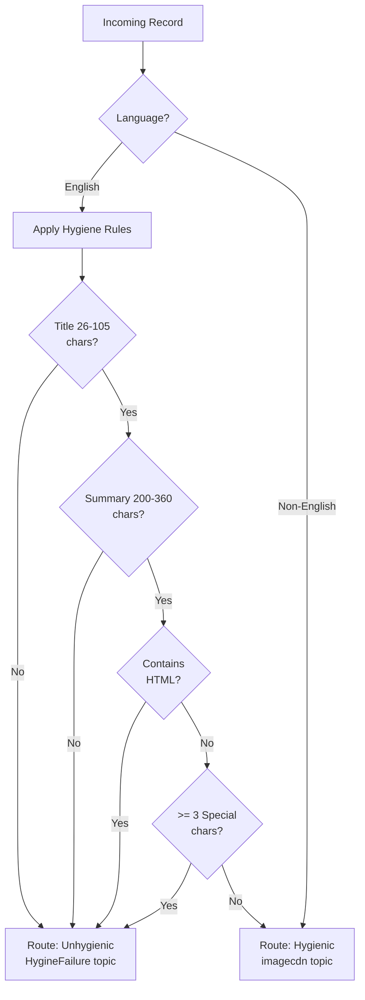
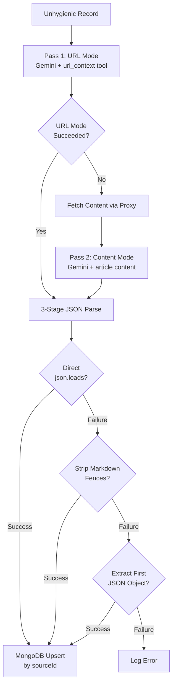
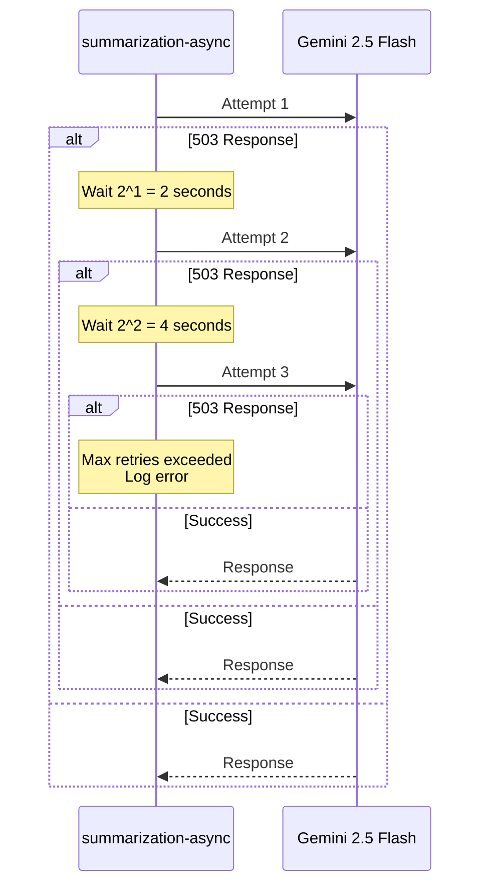
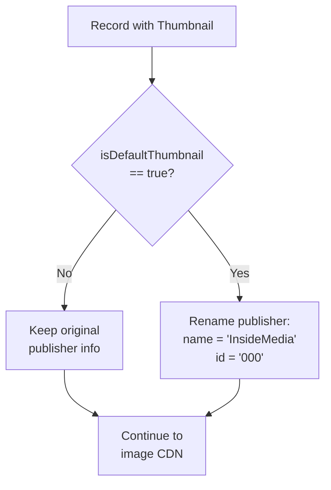

# Summaries Ingestion - Architecture

## Overview

The Summaries Ingestion pipeline is a hybrid serverless architecture combining 5 Cloud Functions with 1 Cloud Run service. It implements a hygiene-based branching pattern: records passing English-language quality checks flow through the standard image CDN path, while failing records are routed to an LLM-based summarization service for content regeneration.

## System Context Diagram

## Pipeline Sequence Diagram

## Hygiene Routing Flow

## LLM Summarization Flow

## Retry Strategy (LLM Calls)

## Default Thumbnail Flow

## Infrastructure Summary

| Component              | GCP Service        | Configuration                      |
|------------------------|--------------------|------------------------------------|
| `FetchFeedsData`       | Cloud Functions    | HTTP trigger, Gen 2                |
| `ProcessSummaries`     | Cloud Functions    | Pub/Sub push (HTTP), Gen 2        |
| `imagecdn`             | Cloud Functions    | Pub/Sub push (HTTP), Gen 2 (shared)|
| `PushToMongoDB`        | Cloud Functions    | CloudEvent trigger, Gen 2         |
| `summarization-async`  | Cloud Run          | Pub/Sub push trigger               |
| `jn-article-render-proxy` | Cloud Run       | Internal HTTP service              |
| Dedup Cache            | Redis              | Single cache, 48h TTL             |
| Persistence            | MongoDB Atlas      | `ingestion-data` database         |
| Image CDN              | Cloud Storage      | `img-cdn-bucket` (shared)         |
| Messaging              | Pub/Sub            | 4 topics (1 shared with Headlines)|
| Scheduling             | Cloud Scheduler    | Cron-based HTTP trigger           |

## Network and Security

| Connection                   | Protocol | Authentication                |
|------------------------------|----------|-------------------------------|
| Cloud Scheduler -> CF        | HTTPS    | IAM service account           |
| CF -> Publisher Feeds        | HTTP/S   | None (public feeds)           |
| CF -> Redis                  | TCP      | Redis AUTH                    |
| CF -> MongoDB                | TLS      | URI with credentials (Secret) |
| CF -> Pub/Sub                | HTTPS    | IAM service account           |
| CF -> GCS                    | HTTPS    | IAM service account           |
| Cloud Run -> Gemini          | HTTPS    | API Key (Secret)              |
| Cloud Run -> Proxy           | HTTPS    | IAM (Cloud Run to Cloud Run)  |
| Cloud Run -> MongoDB         | TLS      | URI with credentials (Secret) |
