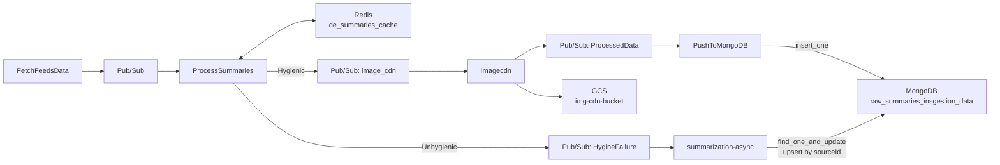

# Summaries Ingestion - Database Schema

## Overview

The Summaries Ingestion pipeline uses MongoDB for document persistence, Redis for title-based deduplication, and shares the GCS `img-cdn-bucket` with the Headlines Ingestion pipeline for image storage.

---

## MongoDB

### Connection

| Attribute       | Value                                    |
|-----------------|------------------------------------------|
| Secret Name     | `mongosh_de_uri`                         |
| Database        | `ingestion-data`                         |
| Auth Method     | URI-embedded credentials                 |
| Protocol        | `mongodb+srv://` (TLS)                   |

### Collection: `raw_summaries_insgestion_data`

**IMPORTANT**: The collection name contains a known production typo: `insgestion` instead of `ingestion`. This is the actual collection name in production and must be used as-is.

**Purpose**: Stores successfully processed summary records. Records arrive via two paths:
1. **Hygienic path**: Standard insert from `PushToMongoDB` Cloud Function.
2. **LLM path**: Upsert from `summarization-async` Cloud Run service.

#### Document Schema (Hygienic Path - Insert)

```json
{
  "_id": "ObjectId (auto-generated)",
  "title": "string",
  "sourceDescription": "string",
  "url": "string (with UTM params)",
  "sourcePublishDate": "integer (epoch)",
  "sourceThumbnailURL": "string",
  "thumbnailUrls": {
    "original": "string (CDN URL)",
    "fhd": "string (CDN URL)",
    "hd": "string (CDN URL)",
    "sd": "string (CDN URL)",
    "low": "string (CDN URL)"
  },
  "sourceId": "string",
  "createdAt": "integer (epoch)",
  "sourceLanguageId": "string",
  "sourceLanguageName": "string",
  "sourceCategoryId": "string",
  "sourceCategoryName": "string",
  "sourcePublisherId": "string",
  "sourcePublisherName": "string",
  "isDefaultThumbnail": "boolean"
}
```

#### Document Schema (LLM Path - Upsert)

Records arriving from the LLM summarization path are upserted by `sourceId`:

```json
{
  "filter": { "sourceId": "<sourceId>" },
  "update": {
    "$set": {
      "summary": "string (LLM-generated summary)",
      "title": "string (LLM-generated or original title)",
      "updatedAt": "integer (epoch)"
    },
    "$setOnInsert": {
      "createdAt": "integer (epoch)",
      "sourceId": "string"
    }
  },
  "upsert": true
}
```

#### Field Details

| Field                  | Type    | Write Path   | Description                                            |
|------------------------|---------|--------------|--------------------------------------------------------|
| `_id`                  | ObjectId| Both         | MongoDB auto-generated primary key                     |
| `title`                | string  | Both         | Article title (26-105 chars if English + hygienic)     |
| `sourceDescription`    | string  | Hygienic     | Summary text (200-360 chars if English + hygienic)     |
| `summary`              | string  | LLM          | LLM-generated summary text                             |
| `url`                  | string  | Hygienic     | Article URL with UTM parameters                        |
| `sourcePublishDate`    | int     | Hygienic     | Publisher date as Unix epoch                           |
| `sourceThumbnailURL`   | string  | Hygienic     | Original thumbnail URL from publisher                  |
| `thumbnailUrls`        | object  | Hygienic     | CDN URLs for 5 image renditions                        |
| `sourceId`             | string  | Both         | Unique article identifier (upsert key for LLM path)   |
| `createdAt`            | int     | Both         | First creation timestamp (setOnInsert for LLM path)    |
| `updatedAt`            | int     | LLM          | Last update timestamp                                  |
| `sourceLanguageId`     | string  | Hygienic     | Language code                                          |
| `sourceLanguageName`   | string  | Hygienic     | Language name                                          |
| `sourceCategoryId`     | string  | Hygienic     | Category code                                         |
| `sourceCategoryName`   | string  | Hygienic     | Category name                                         |
| `sourcePublisherId`    | string  | Hygienic     | Publisher ID (`"000"` for default thumbnails)          |
| `sourcePublisherName`  | string  | Hygienic     | Publisher name (`"InsideMedia"` for default thumbnails)|
| `isDefaultThumbnail`   | boolean | Hygienic     | `true` if using placeholder thumbnail                  |

#### Write Patterns

| Path          | Operation      | Key         | Concurrency         |
|---------------|----------------|-------------|---------------------|
| Hygienic      | `insert_one`   | None (new)  | Append-only         |
| LLM Upsert    | `find_one_and_update` | `sourceId` | Idempotent upsert |

---

## Redis

### Cache: `de_summaries_cache`

| Attribute    | Value                              |
|--------------|------------------------------------|
| Cache Name   | `de_summaries_cache`               |
| Key Pattern  | Article title (raw string)         |
| Value        | Presence flag                      |
| TTL          | 48 hours (172800 seconds)          |
| Purpose      | Prevent re-ingestion of same title |

#### Key Construction

```
key = title  # Direct article title as key
```

#### Deduplication Logic

```
CHECK de_summaries_cache[title]
  -> HIT: DROP record silently
  -> MISS: SET key (TTL 48h), CONTINUE processing
```

### Comparison with Headlines Deduplication

| Aspect          | Headlines                           | Summaries                    |
|-----------------|-------------------------------------|------------------------------|
| Cache count     | 2 (link + title)                    | 1 (title only)               |
| Link dedup      | Yes (`de_headlines_id_cache`)       | No                           |
| Title dedup     | Yes (`de_headlines_title_cache`)    | Yes (`de_summaries_cache`)   |
| Key normalization| Lowercase + strip                  | Raw title string             |
| TTL             | 48 hours                            | 48 hours                    |

---

## Google Cloud Storage (Shared)

### Bucket: `img-cdn-bucket`

Shared with the Headlines Ingestion pipeline. Same structure and CDN mapping.

| Attribute    | Value                                 |
|--------------|---------------------------------------|
| Bucket Name  | `img-cdn-bucket`                      |
| CDN Domain   | `icdn.jionews.com`                    |
| Path Pattern | `{rendition}/{sourceId}.jpeg`         |
| Renditions   | original, fhd, hd, sd, low           |

---

## Data Flow Summary


