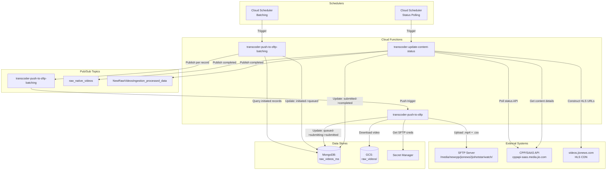
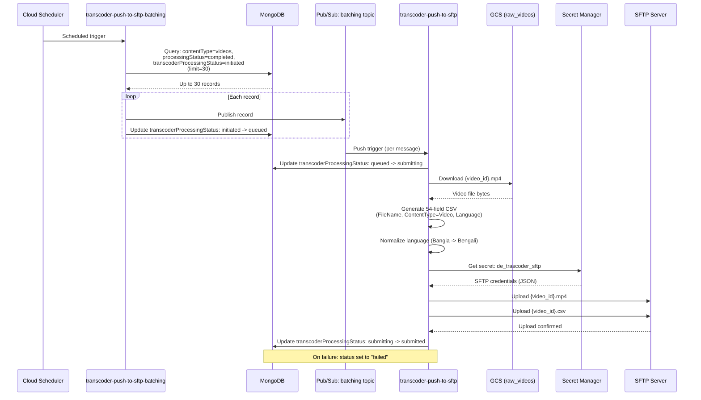
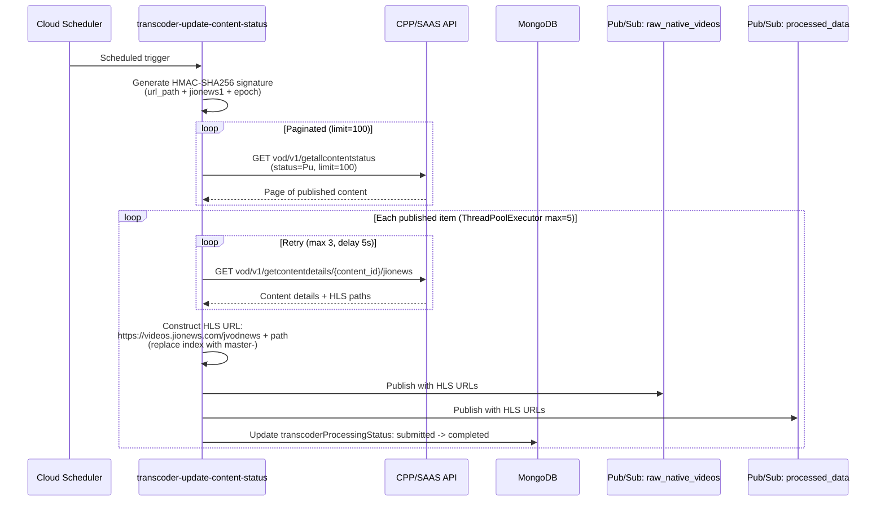
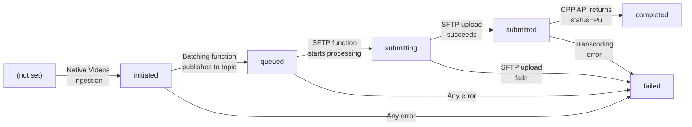

# Video Transcoder Workflow -- Architecture Document

## System Context

The Video Transcoder Workflow pipeline bridges the internal JioNews video ingestion system with an external CPP/SAAS transcoding service. It manages video delivery via SFTP, tracks transcoding status through the external API, and publishes completed HLS URLs for downstream consumption. All components run on Google Cloud Platform (project: `jiox-328108`).

## High-Level Architecture

## Detailed Sequence: Batching and SFTP Delivery

## Detailed Sequence: Status Polling and HLS URL Publishing

## State Machine Diagram

## Component Details

### transcoder-push-to-sftp-batching

| Attribute | Value |
|---|---|
| Trigger | Cloud Scheduler |
| MongoDB query limit | 30 records |
| Output | Pub/Sub: `transcoder-push-to-sftp-batching` |
| Status transition | `initiated` -> `queued` |

### transcoder-push-to-sftp

| Attribute | Value |
|---|---|
| Trigger | Pub/Sub push |
| Input | Single video record from batching topic |
| GCS source | `hls_video_transcoder_storage_output_files/raw_videos/` |
| SFTP destination | `/media/newcpp/jionews2jiohotstar/watch/` |
| Artifacts | `{video_id}.mp4` + `{video_id}.csv` |
| Status transitions | `queued` -> `submitting` -> `submitted` (or `failed`) |
| Credentials | Secret Manager: `de_trascoder_sftp` |

### transcoder-update-content-status

| Attribute | Value |
|---|---|
| Trigger | Cloud Scheduler |
| External API | `https://cppapi-saas.media.jio.com` |
| Auth | HMAC-SHA256 (access key: `jionews1`) |
| Concurrency | `ThreadPoolExecutor(max_workers=5)` |
| Retry | 3 attempts, 5-second delay |
| Pagination | limit=100 per page |
| Status filter | `"Pu"` (Published) |
| HLS CDN | `https://videos.jionews.com/jvodnews` |
| Output topics | `raw_native_videos`, `NewRawVideosIngestion_processed_data` |
| Status transition | `submitted` -> `completed` |

## Infrastructure Dependencies

| Resource | Type | Identifier |
|---|---|---|
| GCP Project | Project | `jiox-328108` (266686822828) |
| GCS Bucket | Storage | `hls_video_transcoder_storage_output_files` |
| Pub/Sub Topic | Messaging | `transcoder-push-to-sftp-batching` |
| Pub/Sub Topic | Messaging | `raw_native_videos` |
| Pub/Sub Topic | Messaging | `NewRawVideosIngestion_processed_data` |
| MongoDB Collection | Database | `ingestion-data.raw_videos_rss` |
| Secret Manager Secret | Credentials | `de_trascoder_sftp` |
| Cloud Scheduler Job | Trigger | Batching schedule |
| Cloud Scheduler Job | Trigger | Status polling schedule |

## Network and Security

| Connection | Protocol | Auth | Notes |
|---|---|---|---|
| Cloud Function -> MongoDB | MongoDB wire protocol | Connection URI (Secret Manager) | Encrypted in transit |
| Cloud Function -> GCS | GCS API (HTTPS) | IAM service account | Default Cloud Function SA |
| Cloud Function -> SFTP | SFTP (SSH) | Credentials from Secret Manager | JSON-formatted credentials |
| Cloud Function -> CPP API | HTTPS | HMAC-SHA256 signature | Custom auth scheme |
| Cloud Function -> Secret Manager | HTTPS (GCP API) | IAM service account | Automatic |
| Cloud Function -> Pub/Sub | gRPC | IAM service account | Automatic |
