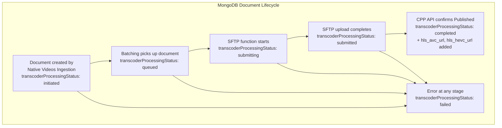

# Video Transcoder Workflow -- Database Schema

## MongoDB

### Collection: `ingestion-data.raw_videos_rss`

This pipeline shares the same MongoDB collection as the Native Videos Ingestion pipeline. The Video Transcoder Workflow reads, updates, and queries the `transcoderProcessingStatus` field to manage the transcoding lifecycle.

### Transcoder-Relevant Fields

| Field | Type | Values | Updated by |
|---|---|---|---|
| `transcoderProcessingStatus` | string | `"initiated"`, `"queued"`, `"submitting"`, `"submitted"`, `"completed"`, `"failed"` | All three functions |
| `processingStatus` | string | `"completed"` (prerequisite for batching) | Native Videos Ingestion |
| `contentType` | string | `"videos"` (filter criterion) | Native Videos Ingestion |
| `source_id` / `video_id` | string | Video identifier | Native Videos Ingestion |
| `language` | string | Language name | Native Videos Ingestion |
| `hls_avc_url` | string | HLS AVC stream URL | transcoder-update-content-status |
| `hls_hevc_url` | string | HLS HEVC stream URL | transcoder-update-content-status |
| `cpp_content_id` | string | External CPP content identifier | transcoder-update-content-status |

### Query Patterns

#### Batching Query

```json
{
  "filter": {
    "contentType": "videos",
    "processingStatus": "completed",
    "transcoderProcessingStatus": "initiated"
  },
  "limit": 30
}
```

#### Status Update Operations

| Transition | Update Operation |
|---|---|
| initiated -> queued | `update_one({"_id": doc_id}, {"$set": {"transcoderProcessingStatus": "queued"}})` |
| queued -> submitting | `update_one({"_id": doc_id}, {"$set": {"transcoderProcessingStatus": "submitting"}})` |
| submitting -> submitted | `update_one({"_id": doc_id}, {"$set": {"transcoderProcessingStatus": "submitted"}})` |
| submitted -> completed | `update_one({"_id": doc_id}, {"$set": {"transcoderProcessingStatus": "completed", "hls_avc_url": url, "hls_hevc_url": url}})` |
| any -> failed | `update_one({"_id": doc_id}, {"$set": {"transcoderProcessingStatus": "failed"}})` |

### Indexes (Recommended for Transcoder Workflow)

| Index | Fields | Type | Purpose |
|---|---|---|---|
| Batching query | `contentType`, `processingStatus`, `transcoderProcessingStatus` | Compound | Efficient batching queries |
| Status tracking | `transcoderProcessingStatus` | Single | Status-based lookups |
| Video ID | `video_id` or `source_id` | Unique | Individual record lookups |

## SFTP File Schema

### CSV Metadata File: `{video_id}.csv`

The CSV file contains 54 columns. Only 3 are populated; the remaining 51 are empty strings.

| Column Position | Field Name | Populated | Value |
|---|---|---|---|
| 1 | FileName | Yes | `{video_id}.mp4` |
| 2 | ContentType | Yes | `"Video"` |
| 3 | Language | Yes | Normalized language name |
| 4 | (Field 4) | No | `""` |
| 5 | (Field 5) | No | `""` |
| ... | ... | No | `""` |
| 54 | (Field 54) | No | `""` |

### Language Normalization Table

| Original Language | CSV Language |
|---|---|
| English | English |
| Hindi | Hindi |
| Marathi | Marathi |
| Gujarati | Gujarati |
| Malayalam | Malayalam |
| Tamil | Tamil |
| Urdu | Urdu |
| Kannada | Kannada |
| Punjabi | Punjabi |
| Telugu | Telugu |
| **Bangla** | **Bengali** |
| Odia | Odia |
| Assamese | Assamese |

Note: Only "Bangla" is actively normalized to "Bengali". All other language names pass through unchanged.

## Secret Manager

### Secret: `de_trascoder_sftp`

| Attribute | Value |
|---|---|
| Name | `de_trascoder_sftp` (note: contains typo "trascoder") |
| Format | JSON |
| Content | SFTP connection credentials |

Expected JSON structure:

| Field | Type | Description |
|---|---|---|
| `host` | string | SFTP server hostname |
| `port` | integer | SFTP server port |
| `username` | string | SFTP login username |
| `password` or `private_key` | string | Authentication credential |

## GCS Storage

### Source Bucket: `hls_video_transcoder_storage_output_files`

| Path | Purpose | Access |
|---|---|---|
| `raw_videos/{video_id}.mp4` | Source video files for SFTP delivery | Read by `transcoder-push-to-sftp` |

## CPP/SAAS API Data

### Authentication Credentials

| Credential | Value | Storage |
|---|---|---|
| Access Key | `jionews1` | Configuration/code |
| Secret Key | (secret) | Secret Manager |
| Distributor | `jionews` | Configuration/code |
| Distributor ID | `685bc98ec9e754683750e182` | Configuration/code |

### API Endpoints Used

| Endpoint | Method | Purpose | Parameters |
|---|---|---|---|
| `vod/v1/getallcontentstatus` | GET | List published content | `limit=100`, pagination, `status=Pu` |
| `vod/v1/getcontentdetails/{content_id}/jionews` | GET | Get HLS URLs | `content_id` in path |

## State Machine Data Model



## Data Volume Estimates

| Metric | Value |
|---|---|
| Batch size per execution | 30 records max |
| SFTP files per video | 2 (mp4 + csv) |
| API poll page size | 100 records |
| Concurrent API detail calls | 5 (ThreadPoolExecutor) |
