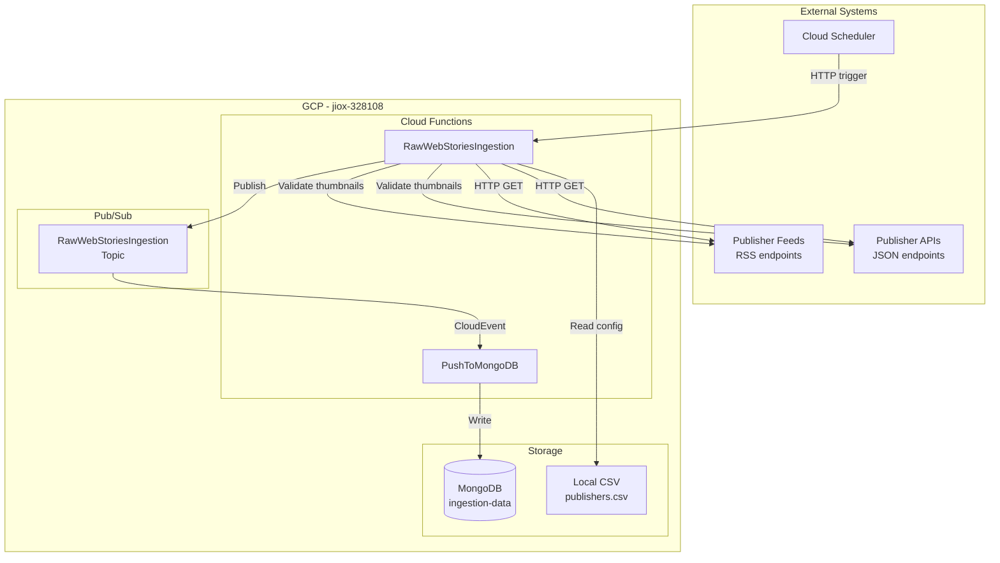
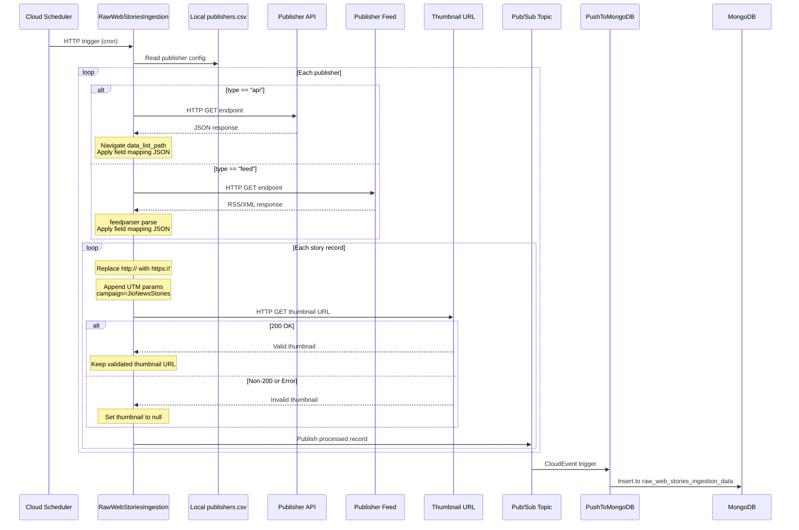
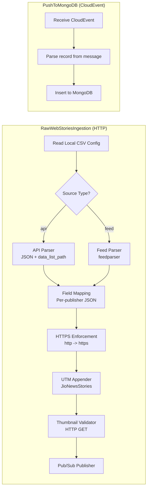
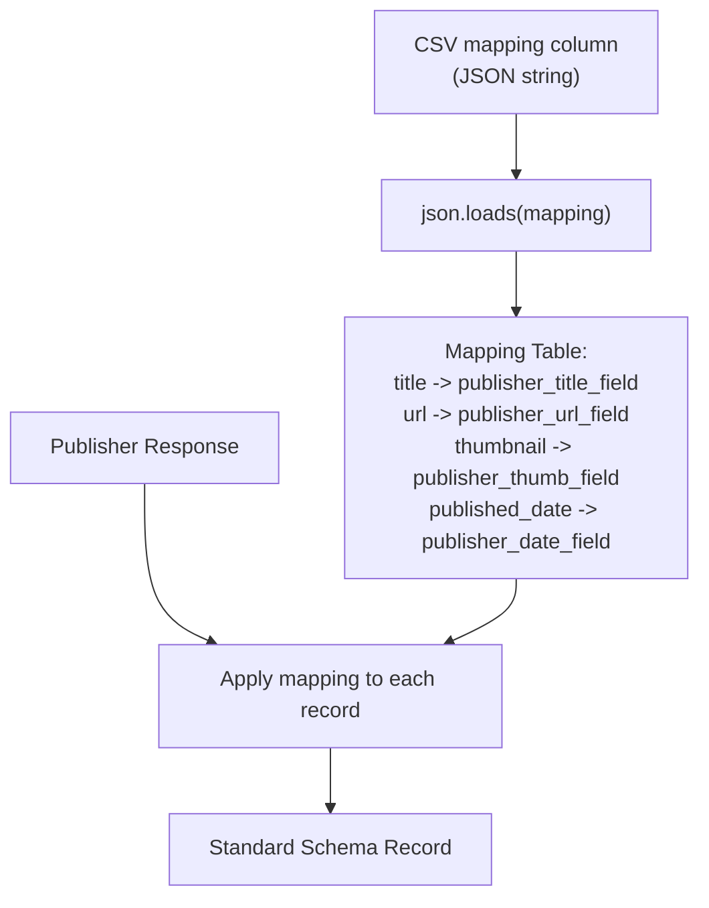
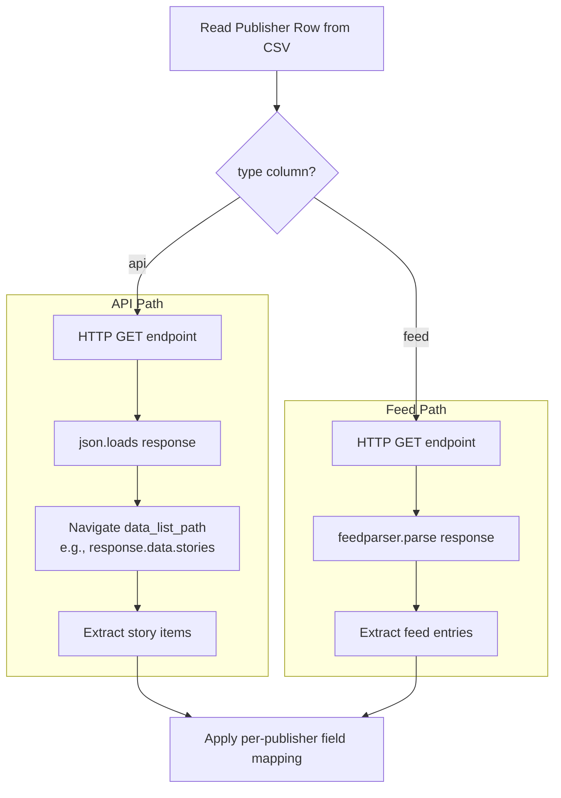
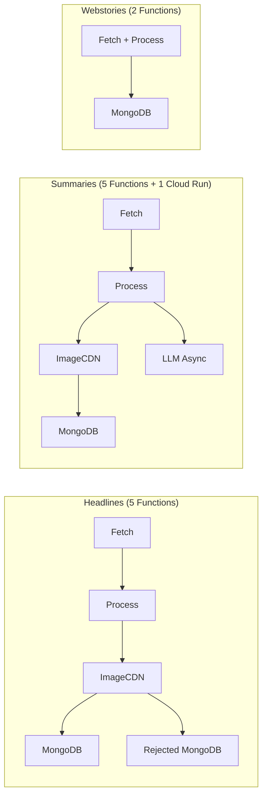

# Webstories Ingestion - Architecture

## Overview

The Webstories Ingestion pipeline is a minimal 2-function serverless architecture on Google Cloud Platform. It follows a simple linear pattern: fetch and process web stories, then persist to MongoDB. There is no image CDN stage, no Redis deduplication, and no hygiene branching.

## System Context Diagram

## Pipeline Sequence Diagram

## Component Architecture

## Field Mapping Flow

## Source Type Decision Flow

## Infrastructure Summary

| Component                | GCP Service        | Configuration                |
|--------------------------|--------------------|------------------------------|
| `RawWebStoriesIngestion` | Cloud Functions    | HTTP trigger, Gen 2          |
| `PushToMongoDB`          | Cloud Functions    | CloudEvent trigger, Gen 2    |
| Publisher Config         | Local File         | Bundled CSV in function pkg  |
| Persistence              | MongoDB Atlas      | `ingestion-data` database    |
| Messaging                | Pub/Sub            | 1 topic with CloudEvent sub  |
| Scheduling               | Cloud Scheduler    | Cron-based HTTP trigger      |

## Comparison with Other Pipeline Architectures

## Network and Security

| Connection                | Protocol | Authentication           |
|---------------------------|----------|--------------------------|
| Cloud Scheduler -> CF     | HTTPS    | IAM service account      |
| CF -> Publisher APIs      | HTTPS    | None (public APIs)       |
| CF -> Publisher Feeds     | HTTPS    | None (public feeds)      |
| CF -> Thumbnail URLs      | HTTPS    | None (public URLs)       |
| CF -> MongoDB             | TLS      | URI with credentials     |
| CF -> Pub/Sub             | HTTPS    | IAM service account      |
