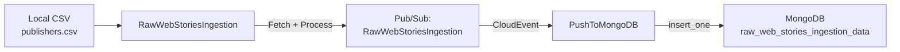
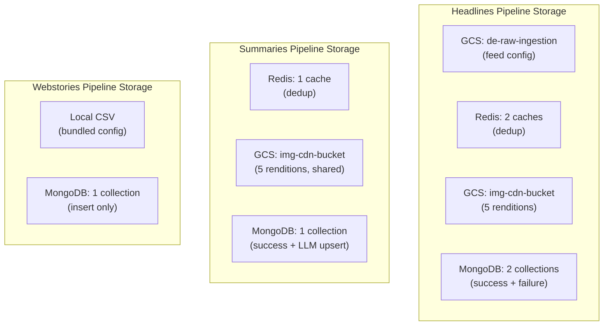

# Webstories Ingestion - Database Schema

## Overview

The Webstories Ingestion pipeline uses MongoDB as its sole persistence layer. Unlike Headlines and Summaries pipelines, there is no Redis cache (no deduplication) and no GCS bucket (no image CDN processing).

---

## MongoDB

### Connection

| Attribute       | Value                                    |
|-----------------|------------------------------------------|
| Secret Name     | `mongosh_de_uri`                         |
| Database        | `ingestion-data`                         |
| Auth Method     | URI-embedded credentials                 |
| Protocol        | `mongodb+srv://` (TLS)                   |

### Collection: `raw_web_stories_ingestion_data`

**Purpose**: Stores all ingested web story records from publisher APIs and RSS feeds.

**Write Pattern**: Insert-only. Each record represents a single web story.

**Written By**: `PushToMongoDB` Cloud Function.

#### Document Schema

```json
{
  "_id": "ObjectId (auto-generated by MongoDB)",
  "sourceId": "string",
  "title": "string",
  "sourcePublishedDate": "string",
  "sourceCategoryName": "string",
  "sourceLanguageName": "string",
  "sourcePublisherName": "string",
  "sourceURL": "string",
  "sourceThumbnailUrl": "string",
  "createdAt": "integer (epoch)"
}
```

#### Field Details

| Field                  | Type     | Indexed  | Required | Description                                       |
|------------------------|----------|----------|----------|---------------------------------------------------|
| `_id`                  | ObjectId | Yes (PK) | Auto     | MongoDB auto-generated primary key                |
| `sourceId`             | string   | Yes      | Yes      | Unique web story identifier                       |
| `title`                | string   | No       | Yes      | Web story title from publisher                    |
| `sourcePublishedDate`  | string   | No       | No       | Publisher date (string, format varies)            |
| `sourceCategoryName`   | string   | No       | Yes      | Category from CSV config                          |
| `sourceLanguageName`   | string   | No       | Yes      | Language from CSV config                          |
| `sourcePublisherName`  | string   | No       | Yes      | Publisher name from CSV config                    |
| `sourceURL`            | string   | No       | Yes      | Web story URL (HTTPS + UTM params)                |
| `sourceThumbnailUrl`   | string   | No       | No       | Validated thumbnail URL (HTTPS enforced)          |
| `createdAt`            | int      | No       | Yes      | Pipeline processing timestamp (Unix epoch)        |

#### Schema Comparison with Other Collections

| Aspect                 | `raw_headlines_ingestion_data` | `raw_summaries_insgestion_data` | `raw_web_stories_ingestion_data` |
|------------------------|-------------------------------|----------------------------------|----------------------------------|
| URL field              | `url`                         | `url`                            | `sourceURL`                      |
| Date field             | `sourcePublishDate` (int)     | `sourcePublishDate` (int)        | `sourcePublishedDate` (string)   |
| Thumbnail field        | `sourceThumbnailURL`          | `sourceThumbnailURL`             | `sourceThumbnailUrl`             |
| CDN thumbnails         | `thumbnailUrls` (5 renditions)| `thumbnailUrls` (5 renditions)   | Not present                      |
| Article body           | `articleBody`, `articleHtml`  | Not present                      | Not present                      |
| Language/Category IDs  | Yes (ID + Name pairs)        | Yes (ID + Name pairs)            | Name only (no IDs)               |
| Publisher IDs          | Yes (ID + Name)              | Yes (ID + Name)                  | Name only (no ID)                |
| Feed info              | `sourceFeedUrl`, `sourceFeedId` | Not present                   | Not present                      |
| Word count             | `briefWordCount`              | Not present                      | Not present                      |

---

## No Redis Cache

The Webstories pipeline does **not** use Redis for deduplication. This means:

- The same web story may be ingested multiple times across scheduler runs.
- Deduplication, if needed, must be handled downstream.
- This is a known trade-off for pipeline simplicity.

## No GCS Storage

The Webstories pipeline does **not** use GCS for image storage:

- Thumbnail URLs point directly to publisher-hosted images.
- No image renditions are generated.
- No CDN URL mapping exists for this pipeline.
- `thumbnailUrls` object is not present in the output schema.

---

## Data Flow Summary



## Storage Architecture Comparison


