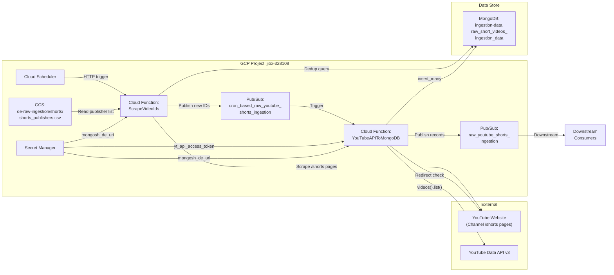
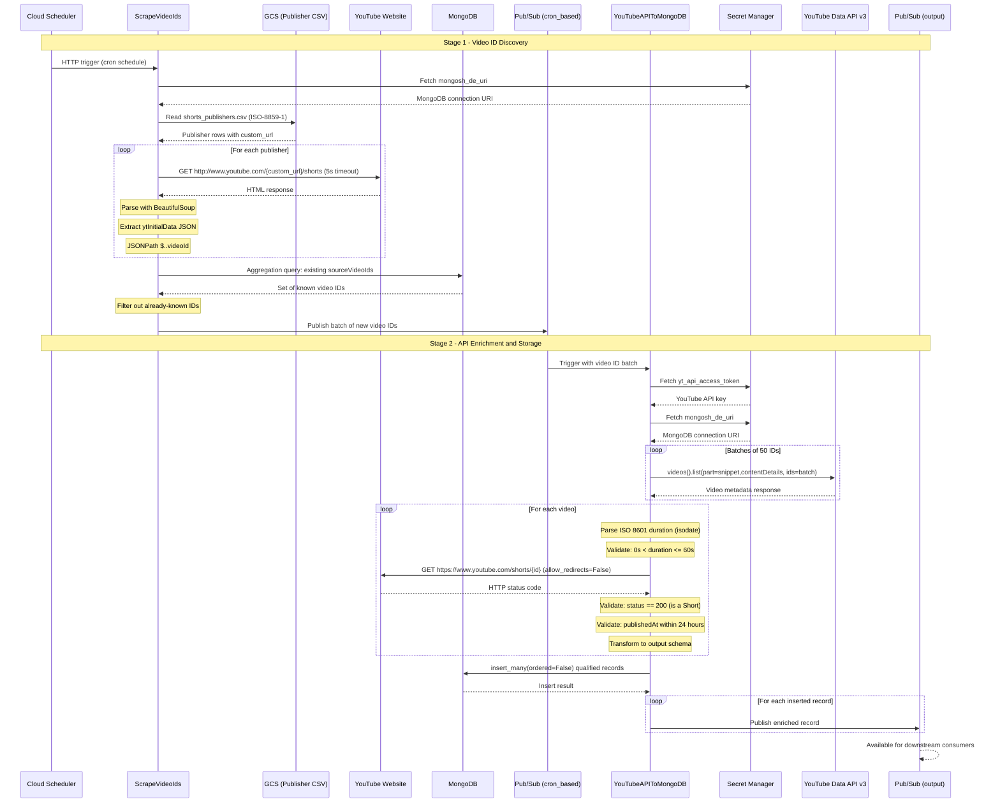
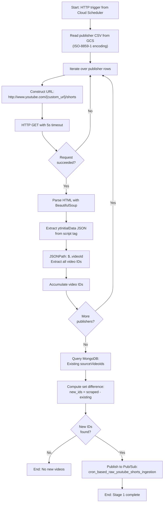
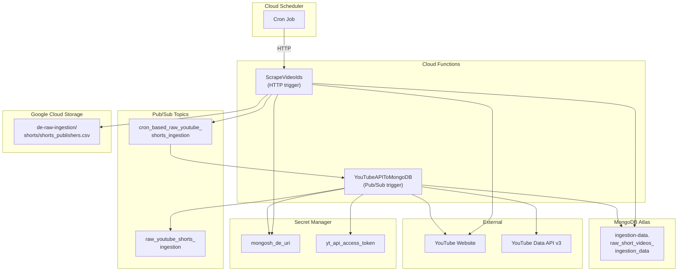

# YouTube Shorts Ingestion - Architecture

## System Context Diagram



## Detailed Pipeline Flow



## Stage 1: ScrapeVideoIds - Internal Flow



## Stage 2: YouTubeAPIToMongoDB - Internal Flow

```mermaid
flowchart TD
    A["Start: Pub/Sub message received"] --> B["Decode message:\nExtract video ID batch"]
    B --> C["Fetch secrets:\nyt_api_access_token, mongosh_de_uri"]
    C --> D["Batch video IDs\n(groups of 50)"]
    D --> E["Call YouTube API:\nvideos().list(part=snippet,contentDetails)"]
    E --> F["Process each video in response"]
    F --> G["Parse duration\n(ISO 8601 via isodate)"]
    G --> H{Duration > 0s\nAND <= 60s?}
    H -->|No| F
    H -->|Yes| I["HTTP GET:\nhttps://www.youtube.com/shorts/{id}\nallow_redirects=False"]
    I --> J{HTTP 200?\n(Is a Short)}
    J -->|No| F
    J -->|Yes| K{publishedAt\nwithin 24h?}
    K -->|No| F
    K -->|Yes| L["Transform to output schema:\n- sourceVideoId, title, thumbnails\n- sourceDate, sourceEpoch\n- duration, dimensions, orientation"]
    L --> M["Add to qualified batch"]
    M --> N{More videos\nto process?}
    N -->|Yes| F
    N -->|No| O["insert_many(ordered=False)\ninto MongoDB"]
    O --> P["Publish each record to\nraw_youtube_shorts_ingestion"]
    P --> Q["End: Stage 2 complete"]
```

## Infrastructure Topology



## Networking and Security

- **Cloud Functions** execute within the GCP project's default VPC.
- **Secret Manager** provides `mongosh_de_uri` (MongoDB connection string) and `yt_api_access_token` (YouTube API key) at runtime.
- **MongoDB** is accessed over the public internet using the connection URI from Secret Manager. TLS is enforced via the `certifi` library for CA bundle verification.
- **YouTube API** calls are authenticated via API key (not OAuth).
- **YouTube website scraping** uses plain HTTP GET requests with no authentication.
