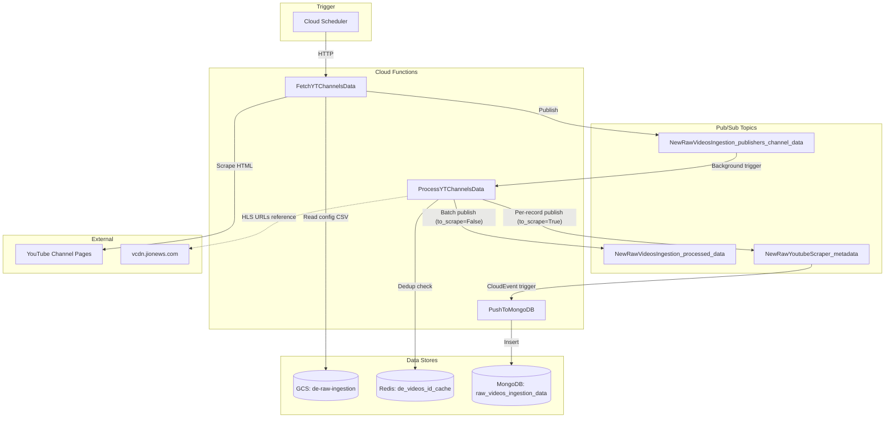
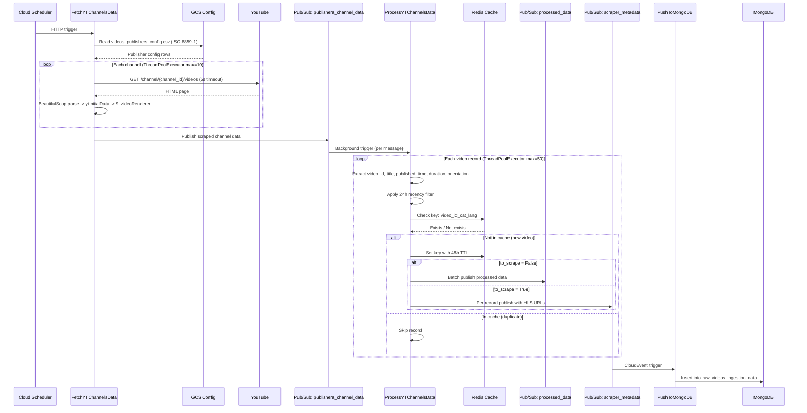
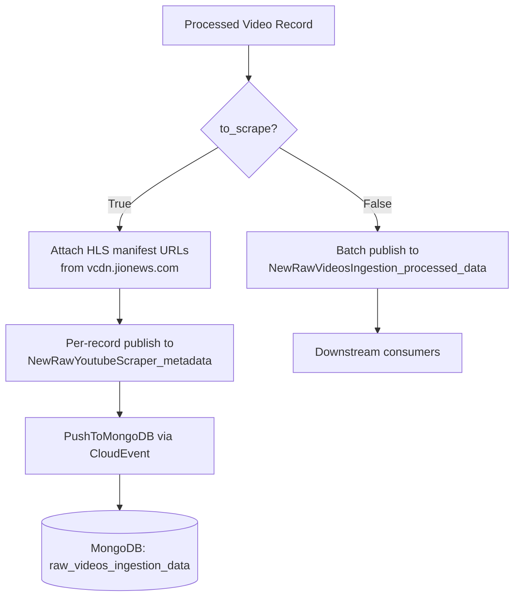

# YouTube Videos Ingestion -- Architecture Document

## System Context

The YouTube Videos Ingestion pipeline is a serverless, event-driven system running on Google Cloud Platform (project: `jiox-328108`). It discovers new video content from YouTube channels via HTML scraping and routes processed metadata through Pub/Sub for downstream consumption and persistence.

## High-Level Architecture

## Detailed Sequence Flow

## to_scrape Branching Logic

## Component Details

### FetchYTChannelsData

| Attribute | Value |
|---|---|
| Trigger | HTTP (Cloud Scheduler) |
| Entry point | `main(req_ph, req_ph2)` |
| Concurrency model | `ThreadPoolExecutor(max_workers=10)` |
| External dependency | YouTube public web pages |
| Output | Pub/Sub: `NewRawVideosIngestion_publishers_channel_data` |

### ProcessYTChannelsData

| Attribute | Value |
|---|---|
| Trigger | Pub/Sub background |
| Entry point | `main(message, context)` |
| Concurrency model | `ThreadPoolExecutor(max_workers=50)` |
| External dependency | Redis for deduplication |
| Output | Pub/Sub: `NewRawVideosIngestion_processed_data` or `NewRawYoutubeScraper_metadata` |

### PushToMongoDB

| Attribute | Value |
|---|---|
| Trigger | Pub/Sub CloudEvent |
| Entry point | `write_to_mongodb(cloud_event)` |
| External dependency | MongoDB Atlas |
| Output | MongoDB document insert |

## Infrastructure Dependencies

| Resource | Type | Identifier |
|---|---|---|
| GCP Project | Project | `jiox-328108` (266686822828) |
| GCS Bucket | Storage | `de-raw-ingestion` |
| Pub/Sub Topic | Messaging | `NewRawVideosIngestion_publishers_channel_data` |
| Pub/Sub Topic | Messaging | `NewRawVideosIngestion_processed_data` |
| Pub/Sub Topic | Messaging | `NewRawYoutubeScraper_metadata` |
| Redis Instance | Cache | `de_videos_id_cache` |
| MongoDB Collection | Database | `ingestion-data.raw_videos_ingestion_data` |

## Scalability Considerations

- Thread pool sizes (10 for fetch, 50 for process) are hardcoded and bound by Cloud Function instance memory/CPU.
- Each Pub/Sub message triggers an independent function invocation, providing horizontal scale at the message level.
- Redis deduplication is the primary bottleneck for concurrent writes (single-threaded Redis model).
- YouTube scraping is rate-limited by the 5-second timeout and potential IP-based throttling from YouTube.
