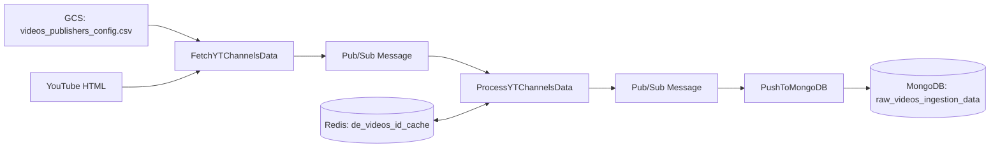

# YouTube Videos Ingestion -- Database Schema

## MongoDB

### Collection: `ingestion-data.raw_videos_ingestion_data`

| Field | Type | Required | Description |
|---|---|---|---|
| `_id` | ObjectId | Yes | MongoDB auto-generated document ID |
| `video_id` | string | Yes | YouTube video identifier |
| `title` | string | Yes | Video title extracted from YouTube |
| `published_time` | datetime | Yes | Publication time converted to IST |
| `duration` | string | Yes | Video duration (e.g., `"12:34"` or `"1:02:34"`) |
| `width` | integer | No | Primary thumbnail width in pixels |
| `height` | integer | No | Primary thumbnail height in pixels |
| `orientation` | string | Yes | `landscape`, `portrait`, or `square` |
| `thumbnails` | object | Yes | Map of size keys to thumbnail URLs |
| `thumbnails.default` | string | No | 120x90 thumbnail URL |
| `thumbnails.mqdefault` | string | No | 320x180 thumbnail URL |
| `thumbnails.hqdefault` | string | No | 480x360 thumbnail URL |
| `thumbnails.sddefault` | string | No | 640x480 thumbnail URL |
| `thumbnails.maxresdefault` | string | No | 1280x720 thumbnail URL |
| `channel_id` | string | Yes | YouTube channel identifier |
| `publisher` | object | Yes | Publisher metadata from config CSV |
| `category` | string | Yes | Content category |
| `language` | string | Yes | Content language |
| `to_scrape` | boolean | Yes | Whether the video was flagged for scraping |
| `hls_manifest_url` | string | No | HLS manifest URL (present when `to_scrape=True`) |
| `ingestion_timestamp` | datetime | Yes | Timestamp when the record was written to MongoDB |

### Indexes (Recommended)

| Index | Fields | Type | Purpose |
|---|---|---|---|
| Primary | `_id` | Unique | Default MongoDB primary key |
| Video lookup | `video_id` | Unique | Fast lookup by YouTube video ID |
| Recency query | `published_time` | Descending | Support time-range queries |
| Category + Language | `category`, `language` | Compound | Support filtered queries |

## Redis

### Cache: `de_videos_id_cache`

| Attribute | Value |
|---|---|
| Purpose | Deduplication of video records across pipeline runs |
| Key format | `{video_id}_{category}_{language}` |
| Value | Set/flag indicating record has been processed |
| TTL | 48 hours (172,800 seconds) |
| Eviction | TTL-based automatic expiry |

### Key Examples

```
dQw4w9WgXcQ_entertainment_English
abc123def_news_Hindi
xyz789_sports_Tamil
```

### Operational Notes

- The Redis cache is a deduplication layer only; it is not the system of record.
- If the Redis cache is flushed or a key expires, the same video may be re-ingested. This is acceptable as MongoDB can handle idempotent upserts.
- Cache key uses underscore (`_`) as delimiter. Video IDs containing underscores could theoretically cause key collisions, though YouTube video IDs typically use alphanumeric characters plus hyphens.

## GCS Objects

### Publisher Configuration

| Attribute | Value |
|---|---|
| Bucket | `de-raw-ingestion` |
| Path | `videos/videos_publishers_config.csv` |
| Encoding | ISO-8859-1 |
| Format | CSV with headers |

Expected CSV columns include (at minimum):

| Column | Type | Description |
|---|---|---|
| `channel_id` | string | YouTube channel identifier |
| `publisher_name` | string | Display name of the publisher |
| `category` | string | Content category |
| `language` | string | Content language |
| `to_scrape` | boolean | Scraping flag (`True`/`False`) |

## Data Lineage


