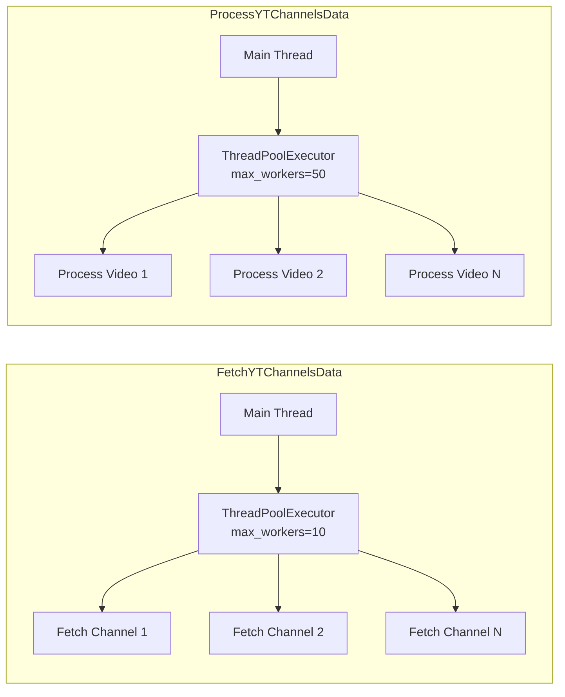

# YouTube Videos Ingestion -- Technical Specification

## Runtime Environment

| Attribute | Value |
|---|---|
| Platform | Google Cloud Functions |
| GCP Project | `jiox-328108` (Project Number: `266686822828`) |
| Language | Python |
| Trigger types | HTTP (scheduler), Pub/Sub background, Pub/Sub CloudEvent |

## Function Specifications

### FetchYTChannelsData

| Attribute | Value |
|---|---|
| Entry point | `main(req_ph, req_ph2)` |
| Trigger | Cloud Scheduler via HTTP |
| Concurrency | `ThreadPoolExecutor(max_workers=10)` |
| Timeout (scrape) | 5 seconds per channel page |

**Processing Logic:**

1. Read publisher config CSV from GCS bucket `de-raw-ingestion` at path `videos/videos_publishers_config.csv` using ISO-8859-1 encoding.
2. For each publisher row, construct the YouTube channel URL: `https://www.youtube.com/channel/{channel_id}/videos`.
3. Issue an HTTP GET request with a 5-second timeout.
4. Parse the HTML response using BeautifulSoup.
5. Locate the `ytInitialData` JavaScript variable in the page source.
6. Parse the extracted JSON and apply JSONPath `$..videoRenderer` to collect all video renderer objects.
7. Package the video renderers with publisher config metadata.
8. Publish to Pub/Sub topic `NewRawVideosIngestion_publishers_channel_data`.

**Error Handling:**
- HTTP timeout (5s): Channel is skipped; no retry at this level.
- HTML parsing failure: Channel is skipped.
- Missing `ytInitialData`: Channel produces zero results (no error raised).

### ProcessYTChannelsData

| Attribute | Value |
|---|---|
| Entry point | `main(message, context)` |
| Trigger | Pub/Sub background (message from `NewRawVideosIngestion_publishers_channel_data`) |
| Concurrency | `ThreadPoolExecutor(max_workers=50)` |

**Processing Logic:**

1. Decode the Pub/Sub message containing scraped channel data.
2. For each `videoRenderer` object, extract:
   - `video_id`: from `videoRenderer.videoId`
   - `title`: from `videoRenderer.title.runs[0].text`
   - `published_time`: from `videoRenderer.publishedTimeText.simpleText` (relative time string)
   - `duration`: from `videoRenderer.lengthText.simpleText`
   - `width`, `height`: from thumbnail dimensions
   - `orientation`: computed as `landscape` if width > height, `portrait` if height > width, `square` otherwise
3. Convert `published_time` from relative format (e.g., "3 hours ago", "1 day ago") to an absolute IST datetime.
4. Apply the 24-hour recency filter: discard if `published_time` is older than `now_IST - 24 hours`.
5. Construct the Redis deduplication key: `{video_id}_{category}_{language}`.
6. Check Redis cache `de_videos_id_cache` for key existence.
7. If the key exists, skip the record (duplicate).
8. If the key does not exist, set the key with a 48-hour TTL.
9. Build thumbnail URL map using pattern `https://i.ytimg.com/vi/{video_id}/{size}.jpg` for all five sizes.
10. Route based on `to_scrape` flag:
    - `False`: Accumulate records and batch-publish to `NewRawVideosIngestion_processed_data`.
    - `True`: Attach HLS manifest URLs from `vcdn.jionews.com` and publish each record individually to `NewRawYoutubeScraper_metadata`.

**Relative Time Parsing:**

The `published_time` field from YouTube is a human-readable relative time string. The function parses patterns such as:
- "X minutes ago"
- "X hours ago"
- "X days ago"
- "Streamed X hours ago"

These are converted to absolute timestamps in IST (UTC+5:30).

### PushToMongoDB

| Attribute | Value |
|---|---|
| Entry point | `write_to_mongodb(cloud_event)` |
| Trigger | Pub/Sub CloudEvent |

**Processing Logic:**

1. Decode the CloudEvent payload containing processed video data.
2. Construct a MongoDB document from the payload.
3. Insert the document into `ingestion-data.raw_videos_ingestion_data`.

## Pub/Sub Topic Configuration

| Topic | Publisher | Subscriber | Publish Mode |
|---|---|---|---|
| `NewRawVideosIngestion_publishers_channel_data` | FetchYTChannelsData | ProcessYTChannelsData | Per-channel batch |
| `NewRawVideosIngestion_processed_data` | ProcessYTChannelsData | Downstream consumers | Batch (to_scrape=False) |
| `NewRawYoutubeScraper_metadata` | ProcessYTChannelsData | PushToMongoDB | Per-record (to_scrape=True) |

## Key Libraries and Dependencies

| Library | Purpose |
|---|---|
| `beautifulsoup4` | HTML parsing of YouTube channel pages |
| `requests` | HTTP client for YouTube scraping |
| `jsonpath-ng` or equivalent | JSONPath query on `ytInitialData` |
| `google-cloud-pubsub` | Pub/Sub publishing |
| `google-cloud-storage` | GCS client for config CSV |
| `redis` | Redis client for deduplication cache |
| `pymongo` | MongoDB client |
| `concurrent.futures` | ThreadPoolExecutor for concurrent processing |

## Thumbnail URL Construction

```python
THUMBNAIL_SIZES = {
    "default": "default",        # 120x90
    "mqdefault": "mqdefault",    # 320x180
    "hqdefault": "hqdefault",    # 480x360
    "sddefault": "sddefault",    # 640x480
    "maxresdefault": "maxresdefault"  # 1280x720
}

def build_thumbnail_urls(video_id: str) -> dict:
    base = f"https://i.ytimg.com/vi/{video_id}"
    return {key: f"{base}/{val}.jpg" for key, val in THUMBNAIL_SIZES.items()}
```

## HLS Manifest URL Pattern (to_scrape=True)

For videos with `to_scrape=True`, HLS manifest URLs are constructed referencing `vcdn.jionews.com`. The exact path construction depends on the video ID and CDN routing logic.

## Concurrency Model



## Error Handling Strategy

| Error | Function | Handling |
|---|---|---|
| HTTP timeout (5s) | FetchYTChannelsData | Channel skipped, continue to next |
| HTML parse failure | FetchYTChannelsData | Channel skipped, logged |
| Missing ytInitialData | FetchYTChannelsData | Zero results for channel, no error |
| Invalid relative time | ProcessYTChannelsData | Record skipped |
| Redis connection failure | ProcessYTChannelsData | Function may fail; Pub/Sub retries |
| MongoDB write failure | PushToMongoDB | Function fails; Pub/Sub retries message |
| Pub/Sub publish failure | Any | Exception raised; Cloud Function reports error |

## Security Considerations

- YouTube scraping uses public channel pages with no authentication.
- GCS access uses the Cloud Function's default service account.
- Redis and MongoDB connections use credentials managed via GCP IAM or Secret Manager.
- No sensitive data (API keys, tokens) is stored in the publisher config CSV.
