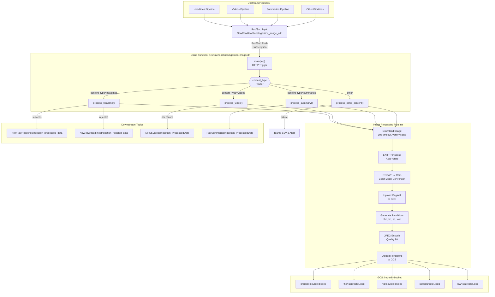
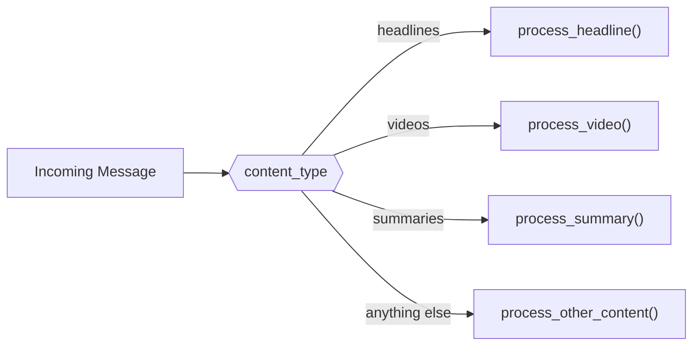
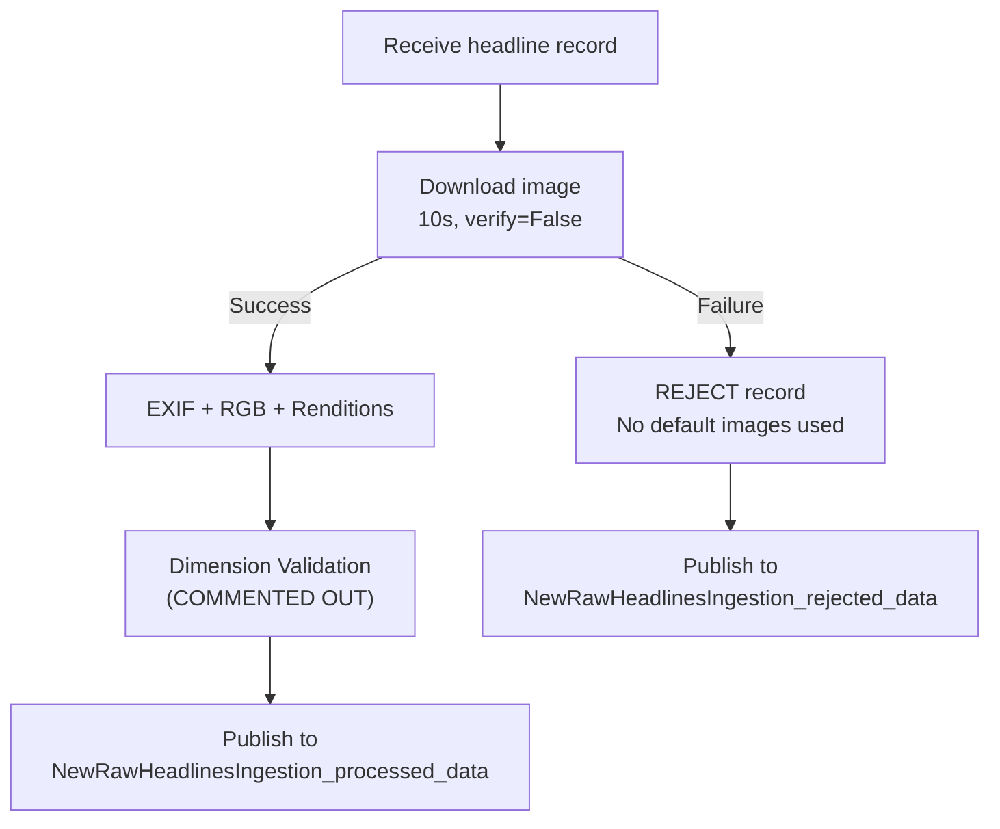
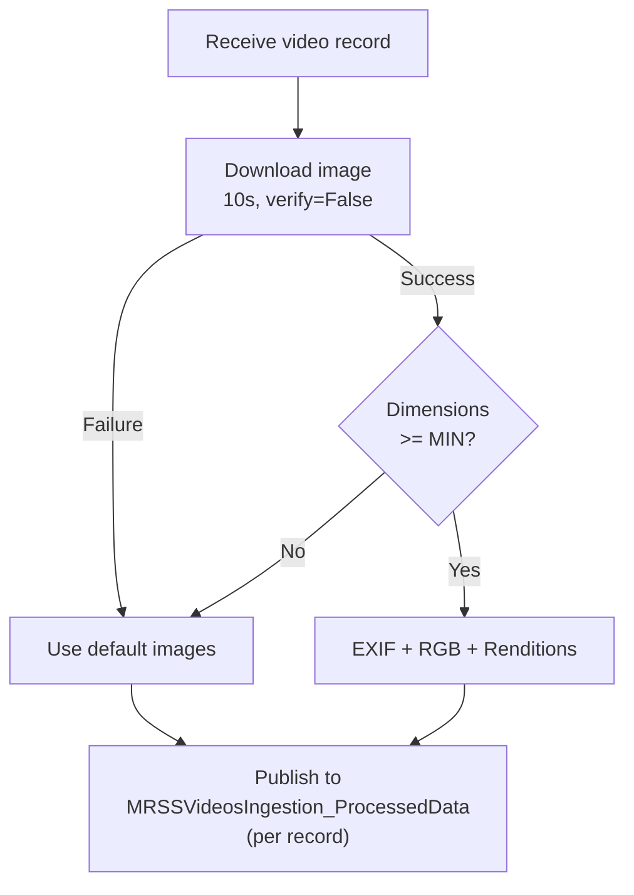
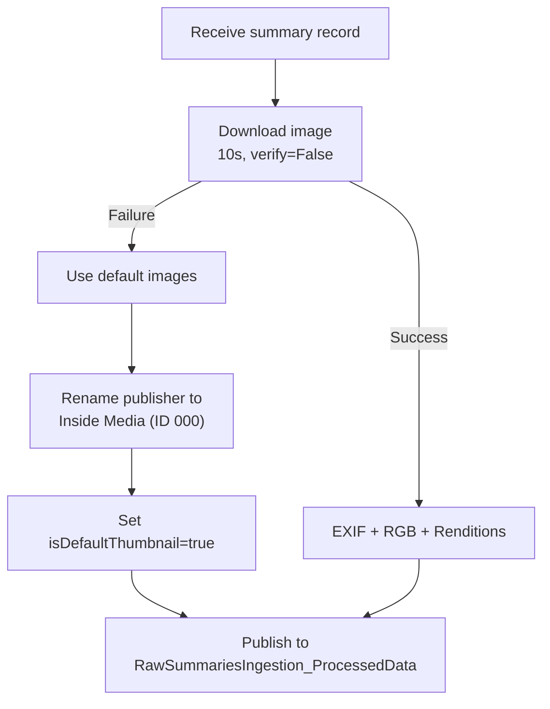

# Image CDN -- AS-IS State

> **Document Classification:** SHARED COMPONENT -- Current State Specification
> **Component:** `newrawheadlinesingestion-imagecdn` (Cloud Function)
> **GCP Project:** `jiox-328108` (Project Number: `266686822828`)
> **Last Updated:** 2026-03-10
> **Version:** 1.0.0

---

## Overview

The Image CDN is a shared Cloud Function that serves as the centralized image processing layer for the JioNews DE platform. It handles thumbnail download, validation, rendition generation, and CDN upload for four content types: **Headlines**, **Videos**, **Summaries**, and **Shorts**.

**Deployment Note:** Identical copies of this function's source code exist in multiple pipeline directories (headlines, videos, summaries), but they all deploy as a single Cloud Function named `newrawheadlinesingestion-imagecdn`. This is a critical architectural detail -- changes must be synchronized across all copies.

---

## Architecture



---

## Entry Point

| Attribute | Value |
|---|---|
| **Function Name** | `newrawheadlinesingestion-imagecdn` |
| **Entry Point** | `main(req)` |
| **Trigger Type** | HTTP (Pub/Sub push subscription) |
| **Input Topic** | `NewRawHeadlinesIngestion_image_cdn` |
| **Runtime** | Python (Cloud Functions) |

The function receives HTTP POST requests from a Pub/Sub push subscription. The request body contains the Pub/Sub message with a base64-encoded data payload. The payload is decoded and parsed as JSON to extract the content record and its `content_type` field.

---

## Content-Type Dispatch

The `content_type` field in the incoming message determines the processing path:



| content_type | Handler | Download Failure Behavior | Dimension Validation | Output Topic |
|---|---|---|---|---|
| `headlines` | `process_headline()` | Record REJECTED (no defaults) | COMMENTED OUT (disabled) | `NewRawHeadlinesIngestion_processed_data` or `_rejected_data` |
| `videos` | `process_video()` | Use default images; always passes | Dims < MIN thresholds -> use defaults | `MRSSVideosIngestion_ProcessedData` |
| `summaries` | `process_summary()` | Use default images | None | `RawSummariesIngestion_ProcessedData` |
| other | `process_other_content()` | Use default images + SEV-3 alert | None | None (alert only) |

---

## Image Processing Pipeline

### Step-by-Step Flow

1. **Download** source thumbnail image from `sourceThumbnailURL`
   - Timeout: 10 seconds
   - SSL verification: `verify=False` (disabled)
   - Warning suppression: `InsecureRequestWarning` suppressed
2. **EXIF Transpose** using `ImageOps.exif_transpose()` to auto-rotate based on EXIF orientation metadata
3. **Color Mode Conversion**: If image mode is `RGBA` or `P`, convert to `RGB`
4. **Upload Original**: Upload the source-resolution image to GCS
5. **Generate Renditions**: For each target size, create a resized copy using `thumbnail()` with `Image.Resampling.LANCZOS` resampling
6. **Encode**: Save each rendition as JPEG with quality 90
7. **Upload Renditions**: Upload all renditions to GCS

### Rendition Specifications

| Rendition | Width | Height | Aspect Ratio | GCS Path |
|---|---|---|---|---|
| `original` | Source | Source | Source | `original/{sourceId}.jpeg` |
| `fhd` | 1920 | 1080 | 16:9 | `fhd/{sourceId}.jpeg` |
| `hd` | 1280 | 720 | 16:9 | `hd/{sourceId}.jpeg` |
| `sd` | 720 | 480 | 3:2 | `sd/{sourceId}.jpeg` |
| `low` | 480 | 320 | 3:2 | `low/{sourceId}.jpeg` |

### CDN URL Generation

| Attribute | Value |
|---|---|
| **GCS Bucket** | `img-cdn-bucket` |
| **CDN Base URL** | `https://icdn.jionews.com` |
| **URL Pattern** | `https://icdn.jionews.com/{rendition}/{sourceId}.jpeg` |

Output `thumbnailUrls` object per record:

```json
{
  "original": "https://icdn.jionews.com/original/{sourceId}.jpeg",
  "fhd": "https://icdn.jionews.com/fhd/{sourceId}.jpeg",
  "hd": "https://icdn.jionews.com/hd/{sourceId}.jpeg",
  "sd": "https://icdn.jionews.com/sd/{sourceId}.jpeg",
  "low": "https://icdn.jionews.com/low/{sourceId}.jpeg"
}
```

---

## Content-Type Specific Behavior

### Headlines (`process_headline`)



- **Download failure**: Record is REJECTED. No default images are substituted.
- **Dimension validation**: Currently **COMMENTED OUT** in the source code. All images pass regardless of dimensions.
- **Output routing**: Success -> `NewRawHeadlinesIngestion_processed_data`, Rejection -> `NewRawHeadlinesIngestion_rejected_data`

### Videos (`process_video`)



- **Download failure**: Default images are used. Record always passes.
- **Dimension validation**: Active. Minimum thresholds enforced:
  - `MIN_SHORT_EDGE` = 480 pixels
  - `MIN_LONG_EDGE` = 720 pixels
  - If either dimension is below the minimum, default images are substituted
- **Output routing**: Always publishes to `MRSSVideosIngestion_ProcessedData` (published per individual record, not batched)

### Summaries (`process_summary`)



- **Download failure**: Default images are used.
- **Publisher rename**: When defaults are used, the publisher is renamed to `"Inside Media"` with publisher ID `"000"`.
- **Default flag**: `isDefaultThumbnail` is set to `true`.
- **Output routing**: Publishes to `RawSummariesIngestion_ProcessedData`

### Other Content Types (`process_other_content`)

- **Download failure**: Default images are used.
- **Alert**: A **SEV-3** alert is sent to the Microsoft Teams webhook (Office 365 Incoming Webhook connector).
- **No downstream Pub/Sub publish**: The function does not publish to any topic for unrecognized content types.

---

## Default Image System

When a source thumbnail cannot be downloaded or fails dimension validation, the system falls back to category-specific default images stored in GCS.

### Default Image GCS Path Pattern

```
gs://img-cdn-bucket/default/{category}/{rendition}/{category}_{n}.png
```

Example: `gs://img-cdn-bucket/default/latest_news/hd/latest_news_5.png`

### Default Image Pool Sizes

| Category | Number of Variants | Selection Method |
|---|---|---|
| `latest_news` | 22 (1-22) | Random selection |
| All other categories | 10 (1-10) | Random selection |

### Category Mapping (21 entries)

The `sourceCategoryName` field is mapped to a default image directory name:

| Source Category Name | Default Image Category |
|---|---|
| `Agro` | `agro` |
| `Astrology` | `astrology` |
| `Auto` | `automobile` |
| `Business` | `business` |
| `Money` | `business` |
| `Career` | `education` |
| `Entertainment` | `entertainment` |
| `Movie Reviews` | `entertainment` |
| `Health` | `health` |
| `Corona` | `health` |
| `National` | `india` |
| `Regional` | `india` |
| `World` | `international` |
| `Top News` | `latest_news` |
| `Top Stories` | `latest_news` |
| `news` | `latest_news` |
| `News` | `latest_news` |
| `Lifestyle` | `lifestyle` |
| `Fashion` | `lifestyle` |
| `Sci & Tech` | `sci_and_tech` |
| `Sports` | `sports` |
| `cricket` | `cricket` |

**Note:** Category mapping is case-sensitive. `"news"` and `"News"` are separate entries that both map to `latest_news`.

---

## Publishing Behavior

| Content Type | Output Topic | Publish Mode | Condition |
|---|---|---|---|
| Headlines (success) | `NewRawHeadlinesIngestion_processed_data` | Batch | Image processed successfully |
| Headlines (rejected) | `NewRawHeadlinesIngestion_rejected_data` | Batch | Image download failed |
| Videos | `MRSSVideosIngestion_ProcessedData` | Per record | Always (defaults used on failure) |
| Summaries | `RawSummariesIngestion_ProcessedData` | Batch | Always (defaults used on failure) |
| Other | None | N/A | SEV-3 Teams alert on failure |

---

## Alerting

| Attribute | Value |
|---|---|
| **Channel** | Microsoft Teams |
| **Connector Type** | Office 365 Incoming Webhook |
| **Severity** | SEV-3 |
| **Trigger Condition** | `content_type` not in `{headlines, videos, summaries}` |
| **Alert Content** | Content type identifier, failure details |

---

## Known Issues and Technical Debt

| ID | Issue | Severity | Impact |
|---|---|---|---|
| IMG-01 | Dimension validation is COMMENTED OUT for headlines | High | Oversized or undersized images pass through unchecked |
| IMG-02 | SSL verification disabled (`verify=False`) on all image downloads | Medium | Vulnerable to MITM attacks on image download |
| IMG-03 | Identical source code copies exist across multiple pipeline directories | Medium | Code drift risk; changes must be manually synchronized |
| IMG-04 | InsecureRequestWarning and UserWarning globally suppressed | Low | Legitimate warnings may be hidden |
| IMG-05 | Default image selection is random, not deterministic | Low | Same article could get different defaults across retries |
| IMG-06 | No image format validation before processing | Low | Corrupt or non-image files could cause processing errors |

---

## Integration Points

| System | Direction | Protocol | Purpose |
|---|---|---|---|
| Pub/Sub (`NewRawHeadlinesIngestion_image_cdn`) | Inbound | HTTP Push | Receive records for processing |
| Source thumbnail URLs | Outbound | HTTPS (no verify) | Download source images |
| GCS (`img-cdn-bucket`) | Outbound | GCS API | Upload renditions and read defaults |
| Pub/Sub (4 output topics) | Outbound | gRPC | Publish processed/rejected records |
| Microsoft Teams | Outbound | HTTPS Webhook | SEV-3 alerts for unknown content types |
