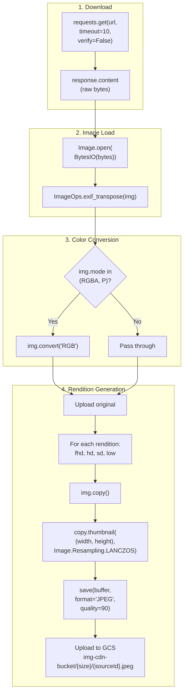

# Image CDN -- Technical Specification

> **Document Classification:** SHARED COMPONENT -- Technical Implementation Details
> **Component:** `newrawheadlinesingestion-imagecdn` (Cloud Function)
> **GCP Project:** `jiox-328108` (Project Number: `266686822828`)
> **Last Updated:** 2026-03-10
> **Version:** 1.0.0

---

## Runtime Environment

| Attribute | Value |
|---|---|
| **Platform** | Google Cloud Functions |
| **Runtime** | Python |
| **Entry Point** | `main` |
| **Trigger** | HTTP (Pub/Sub push subscription) |
| **Function Name** | `newrawheadlinesingestion-imagecdn` |

---

## Dependencies

### Python Libraries

| Library | Module(s) Used | Purpose |
|---|---|---|
| **Pillow (PIL)** | `PIL.Image`, `PIL.ImageOps` | Image loading, resizing, encoding, EXIF transpose |
| **requests** | `requests` | HTTP image download from publisher URLs |
| **google-cloud-pubsub** | `google.cloud.pubsub_v1` | Publishing processed/rejected records to downstream topics |
| **google-cloud-storage** | `google.cloud.storage` | Upload renditions to GCS, read default images |

### Warning Suppressions

| Warning | Module | Reason |
|---|---|---|
| `InsecureRequestWarning` | `urllib3.exceptions` | SSL verification is disabled (`verify=False`) on image downloads |
| `UserWarning` | `warnings` | Suppresses Pillow warnings for non-standard image formats |

---

## Image Processing Technical Details

### Pillow Configuration

| Setting | Value | Notes |
|---|---|---|
| **Resampling Algorithm** | `Image.Resampling.LANCZOS` | High-quality downsampling (formerly `ANTIALIAS`) |
| **Resize Method** | `thumbnail()` | In-place resize that preserves aspect ratio |
| **Output Format** | JPEG | All renditions saved as JPEG |
| **JPEG Quality** | 90 | Out of 100; high quality with reasonable compression |
| **EXIF Handling** | `ImageOps.exif_transpose()` | Auto-rotates based on EXIF orientation tag |
| **Color Modes** | `RGBA` -> `RGB`, `P` -> `RGB` | Converts non-standard modes before JPEG encoding |

### Processing Pipeline Detail

### Rendition Size Specifications

| Rendition | Target Width | Target Height | Behavior |
|---|---|---|---|
| `original` | Source width | Source height | No resize; source dimensions preserved |
| `fhd` | 1920 | 1080 | `thumbnail()` fits within bounding box, maintains aspect ratio |
| `hd` | 1280 | 720 | `thumbnail()` fits within bounding box, maintains aspect ratio |
| `sd` | 720 | 480 | `thumbnail()` fits within bounding box, maintains aspect ratio |
| `low` | 480 | 320 | `thumbnail()` fits within bounding box, maintains aspect ratio |

**Important:** `thumbnail()` resizes the image to fit within the specified bounding box while preserving the original aspect ratio. The resulting image may be smaller than the target dimensions in one axis. It never upscales -- if the source is smaller than the target, the source dimensions are preserved.

---

## Network Configuration

### Image Download

| Parameter | Value |
|---|---|
| **HTTP Method** | GET |
| **Timeout** | 10 seconds |
| **SSL Verification** | `verify=False` (disabled) |
| **User-Agent** | Default `requests` user-agent |
| **Max Retries** | None (single attempt) |
| **Redirect Following** | Default (enabled) |

### GCS Upload

| Parameter | Value |
|---|---|
| **Bucket** | `img-cdn-bucket` |
| **Path Pattern** | `{rendition}/{sourceId}.jpeg` |
| **Content Type** | `image/jpeg` |
| **Authentication** | IAM (Cloud Function service account) |

### Default Image Read

| Parameter | Value |
|---|---|
| **Bucket** | `img-cdn-bucket` |
| **Path Pattern** | `default/{category}/{rendition}/{category}_{n}.png` |
| **Content Type** | `image/png` (source), converted to JPEG on serve |

---

## Pub/Sub Integration

### Input

| Attribute | Value |
|---|---|
| **Topic** | `NewRawHeadlinesIngestion_image_cdn` |
| **Subscription Type** | Push |
| **Delivery** | HTTP POST to Cloud Function URL |
| **Message Format** | Base64-encoded JSON |
| **Acknowledgment** | HTTP 200 response from function |

### Output Topics

| Topic | Content Type | Publish Mode |
|---|---|---|
| `NewRawHeadlinesIngestion_processed_data` | Headlines (success) | Batch |
| `NewRawHeadlinesIngestion_rejected_data` | Headlines (failure) | Batch |
| `MRSSVideosIngestion_ProcessedData` | Videos | Per record |
| `RawSummariesIngestion_ProcessedData` | Summaries | Batch |

---

## Dimension Validation (Videos Only)

| Constant | Value | Description |
|---|---|---|
| `MIN_SHORT_EDGE` | 480 pixels | Minimum value for the shorter dimension |
| `MIN_LONG_EDGE` | 720 pixels | Minimum value for the longer dimension |

**Logic:** If the downloaded image's shorter edge < 480 OR longer edge < 720, the image is discarded and default images are substituted.

**Note:** For headlines, equivalent dimension validation code exists but is **commented out** in the current source.

---

## Alerting Configuration

| Attribute | Value |
|---|---|
| **Platform** | Microsoft Teams |
| **Connector** | Office 365 Incoming Webhook |
| **Trigger** | Unknown `content_type` in incoming message |
| **Severity** | SEV-3 |
| **Payload Format** | Teams Adaptive Card / MessageCard |
| **HTTP Method** | POST |

---

## Error Handling

| Error Scenario | Handling |
|---|---|
| Image download timeout (>10s) | Content-type-specific fallback (reject or default) |
| Image download HTTP error | Content-type-specific fallback (reject or default) |
| Invalid image format (Pillow cannot open) | Content-type-specific fallback (reject or default) |
| GCS upload failure | Unhandled; function may fail |
| Pub/Sub publish failure | Unhandled; function may fail |
| Unknown content_type | Default images + Teams SEV-3 alert |

---

## Performance Characteristics

| Metric | Estimated Value |
|---|---|
| **Image download latency** | 1-10 seconds per image |
| **EXIF transpose** | <10ms per image |
| **Rendition generation (4 sizes)** | 50-200ms per image (depends on source resolution) |
| **GCS upload (5 files)** | 100-500ms total |
| **Total per-record processing** | 1-11 seconds (dominated by download) |
