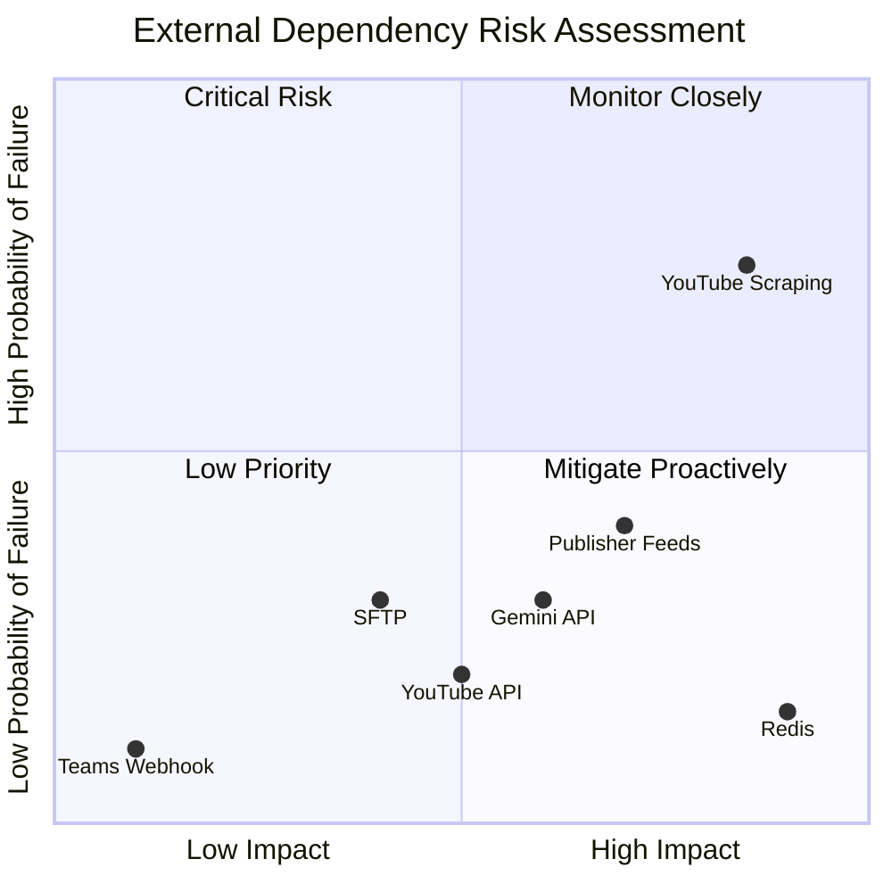

# External Dependencies

> **Document Classification:** INFRASTRUCTURE REGISTRY -- External APIs, Services, and Endpoints
> **GCP Project:** `jiox-328108` (Project Number: `266686822828`)
> **Last Updated:** 2026-03-10
> **Version:** 1.0.0

---

## Overview

The JioNews DE platform depends on external APIs, infrastructure services, CDN domains, and web scraping targets that are outside the GCP project boundary. This document catalogs all external dependencies, their consumers, and their operational characteristics.

---

## Architecture

```mermaid
flowchart TD
    subgraph Platform["JioNews DE Platform"]
        HL["Headlines"]
        SM["Summaries"]
        YV["YouTube Videos"]
        YS["YouTube Shorts"]
        MV["MRSS Videos"]
        IMG["Image CDN"]
        LLM["LLM Services"]
        TX["Transcoder"]
        JB["JioBharat"]
        RSS["RSS Feeds"]
    end

    subgraph APIs["External APIs"]
        YT_API["YouTube Data API v3"]
        GEMINI["Google Gemini API"]
        CPP["CPP/SAAS Transcoder API"]
        SCRAPER_PRI["Article Scraper\n(Primary)"]
        SCRAPER_FB["Article Scraper\n(Fallback)"]
        PROXY["Article Render Proxy"]
        TTS["TTS Service"]
    end

    subgraph Infra["Infrastructure Services"]
        REDIS["Redis\n34.93.131.211"]
        TEAMS["Microsoft Teams\nWebhook"]
        SFTP["SFTP Server\n(Transcoder)"]
    end

    subgraph CDN["CDN Domains"]
        ICDN["icdn.jionews.com"]
        VCDN["vcdn.jionews.com"]
        SCRAPER_CDN["service.jionews.com"]
        PROXY_CDN["jn-article-render-proxy"]
    end

    subgraph Scrape["Web Scraping Targets"]
        YT_WEB["youtube.com\n(channel pages)"]
        YT_SHORTS["youtube.com/shorts\n(short pages)"]
        PUB_FEEDS["Publisher RSS/JSON\nfeed URLs"]
        PUB_ARTICLES["Publisher article\nweb pages"]
    end

    YS --> YT_API
    LLM --> GEMINI
    TX --> CPP
    HL --> SCRAPER_PRI
    HL --> SCRAPER_FB
    LLM --> PROXY
    JB --> TTS

    HL --> REDIS
    SM --> REDIS
    YV --> REDIS
    MV --> REDIS
    IMG --> TEAMS
    TX --> SFTP

    IMG --> ICDN
    TX --> VCDN

    YV --> YT_WEB
    YS --> YT_SHORTS
    HL --> PUB_FEEDS
    SM --> PUB_FEEDS
    HL --> PUB_ARTICLES
```

---

## External APIs (7)

### 1. YouTube Data API v3

| Attribute | Value |
|---|---|
| **Provider** | Google |
| **Endpoint** | `https://www.googleapis.com/youtube/v3/videos` |
| **Authentication** | API key (Secret Manager: `yt_api_access_token`) |
| **Quota** | 10,000 units/day (default) |
| **Consumer** | YouTube Shorts Ingestion (`YouTubeAPIToMongoDB`) |
| **Operations** | `videos().list(part="snippet,contentDetails")` |
| **Batch Size** | Up to 50 video IDs per request |
| **Cost** | 1 quota unit per request |

**Usage:** Enriches video IDs discovered via web scraping with official metadata (title, description, duration, publishedAt, thumbnails). Used exclusively by the YouTube Shorts pipeline.

---

### 2. Google Gemini API

| Attribute | Value |
|---|---|
| **Provider** | Google |
| **Model** | `gemini-2.5-flash` |
| **Client** | `google.genai.Client(api_key=...)` |
| **Authentication** | API key (Secret Manager: `gemini_api_key`) |
| **Consumers** | `jionews-summarization-async`, `jionews-summarization` |
| **Tools** | `url_context` (allows Gemini to fetch web pages) |
| **Temperature** | 0 |
| **Retry** | 3 attempts with `2^attempt` second backoff on HTTP 503 |

**Usage:** Generates news article titles and summaries. The async service reprocesses hygiene-failed summaries. The sync service provides on-demand summarization for CMS.

---

### 3. CPP/SAAS Transcoder API

| Attribute | Value |
|---|---|
| **Provider** | CPP/SAAS (third-party transcoding service) |
| **Protocol** | HTTPS REST API + SFTP |
| **Authentication** | HMAC-based authentication |
| **Consumer** | Video Transcoder Workflow |
| **Operations** | Job submission, status polling, result retrieval |

**Usage:** Transcodes MP4 video files into HLS format (m3u8 + ts segments). Videos are uploaded via SFTP, transcoding is initiated via API, and status is polled until completion.

---

### 4. Article Scraper -- Primary (`service.jionews.com`)

| Attribute | Value |
|---|---|
| **Endpoint** | `https://service.jionews.com` |
| **Protocol** | HTTPS GET |
| **Authentication** | None |
| **Consumer** | Headlines Ingestion (`processheadlines`) |
| **Purpose** | Scrape article body text from publisher URLs |

**Usage:** Primary article body scraping service. Accepts a publisher article URL and returns the extracted article text, HTML, and word count.

---

### 5. Article Scraper -- Fallback (`34.36.231.72`)

| Attribute | Value |
|---|---|
| **Endpoint** | `http://34.36.231.72` |
| **Protocol** | HTTP POST (unencrypted) |
| **Authentication** | None |
| **Consumer** | Headlines Ingestion (`processheadlines`) |
| **Limitation** | English-only |

**Usage:** Fallback article body scraper used when the primary scraper fails. Only supports English-language articles. Uses unencrypted HTTP (known security issue H-02).

---

### 6. Article Render Proxy

| Attribute | Value |
|---|---|
| **Endpoint** | `https://jn-article-render-proxy-266686822828.asia-south1.run.app/proxy` |
| **Platform** | Cloud Run (`asia-south1`) |
| **Protocol** | HTTPS GET |
| **Authentication** | IAM (Cloud Run invoker) |
| **Timeout** | 45 seconds (sync service) |
| **Consumers** | `jionews-summarization-async`, `jionews-summarization` |

**Usage:** Headless browser-based article renderer. Used as a fallback when Gemini's `url_context` tool cannot access a publisher's article page directly. Fetches the rendered article text via a headless browser and returns it for LLM processing.

---

### 7. TTS (Text-to-Speech) Service

| Attribute | Value |
|---|---|
| **Consumer** | JioBharat Video Summaries pipeline |
| **Purpose** | Convert text summaries to audio for JioBharat video overlays |
| **Protocol** | HTTPS |

**Usage:** Generates audio narration from text summaries for the JioBharat pipeline, which combines video content with TTS-generated audio summaries.

---

## Infrastructure Services (3)

### 1. Redis

| Attribute | Value |
|---|---|
| **Host** | `34.93.131.211` |
| **Port** | `6379` |
| **Protocol** | Redis wire protocol (RESP) |
| **TLS** | Not configured |
| **Authentication** | Username/password (`default` / `developpd`) |
| **Consumers** | Headlines, Summaries, YouTube Videos, MRSS Videos, MRSS Shorts |

**Usage:** Centralized deduplication cache for all ingestion pipelines. Uses Sorted Sets with time-based expiration scores. See `../redis-caching/AS-IS.md` for full details.

---

### 2. Microsoft Teams (Webhook)

| Attribute | Value |
|---|---|
| **Protocol** | HTTPS POST |
| **Connector** | Office 365 Incoming Webhook |
| **Authentication** | Webhook URL (Secret Manager: `teams_webhook_url`) |
| **Consumer** | Image CDN Cloud Function |
| **Alert Level** | SEV-3 |

**Usage:** Receives operational alerts from the Image CDN function when an unrecognized `content_type` is encountered. Alert payload is sent as a Teams MessageCard/Adaptive Card.

---

### 3. SFTP Server (Transcoder)

| Attribute | Value |
|---|---|
| **Protocol** | SFTP |
| **Authentication** | Credentials from Secret Manager (`sftp_credentials`) |
| **Consumers** | Video Transcoder Workflow, JioBharat Video Summaries |

**Usage:** File transfer endpoint for the CPP/SAAS transcoder service. MP4 video files are uploaded via SFTP for HLS transcoding. The JioBharat pipeline also uses SFTP to upload TTS audio files.

---

## CDN Domains (4)

### 1. `icdn.jionews.com`

| Attribute | Value |
|---|---|
| **Type** | Image CDN |
| **Backend** | GCS `img-cdn-bucket` |
| **URL Pattern** | `https://icdn.jionews.com/{rendition}/{sourceId}.jpeg` |
| **Renditions** | `original`, `fhd`, `hd`, `sd`, `low` |
| **Consumers** | All downstream apps, RSS feeds, editorial tools |

**Usage:** Serves all processed thumbnail images for headlines, summaries, and videos. All `thumbnailUrls` objects in MongoDB documents reference this domain.

---

### 2. `vcdn.jionews.com`

| Attribute | Value |
|---|---|
| **Type** | Video CDN |
| **Backend** | GCS `vcdn-bucket` |
| **URL Pattern** | `https://vcdn.jionews.com/{video_id}/manifest.m3u8` |
| **Consumers** | YouTube Videos pipeline (HLS manifest references), downstream video players |

**Usage:** Serves HLS-transcoded video content (m3u8 playlists and ts segments) for native and scraped videos.

---

### 3. `service.jionews.com`

| Attribute | Value |
|---|---|
| **Type** | Article scraping service |
| **Protocol** | HTTPS |
| **Consumer** | Headlines Ingestion |

**Usage:** Primary article body extraction service endpoint. Not a CDN in the traditional sense, but a domain-fronted service for article scraping.

---

### 4. `jn-article-render-proxy-266686822828.asia-south1.run.app`

| Attribute | Value |
|---|---|
| **Type** | Article rendering proxy |
| **Platform** | Cloud Run |
| **Region** | `asia-south1` |
| **Consumer** | LLM Summarization services |

**Usage:** Cloud Run-hosted headless browser proxy for rendering article pages that are inaccessible to the Gemini `url_context` tool.

---

## Web Scraping Targets (4)

### 1. YouTube Channel Video Pages

| Attribute | Value |
|---|---|
| **URL Pattern** | `https://www.youtube.com/channel/{channel_id}/videos` |
| **Consumer** | YouTube Videos Ingestion (`FetchYTChannelsData`) |
| **Method** | HTTP GET |
| **Timeout** | 5 seconds |
| **Parsing** | BeautifulSoup -> `ytInitialData` -> JSONPath `$..videoRenderer` |
| **Concurrency** | `ThreadPoolExecutor(10)` |

---

### 2. YouTube Shorts Pages

| Attribute | Value |
|---|---|
| **URL Pattern** | `http://www.youtube.com/{custom_url}/shorts` |
| **Consumer** | YouTube Shorts Ingestion (`ScrapeVideoIds`) |
| **Method** | HTTP GET |
| **Timeout** | 5 seconds |
| **Parsing** | BeautifulSoup -> `ytInitialData` -> JSONPath `$..videoId` |
| **Validation** | GET `https://www.youtube.com/shorts/{video_id}` with `allow_redirects=False` (HTTP 200 confirms Short) |

---

### 3. Publisher RSS/JSON Feed URLs

| Attribute | Value |
|---|---|
| **URL Pattern** | Varies per publisher (configured in GCS CSV files) |
| **Consumers** | Headlines Ingestion, Summaries Ingestion |
| **Method** | HTTP GET |
| **Formats** | RSS/XML (parsed by `feedparser`), JSON (parsed by `json.loads()`) |
| **Concurrency** | `ThreadPoolExecutor(100)` (headlines) |
| **Feed Count** | Hundreds of feeds across multiple languages |

---

### 4. Publisher Article Web Pages

| Attribute | Value |
|---|---|
| **URL Pattern** | Varies per article (extracted from feed entries) |
| **Consumers** | Headlines Ingestion (via scrapers), LLM Summarization (via Gemini/proxy) |
| **Method** | HTTP GET (scrapers), Gemini `url_context` (LLM) |
| **Purpose** | Extract full article body text from publisher websites |

---

## Dependency Risk Matrix

| Dependency | Failure Impact | Mitigation |
|---|---|---|
| YouTube web scraping | Pipeline produces zero results | No fallback; relies on stable YouTube HTML structure |
| Publisher RSS/JSON feeds | Individual publishers produce zero results | Per-publisher; other publishers unaffected |
| Gemini API | Summarization fails | Two-pass strategy with proxy fallback; 3-retry with backoff |
| YouTube Data API v3 | Shorts enrichment fails | Quota monitoring; batching at 50 IDs per call |
| Redis | All dedup fails; temporary duplicates | Single instance; no replication (known risk RD-03) |
| SFTP (Transcoder) | Video transcoding halts | Retry logic in transcoder workflow |
| Teams Webhook | Alerts not delivered | Non-critical; only SEV-3 alerts for unknown content types |

---

## Operational Notes

- YouTube scraping targets are the highest-risk dependency due to HTML structure fragility
- All publisher feed URLs are externally controlled and can change without notice
- The Gemini API `url_context` tool may be blocked by publisher paywalls or anti-bot measures (mitigated by proxy fallback)
- Rate limiting must be respected for all external APIs per the Constitution (Article 4, Section 4.3)
- The fallback article scraper uses unencrypted HTTP -- this is a known security issue
