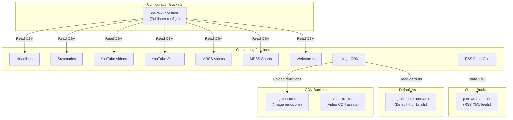

# GCS Registry

> **Document Classification:** INFRASTRUCTURE REGISTRY -- Google Cloud Storage Buckets
> **GCP Project:** `jiox-328108` (Project Number: `266686822828`)
> **Last Updated:** 2026-03-10
> **Version:** 1.0.0

---

## Overview

Google Cloud Storage (GCS) is used across the JioNews DE platform for three purposes: publisher feed configuration storage, image CDN asset hosting, and RSS feed output distribution. The platform currently uses 5 GCS buckets.

---

## Architecture

---

## Bucket Registry

### 1. `de-raw-ingestion`

| Attribute | Value |
|---|---|
| **Purpose** | Publisher feed configuration storage |
| **Access Pattern** | Read-only by pipeline functions |
| **CDN Fronted** | No |

#### Path Patterns

| Path | Format | Encoding | Consumer Pipeline |
|---|---|---|---|
| `headlines/headlines_publishers_feeds.csv` | CSV | UTF-8 | Headlines Ingestion |
| `summaries/summaries_publishers_feeds.csv` | CSV | UTF-8 | Summaries Ingestion |
| `videos/videos_publishers_config.csv` | CSV | ISO-8859-1 | YouTube Videos Ingestion |
| `shorts/shorts_publishers.csv` | CSV | ISO-8859-1 | YouTube Shorts Ingestion |
| `mrss-videos/mrss_videos_publishers.csv` | CSV | UTF-8 | MRSS Videos Ingestion |
| `mrss-shorts/mrss_shorts_publishers.csv` | CSV | UTF-8 | MRSS Shorts Ingestion |
| `webstories/webstories_publishers.csv` | CSV | UTF-8 | Webstories Ingestion |

#### File Structure

All CSV files contain publisher-level configuration with columns including:
- Publisher name, ID
- Feed URL / Channel URL / API endpoint
- Language ID, language name
- Category ID, category name
- Pipeline-specific flags (e.g., `to_scrape`, `feed_type`)

---

### 2. `img-cdn-bucket`

| Attribute | Value |
|---|---|
| **Purpose** | Image CDN storage for all content thumbnails |
| **Access Pattern** | Write by Image CDN function; Read via CDN |
| **CDN Base URL** | `https://icdn.jionews.com` |
| **CDN Provider** | Fronted by CDN (maps to bucket paths) |

#### Path Patterns -- Processed Images

| Path Pattern | Description | Content Type |
|---|---|---|
| `original/{sourceId}.jpeg` | Source resolution image | `image/jpeg` |
| `fhd/{sourceId}.jpeg` | 1920x1080 rendition | `image/jpeg` |
| `hd/{sourceId}.jpeg` | 1280x720 rendition | `image/jpeg` |
| `sd/{sourceId}.jpeg` | 720x480 rendition | `image/jpeg` |
| `low/{sourceId}.jpeg` | 480x320 rendition | `image/jpeg` |

#### Path Patterns -- Default Images

| Path Pattern | Description | Content Type |
|---|---|---|
| `default/{category}/{rendition}/{category}_{n}.png` | Category-specific default thumbnails | `image/png` |

Where:
- `{category}` is one of: `agro`, `astrology`, `automobile`, `business`, `education`, `entertainment`, `health`, `india`, `international`, `latest_news`, `lifestyle`, `sci_and_tech`, `sports`, `cricket`
- `{rendition}` is one of: `original`, `fhd`, `hd`, `sd`, `low`
- `{n}` is a numeric variant (1-22 for `latest_news`, 1-10 for all others)

---

### 3. `vcdn-bucket`

| Attribute | Value |
|---|---|
| **Purpose** | Video CDN storage for HLS transcoded video assets |
| **Access Pattern** | Write by Transcoder Workflow; Read via CDN |
| **CDN Base URL** | `https://vcdn.jionews.com` |

#### Path Patterns

| Path Pattern | Description |
|---|---|
| `{video_id}/manifest.m3u8` | HLS master playlist |
| `{video_id}/{quality}/segment_{n}.ts` | HLS video segments |

---

### 4. `jionews-rss-feeds`

| Attribute | Value |
|---|---|
| **Purpose** | RSS/XML feed output for downstream consumers |
| **Access Pattern** | Write by RSS Feed Generation pipeline; Read by external consumers |
| **CDN Fronted** | Yes (external consumer access) |

#### Path Patterns

| Path Pattern | Description |
|---|---|
| `feeds/{language}/{category}/rss.xml` | Language + category-specific RSS feed |
| `feeds/{language}/all/rss.xml` | Language-wide aggregated RSS feed |

---

### 5. SFTP Staging (Transcoder Workflow)

| Attribute | Value |
|---|---|
| **Purpose** | Temporary staging for video files before SFTP upload to transcoder |
| **Access Pattern** | Write by download step; Read by SFTP upload step; Delete after upload |

#### Path Patterns

| Path Pattern | Description |
|---|---|
| `transcoder-staging/{video_id}.mp4` | Temporary MP4 file awaiting SFTP upload |

---

## CDN Domain Mapping

| CDN Domain | GCS Bucket | Content Type |
|---|---|---|
| `https://icdn.jionews.com` | `img-cdn-bucket` | Image renditions (JPEG) |
| `https://vcdn.jionews.com` | `vcdn-bucket` | HLS video assets |

---

## Access Control

| Bucket | Read Access | Write Access |
|---|---|---|
| `de-raw-ingestion` | Pipeline Cloud Functions (IAM) | Manual upload / CI-CD |
| `img-cdn-bucket` | CDN (public read) | Image CDN Cloud Function (IAM) |
| `vcdn-bucket` | CDN (public read) | Transcoder Workflow (IAM) |
| `jionews-rss-feeds` | External consumers (public read) | RSS Feed Generation (IAM) |

---

## Operational Notes

- All bucket operations use the `google-cloud-storage` Python client library
- Authentication is via Cloud Function / Cloud Run service account IAM bindings
- No lifecycle policies are documented for automatic object deletion
- Publisher config CSVs in `de-raw-ingestion` are critical configuration -- modifications require human approval per the Constitution (Article 6, Section 6.1)
