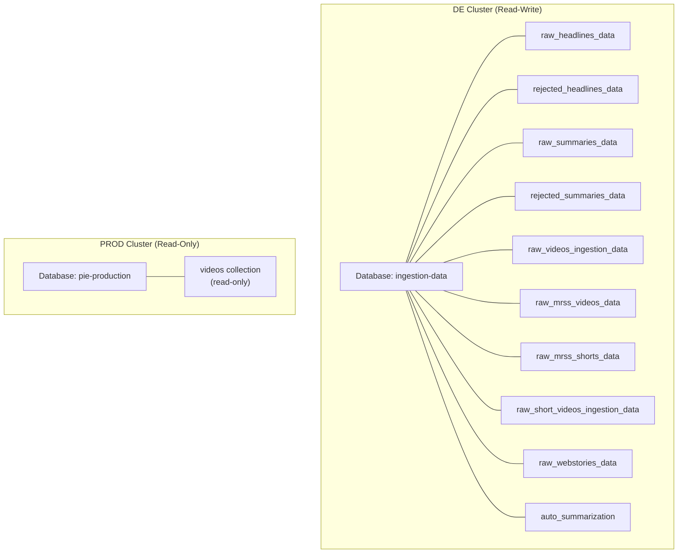
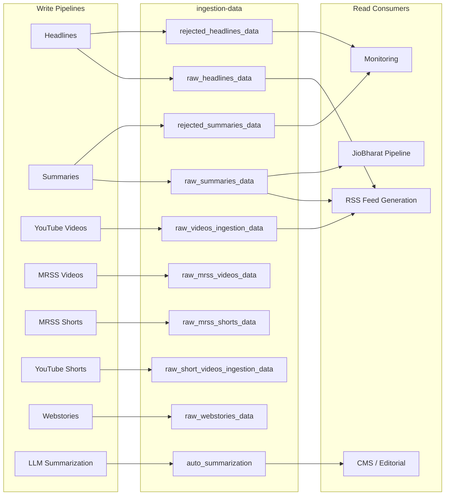

# MongoDB Registry

> **Document Classification:** INFRASTRUCTURE REGISTRY -- MongoDB Collections
> **GCP Project:** `jiox-328108` (Project Number: `266686822828`)
> **Last Updated:** 2026-03-10
> **Version:** 1.0.0

---

## Overview

The JioNews DE platform uses two MongoDB Atlas clusters for data persistence. The DE cluster is the primary read-write data store for all ingestion pipelines. The PROD cluster is accessed read-only for downstream consumption by the JioBharat pipeline.

---

## Cluster Registry

### DE Cluster

| Attribute | Value |
|---|---|
| **URI Source** | GCP Secret Manager: `projects/266686822828/secrets/mongosh_de_uri/versions/latest` |
| **Access Mode** | Read-Write |
| **Database** | `ingestion-data` |
| **Consumers** | All ingestion pipelines, LLM services, RSS feed generation |

### PROD Cluster

| Attribute | Value |
|---|---|
| **URI Source** | Base64-encoded in JioBharat pipeline source code |
| **Access Mode** | Read-Only |
| **Database** | `pie-production` |
| **Consumers** | JioBharat Video Summaries pipeline only |

---

## Collection Registry

### 1. `raw_headlines_data`

| Attribute | Value |
|---|---|
| **Database** | `ingestion-data` |
| **Pipeline** | Headlines Ingestion |
| **Written By** | `PushToMongoDB` Cloud Function |
| **Read By** | RSS Feed Generation, downstream consumers |
| **Operation** | Insert (batch) |
| **Purpose** | Stores successfully processed headline records with CDN image URLs |

**Key Fields:**

| Field | Type | Description |
|---|---|---|
| `sourceId` | string | Unique record identifier (generated via `bson.ObjectId()`) |
| `title` | string | Article headline |
| `url` | string | Article URL with UTM parameters |
| `sourcePublishDate` | integer | Publisher's original publish date (Unix epoch) |
| `thumbnailUrls` | object | CDN URLs for all 5 image renditions |
| `sourceThumbnailURL` | string | Original source thumbnail URL |
| `sourceLanguageId` | string | Language code |
| `sourceCategoryId` | string | Category code |
| `sourcePublisherId` | string | Publisher identifier |
| `articleBody` | string | Cleaned article body text |
| `createdAt` | integer | Pipeline processing timestamp (Unix epoch) |

---

### 2. `rejected_headlines_data`

| Attribute | Value |
|---|---|
| **Database** | `ingestion-data` |
| **Pipeline** | Headlines Ingestion |
| **Written By** | `rejected-pushtomongo` Cloud Function |
| **Read By** | Monitoring, debugging |
| **Operation** | Insert (batch) |
| **Purpose** | Stores headline records that failed image processing |

**Additional Fields (beyond base headline schema):**

| Field | Type | Description |
|---|---|---|
| `rejectionReason` | string | Human-readable rejection reason |
| `rejectedAt` | integer | Epoch timestamp of rejection |

---

### 3. `raw_summaries_data`

| Attribute | Value |
|---|---|
| **Database** | `ingestion-data` |
| **Pipeline** | Summaries Ingestion |
| **Written By** | Summaries `PushToMongoDB` Cloud Function |
| **Read By** | RSS Feed Generation, JioBharat pipeline, downstream consumers |
| **Operation** | Insert (batch) |
| **Purpose** | Stores successfully processed summary records |

**Key Fields:**

| Field | Type | Description |
|---|---|---|
| `sourceId` | string | Unique record identifier |
| `title` | string | Summary title |
| `sourceDescription` | string | Summary body text |
| `url` | string | Article URL |
| `thumbnailUrls` | object | CDN URLs for image renditions |
| `isDefaultThumbnail` | boolean | Whether a default image was used |
| `sourcePublisherId` | string | Publisher identifier |
| `sourcePublisherName` | string | Publisher name (may be renamed to "Inside Media") |

---

### 4. `rejected_summaries_data`

| Attribute | Value |
|---|---|
| **Database** | `ingestion-data` |
| **Pipeline** | Summaries Ingestion |
| **Written By** | Summaries rejection handler |
| **Read By** | Async Summarization (LLM reprocessing), monitoring |
| **Operation** | Insert |
| **Purpose** | Stores summary records that failed hygiene validation |

---

### 5. `raw_videos_ingestion_data`

| Attribute | Value |
|---|---|
| **Database** | `ingestion-data` |
| **Pipeline** | YouTube Videos Ingestion |
| **Written By** | `PushToMongoDB` Cloud Function (CloudEvent trigger) |
| **Read By** | RSS Feed Generation, downstream consumers |
| **Operation** | Insert (batch, `ordered=False`) |
| **Purpose** | Stores YouTube video metadata records |

**Key Fields:**

| Field | Type | Description |
|---|---|---|
| `sourceVideoId` | string | YouTube video identifier |
| `title` | string | Video title |
| `published_time` | string (ISO 8601) | Publication time in IST |
| `duration` | string | Video duration |
| `thumbnails` | object | Map of thumbnail size to URL |
| `orientation` | string | `landscape`, `portrait`, or `square` |

---

### 6. `raw_mrss_videos_data`

| Attribute | Value |
|---|---|
| **Database** | `ingestion-data` |
| **Pipeline** | Native Videos Ingestion (MRSS) |
| **Written By** | MRSS Videos processing pipeline |
| **Read By** | Video Transcoder Workflow, RSS Feed Generation |
| **Operation** | Insert / Upsert |
| **Purpose** | Stores native video metadata from MRSS feeds |

**Key Fields:**

| Field | Type | Description |
|---|---|---|
| `sourceId` | string | Unique record identifier |
| `title` | string | Video title |
| `link` | string | Source video URL |
| `thumbnailUrls` | object | CDN image rendition URLs |
| `sourceCategoryId` | string | Category code |
| `sourceLanguageId` | string | Language code |

---

### 7. `raw_mrss_shorts_data`

| Attribute | Value |
|---|---|
| **Database** | `ingestion-data` |
| **Pipeline** | Native Shorts Ingestion (MRSS) |
| **Written By** | MRSS Shorts processing pipeline |
| **Read By** | Downstream consumers |
| **Operation** | Insert / Upsert |
| **Purpose** | Stores native short video metadata from MRSS feeds |

**Key Fields:** Same structure as `raw_mrss_videos_data` with short-form video constraints.

---

### 8. `raw_short_videos_ingestion_data`

| Attribute | Value |
|---|---|
| **Database** | `ingestion-data` |
| **Pipeline** | YouTube Shorts Ingestion |
| **Written By** | `YouTubeAPIToMongoDB` Cloud Function |
| **Read By** | Downstream consumers |
| **Operation** | `insert_many(ordered=False)` |
| **Purpose** | Stores YouTube Shorts metadata enriched via YouTube Data API v3 |

**Key Fields:**

| Field | Type | Description |
|---|---|---|
| `sourceVideoId` | string | YouTube video identifier (used for dedup) |
| `title` | string | Short video title |
| `publishedAt` | string (ISO 8601) | Publication timestamp |
| `duration` | integer | Duration in seconds (0-60) |
| `sourceVideoWidth` | integer | Always 1080 (hardcoded portrait) |
| `sourceVideoHeight` | integer | Always 1920 (hardcoded portrait) |
| `sourceVideoOrientation` | string | Always `"portrait"` |
| `src` | string | Always `"youtube"` |

---

### 9. `raw_webstories_data`

| Attribute | Value |
|---|---|
| **Database** | `ingestion-data` |
| **Pipeline** | Webstories Ingestion |
| **Written By** | Webstories processing pipeline |
| **Read By** | Downstream consumers |
| **Operation** | Insert |
| **Purpose** | Stores web story metadata and content |

---

### 10. `auto_summarization`

| Attribute | Value |
|---|---|
| **Database** | `ingestion-data` |
| **Pipeline** | Sync Summarization (LLM) |
| **Written By** | `jionews-summarization` Cloud Run service |
| **Read By** | CMS, editorial tools |
| **Operation** | Upsert |
| **Purpose** | Stores on-demand LLM-generated summaries |

**Key Fields:**

| Field | Type | Description |
|---|---|---|
| `title` | string | LLM-generated title |
| `summary` | string | LLM-generated summary (350-360 chars) |
| `compliance_score` | integer | LLM self-assessed quality (0-100) |
| `processingSource` | string | `"publisher_url"`, `"publisher_content"`, or `"proxy_url"` |

---

### 11. PROD: `pie-production.videos`

| Attribute | Value |
|---|---|
| **Database** | `pie-production` |
| **Cluster** | PROD (read-only from DE perspective) |
| **Pipeline** | JioBharat Video Summaries (read-only consumer) |
| **Read By** | JioBharat pipeline for video metadata lookup |
| **Write Access** | None from DE pipelines |
| **Purpose** | Production video catalog used for TTS summary generation |

---

## Access Patterns

---

## Security Notes

- The DE cluster URI is stored in GCP Secret Manager and should NEVER be logged, printed, or exposed
- The PROD cluster URI is base64-encoded in source code (technical debt -- should be migrated to Secret Manager)
- AI agents operate under READ-ONLY access per the Constitution (Article 1, Section 1.2)
- Write operations require explicit human approval per the Constitution
