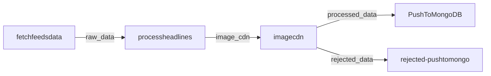
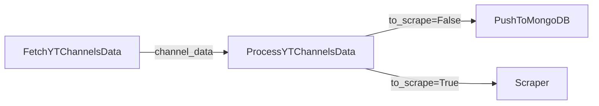
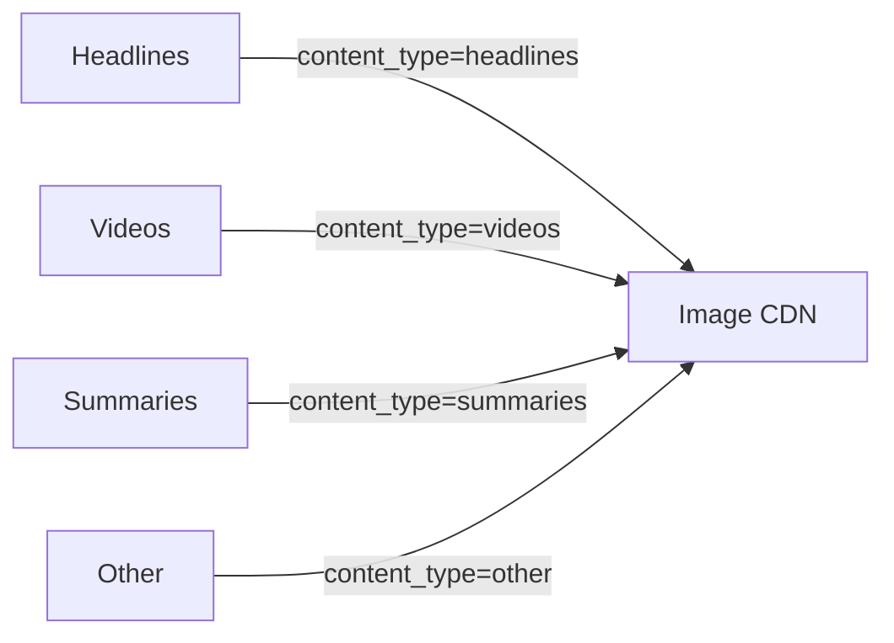

# Pub/Sub Registry

> **Document Classification:** INFRASTRUCTURE REGISTRY -- Pub/Sub Topics & Subscriptions
> **GCP Project:** `jiox-328108` (Project Number: `266686822828`)
> **Last Updated:** 2026-03-10
> **Version:** 1.0.0

---

## Overview

Google Cloud Pub/Sub is the primary inter-function messaging backbone for the JioNews DE platform. All pipelines use Pub/Sub topics to decouple processing stages, enabling independent scaling and fault isolation. The platform currently manages 23 topics across 11 pipelines.

---

## Architecture

```mermaid
flowchart TD
    subgraph Headlines["Headlines Pipeline"]
        HT1["NewRawHeadlinesIngestion_raw_data"]
        HT2["NewRawHeadlinesIngestion_image_cdn"]
        HT3["NewRawHeadlinesIngestion_processed_data"]
        HT4["NewRawHeadlinesIngestion_rejected_data"]
        HT1 --> HT2 --> HT3
        HT2 --> HT4
    end

    subgraph Summaries["Summaries Pipeline"]
        ST1["RawSummariesIngestion_RawData"]
        ST2["RawSummariesIngestion_ImageCDN"]
        ST3["RawSummariesIngestion_ProcessedData"]
        ST4["RawSummariesIngestion_RejectedData"]
        ST5["RawSummariesIngestion_HygineFailure"]
        ST1 --> ST2 --> ST3
        ST2 --> ST4
        ST1 --> ST5
    end

    subgraph Videos["YouTube Videos Pipeline"]
        VT1["NewRawVideosIngestion_publishers_channel_data"]
        VT2["NewRawVideosIngestion_processed_data"]
        VT3["NewRawYoutubeScraper_metadata"]
        VT1 --> VT2
        VT1 --> VT3
    end

    subgraph Shorts["YouTube Shorts Pipeline"]
        SHT1["cron_based_raw_youtube_shorts_ingestion"]
        SHT2["raw_youtube_shorts_ingestion"]
        SHT1 --> SHT2
    end

    subgraph MRSS_V["MRSS Videos Pipeline"]
        MVT1["MRSSVideosIngestion_RawData"]
        MVT2["MRSSVideosIngestion_ProcessedData"]
        MVT1 --> MVT2
    end

    subgraph MRSS_S["MRSS Shorts Pipeline"]
        MST1["MRSSShortsIngestion_RawData"]
        MST2["MRSSShortsIngestion_ProcessedData"]
        MST1 --> MST2
    end

    subgraph Webstories["Webstories Pipeline"]
        WST1["WebstoriesIngestion_RawData"]
        WST2["WebstoriesIngestion_ProcessedData"]
        WST1 --> WST2
    end

    subgraph Transcoder["Transcoder Workflow"]
        TT1["VideoTranscoder_UploadQueue"]
        TT2["VideoTranscoder_StatusCheck"]
        TT1 --> TT2
    end
```

---

## Topic Registry

### Headlines Ingestion Topics

| # | Topic Name | Publisher | Consumer | Trigger Type | Message Format |
|---|---|---|---|---|---|
| 1 | `NewRawHeadlinesIngestion_raw_data` | `fetchfeedsdata` | `processheadlines` | Push subscription | JSON: raw feed records with publisher metadata |
| 2 | `NewRawHeadlinesIngestion_image_cdn` | `processheadlines` | `newrawheadlinesingestion-imagecdn` | Push subscription (HTTP) | JSON: processed records with `content_type: "headlines"` |
| 3 | `NewRawHeadlinesIngestion_processed_data` | `newrawheadlinesingestion-imagecdn` | `PushToMongoDB` | Push subscription | JSON: records with CDN image URLs |
| 4 | `NewRawHeadlinesIngestion_rejected_data` | `newrawheadlinesingestion-imagecdn` | `rejected-pushtomongo` | Push subscription | JSON: rejected records with rejection reason |

### Summaries Ingestion Topics

| # | Topic Name | Publisher | Consumer | Trigger Type | Message Format |
|---|---|---|---|---|---|
| 5 | `RawSummariesIngestion_RawData` | Summaries `fetchfeedsdata` | Summaries `processdata` | Push subscription | JSON: raw summary feed records |
| 6 | `RawSummariesIngestion_ImageCDN` | Summaries `processdata` | `newrawheadlinesingestion-imagecdn` | Push subscription (HTTP) | JSON: processed records with `content_type: "summaries"` |
| 7 | `RawSummariesIngestion_ProcessedData` | `newrawheadlinesingestion-imagecdn` | Summaries `PushToMongoDB` | Push subscription | JSON: records with CDN image URLs |
| 8 | `RawSummariesIngestion_RejectedData` | `newrawheadlinesingestion-imagecdn` | Summaries `rejected-pushtomongo` | Push subscription | JSON: rejected summary records |
| 9 | `RawSummariesIngestion_HygineFailure` | Summaries `processdata` | `jionews-summarization-async` | Pull subscription | JSON: records that failed hygiene validation |

### YouTube Videos Ingestion Topics

| # | Topic Name | Publisher | Consumer | Trigger Type | Message Format |
|---|---|---|---|---|---|
| 10 | `NewRawVideosIngestion_publishers_channel_data` | `FetchYTChannelsData` | `ProcessYTChannelsData` | Push subscription | JSON: raw scraped channel data with video renderers |
| 11 | `NewRawVideosIngestion_processed_data` | `ProcessYTChannelsData` | `PushToMongoDB` | CloudEvent | JSON: processed video records (batch, `to_scrape=False`) |
| 12 | `NewRawYoutubeScraper_metadata` | `ProcessYTChannelsData` | YouTube scraper downstream | Push subscription | JSON: video records with HLS manifest URLs (`to_scrape=True`) |

### YouTube Shorts Ingestion Topics

| # | Topic Name | Publisher | Consumer | Trigger Type | Message Format |
|---|---|---|---|---|---|
| 13 | `cron_based_raw_youtube_shorts_ingestion` | `ScrapeVideoIds` | `YouTubeAPIToMongoDB` | Push subscription | JSON: batch of new video IDs |
| 14 | `raw_youtube_shorts_ingestion` | `YouTubeAPIToMongoDB` | Downstream consumers | Push subscription | JSON: enriched short video records |

### MRSS Videos Ingestion Topics

| # | Topic Name | Publisher | Consumer | Trigger Type | Message Format |
|---|---|---|---|---|---|
| 15 | `MRSSVideosIngestion_RawData` | MRSS Videos fetch function | MRSS Videos process function | Push subscription | JSON: raw MRSS feed records |
| 16 | `MRSSVideosIngestion_ProcessedData` | `newrawheadlinesingestion-imagecdn` / MRSS processor | MRSS Videos `PushToMongoDB` | Push subscription | JSON: processed video records with CDN URLs |

### MRSS Shorts Ingestion Topics

| # | Topic Name | Publisher | Consumer | Trigger Type | Message Format |
|---|---|---|---|---|---|
| 17 | `MRSSShortsIngestion_RawData` | MRSS Shorts fetch function | MRSS Shorts process function | Push subscription | JSON: raw MRSS short feed records |
| 18 | `MRSSShortsIngestion_ProcessedData` | MRSS Shorts processor | MRSS Shorts `PushToMongoDB` | Push subscription | JSON: processed short records |

### Webstories Ingestion Topics

| # | Topic Name | Publisher | Consumer | Trigger Type | Message Format |
|---|---|---|---|---|---|
| 19 | `WebstoriesIngestion_RawData` | Webstories fetch function | Webstories process function | Push subscription | JSON: raw webstory records |
| 20 | `WebstoriesIngestion_ProcessedData` | Webstories process function | Webstories `PushToMongoDB` | Push subscription | JSON: processed webstory records |

### Video Transcoder Workflow Topics

| # | Topic Name | Publisher | Consumer | Trigger Type | Message Format |
|---|---|---|---|---|---|
| 21 | `VideoTranscoder_UploadQueue` | Transcoder upload initiator | Transcoder SFTP uploader | Push subscription | JSON: video file metadata for SFTP upload |
| 22 | `VideoTranscoder_StatusCheck` | Transcoder SFTP uploader | Transcoder status checker | Push subscription | JSON: uploaded video status check request |

### Cross-Pipeline Topics

| # | Topic Name | Publisher | Consumer | Trigger Type | Message Format |
|---|---|---|---|---|---|
| 23 | `NewRawHeadlinesIngestion_image_cdn` | Multiple pipelines (headlines, summaries, videos) | `newrawheadlinesingestion-imagecdn` | Push subscription (HTTP) | JSON: records with `content_type` field for routing |

---

## Subscription Types

| Type | Description | Used By |
|---|---|---|
| **Push** | Pub/Sub delivers messages via HTTP POST to a Cloud Function URL | Most pipeline stages |
| **Pull** | Consumer actively pulls messages from the subscription | `jionews-summarization-async` (persistent subscriber) |
| **CloudEvent** | Pub/Sub triggers Cloud Function via CloudEvent format | `PushToMongoDB` (YouTube Videos) |

---

## Message Flow Patterns

### Linear Chain (Headlines)

### Fork (YouTube Videos)

### Fan-In (Image CDN)

---

## Operational Notes

- All topic names are project-scoped: `projects/jiox-328108/topics/<topic_name>`
- Push subscriptions auto-acknowledge on HTTP 200 response from the consumer
- Pull subscriptions require explicit `ack()` from the consumer
- No dead-letter queues are configured on any subscription (known gap)
- Message retention defaults to 7 days for unacknowledged messages
