# Secrets Registry

> **Document Classification:** INFRASTRUCTURE REGISTRY -- GCP Secret Manager Entries
> **GCP Project:** `jiox-328108` (Project Number: `266686822828`)
> **Last Updated:** 2026-03-10
> **Version:** 1.0.0

---

## Overview

All sensitive credentials for the JioNews DE platform are managed through Google Cloud Secret Manager. This registry documents all known secrets, their paths, and their consumers. AI agents are prohibited from creating, updating, or deleting secrets per the Constitution (Article 4, Section 4.2).

**IMPORTANT:** Secret values must NEVER be logged, printed, displayed, or transmitted. Only secret paths are documented here.

---

## Architecture

```mermaid
flowchart TD
    subgraph SecretManager["GCP Secret Manager\nProject: 266686822828"]
        S1["mongosh_de_uri"]
        S2["yt_api_access_token"]
        S3["teams_webhook_url"]
        S4["gemini_api_key"]
        S5["sftp_credentials"]
    end

    subgraph Consumers["Secret Consumers"]
        HL["Headlines Pipeline"]
        SM["Summaries Pipeline"]
        YV["YouTube Videos Pipeline"]
        YS["YouTube Shorts Pipeline"]
        MV["MRSS Videos Pipeline"]
        MS["MRSS Shorts Pipeline"]
        WS["Webstories Pipeline"]
        IMG["Image CDN"]
        LLM_A["Async Summarization"]
        LLM_S["Sync Summarization"]
        TX["Transcoder Workflow"]
        RSS["RSS Feed Generation"]
        JB["JioBharat Pipeline"]
    end

    S1 --> HL
    S1 --> SM
    S1 --> YV
    S1 --> YS
    S1 --> MV
    S1 --> MS
    S1 --> WS
    S1 --> LLM_A
    S1 --> LLM_S
    S1 --> RSS
    S1 --> JB
    S2 --> YS
    S3 --> IMG
    S4 --> LLM_A
    S4 --> LLM_S
    S5 --> TX
```

---

## Secret Registry

### 1. `mongosh_de_uri`

| Attribute | Value |
|---|---|
| **Secret Path** | `projects/266686822828/secrets/mongosh_de_uri/versions/latest` |
| **Type** | MongoDB connection URI |
| **Target** | DE MongoDB Atlas cluster |
| **Database** | `ingestion-data` |

**Consumers:**

| Consumer | Pipeline | Access Method |
|---|---|---|
| `PushToMongoDB` (Headlines) | Headlines Ingestion | Cloud Function env / Secret Manager API |
| `rejected-pushtomongo` (Headlines) | Headlines Ingestion | Cloud Function env / Secret Manager API |
| `PushToMongoDB` (Summaries) | Summaries Ingestion | Cloud Function env / Secret Manager API |
| `PushToMongoDB` (YouTube Videos) | YouTube Videos Ingestion | Cloud Function env / Secret Manager API |
| `YouTubeAPIToMongoDB` | YouTube Shorts Ingestion | Secret Manager API |
| `ScrapeVideoIds` | YouTube Shorts Ingestion | Secret Manager API |
| MRSS Videos processing functions | MRSS Videos Ingestion | Cloud Function env / Secret Manager API |
| MRSS Shorts processing functions | MRSS Shorts Ingestion | Cloud Function env / Secret Manager API |
| Webstories processing functions | Webstories Ingestion | Cloud Function env / Secret Manager API |
| `jionews-summarization-async` | Async Summarization | Cloud Run env / Secret Manager API |
| `jionews-summarization` | Sync Summarization | Cloud Run env / Secret Manager API |
| RSS Feed Generation functions | RSS Feed Generation | Cloud Function env / Secret Manager API |
| JioBharat pipeline functions | JioBharat Video Summaries | Cloud Function env / Secret Manager API |

---

### 2. `yt_api_access_token`

| Attribute | Value |
|---|---|
| **Secret Path** | `projects/266686822828/secrets/yt_api_access_token/versions/latest` |
| **Type** | YouTube Data API v3 key |
| **Quota** | Default 10,000 units/day |

**Consumers:**

| Consumer | Pipeline | Purpose |
|---|---|---|
| `YouTubeAPIToMongoDB` | YouTube Shorts Ingestion | Video metadata enrichment via `videos().list()` API |

**Quota Notes:**
- Each `videos().list()` call costs 1 quota unit
- Batching up to 50 video IDs per call for efficiency
- Quota exceeded returns HTTP 403

---

### 3. `teams_webhook_url`

| Attribute | Value |
|---|---|
| **Secret Path** | `projects/266686822828/secrets/teams_webhook_url/versions/latest` |
| **Type** | Microsoft Teams Incoming Webhook URL |
| **Connector** | Office 365 Incoming Webhook |

**Consumers:**

| Consumer | Pipeline | Purpose |
|---|---|---|
| `newrawheadlinesingestion-imagecdn` | Image CDN (shared) | SEV-3 alerts for unknown content types |

---

### 4. `gemini_api_key`

| Attribute | Value |
|---|---|
| **Secret Path** | `projects/266686822828/secrets/gemini_api_key/versions/latest` |
| **Type** | Google Gemini API key |
| **Model** | `gemini-2.5-flash` |

**Consumers:**

| Consumer | Pipeline | Purpose |
|---|---|---|
| `jionews-summarization-async` | Async Summarization | LLM inference for summary generation |
| `jionews-summarization` | Sync Summarization | LLM inference for on-demand summarization |

---

### 5. `sftp_credentials`

| Attribute | Value |
|---|---|
| **Secret Path** | `projects/266686822828/secrets/sftp_credentials/versions/latest` |
| **Type** | SFTP connection credentials (host, username, password/key) |
| **Target** | CPP/SAAS transcoder SFTP server |

**Consumers:**

| Consumer | Pipeline | Purpose |
|---|---|---|
| Transcoder SFTP uploader | Video Transcoder Workflow | Upload MP4 files for HLS transcoding |
| JioBharat SFTP uploader | JioBharat Video Summaries | Upload TTS audio files |

---

## Access Control

| Secret | Access Method | IAM Binding |
|---|---|---|
| `mongosh_de_uri` | `secretmanager.versions.access` | Cloud Function / Cloud Run service accounts |
| `yt_api_access_token` | `secretmanager.versions.access` | YouTube Shorts Cloud Function service account |
| `teams_webhook_url` | `secretmanager.versions.access` | Image CDN Cloud Function service account |
| `gemini_api_key` | `secretmanager.versions.access` | Summarization Cloud Run service accounts |
| `sftp_credentials` | `secretmanager.versions.access` | Transcoder / JioBharat service accounts |

---

## Security Notes

- All secrets are accessed via the `google-cloud-secret-manager` Python library or mounted as environment variables in Cloud Run
- Secret values must NEVER appear in logs, error messages, or API responses
- AI agents may reference secret paths for documentation purposes but must NEVER attempt to read secret values
- The PROD MongoDB URI is currently base64-encoded in JioBharat source code rather than stored in Secret Manager (known technical debt)
- Redis credentials (`developpd`) are currently hardcoded in application code rather than stored in Secret Manager (known technical debt)
- Per the Constitution (Article 4, Section 4.2): AI agents are PROHIBITED from creating, updating, or deleting secrets
