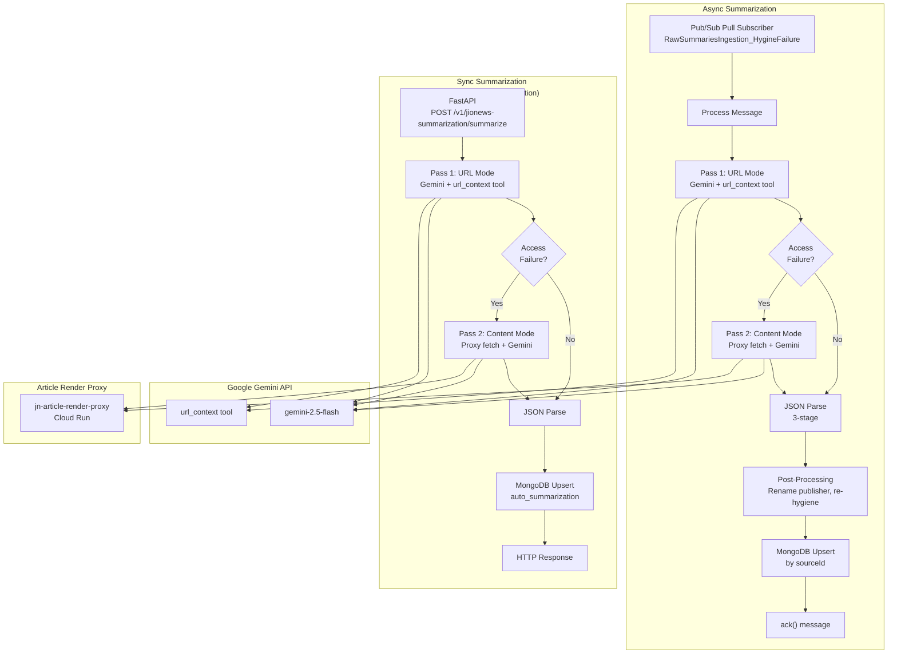
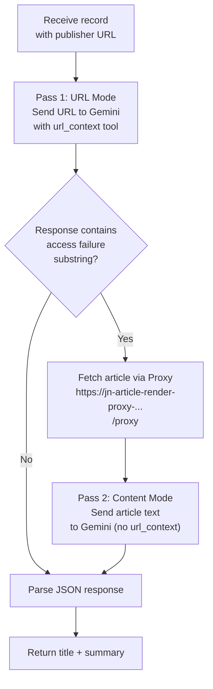
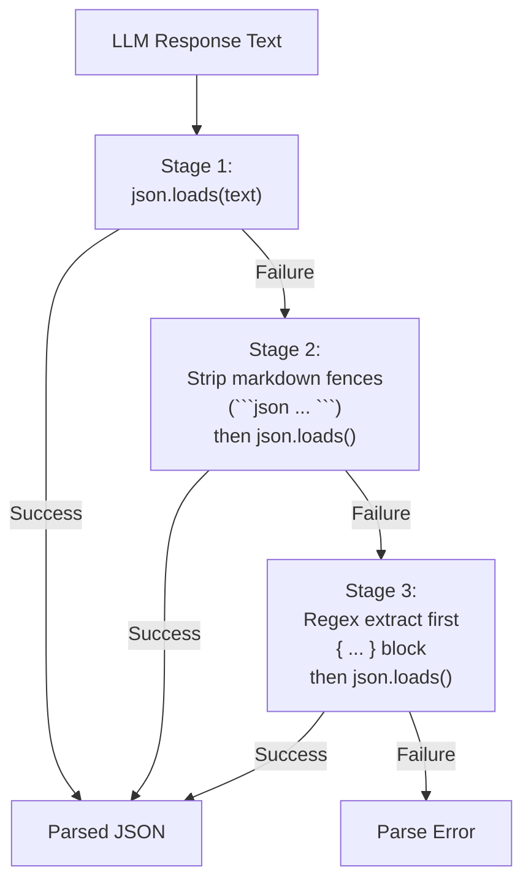

# LLM Integration -- AS-IS State

> **Document Classification:** SHARED COMPONENT -- Current State Specification
> **Component:** LLM-Powered Summarization Services
> **GCP Project:** `jiox-328108` (Project Number: `266686822828`)
> **Last Updated:** 2026-03-10
> **Version:** 1.0.0

---

## Overview

The JioNews DE platform integrates two LLM-powered summarization services that use Google's Gemini models to generate news article titles and summaries. Both services share the same core approach (two-pass URL/content strategy with proxy fallback) but differ in deployment model, trigger mechanism, and downstream behavior.

| Service | Deployment | Trigger | Use Case |
|---|---|---|---|
| **Async Summarization** | Cloud Run (persistent subscriber) | Pub/Sub pull subscription | Reprocessing hygiene-failed summaries |
| **Sync Summarization** | Cloud Run (FastAPI) | HTTP POST | On-demand CMS summarization |

---

## Architecture



---

## Service 1: Async Summarization (`jionews-summarization-async`)

### Deployment

| Attribute | Value |
|---|---|
| **Platform** | Google Cloud Run |
| **Service Name** | `jionews-summarization-async` |
| **Execution Model** | Persistent Pub/Sub pull subscriber (long-running process) |
| **Input** | `RawSummariesIngestion_HygineFailure` subscription |
| **Purpose** | Reprocess summaries that failed hygiene checks using LLM |

### Model Configuration

| Parameter | Value |
|---|---|
| **Model** | `gemini-2.5-flash` |
| **Client** | `google.genai.Client(api_key=...)` |
| **Temperature** | 0 |
| **Thinking** | Disabled |
| **Tools** | `[{"url_context": {}}]` |

### System Instruction

The system instruction defines the LLM's role as a senior news editor:

> *"You are a senior news editor for a reputable, high-traffic digital news outlet. Your responsibility is to generate publishable news content that is highly engaging, editorially responsible, accurate, and ethical. You act as a news editor/writer and summarize news articles accurately and concisely. Do NOT include: reasoning, planning, steps, drafts, explanations, notes, meta comments, chain-of-thought, or analysis. Never exceed 15 words (must stay under 105 characters) for title and 45 words (must stay under 105 characters) summary under any condition. If you cannot fit within the limits, rewrite and compress/expand while keeping meaning. Make sure to generate the output in specified language"*

### User Prompt Template

The user prompt requests structured output with the following fields:

| Field | Constraints |
|---|---|
| `title` | 6-18 words, 40-90 characters |
| `summary` | 45-60 words, 225-310 characters |
| `compliance_score` | Integer 0-100 |
| `error_message` | String (empty if no error) |

### Two-Pass Strategy



**Pass 1 (URL Mode):** The article URL is sent directly to Gemini with the `url_context` tool enabled. Gemini fetches and reads the article content from the URL.

**Access Failure Detection:** The LLM response is checked against 15 known failure substrings:

| # | Substring |
|---|---|
| 1 | `"unable to summarize"` |
| 2 | `"unable to access"` |
| 3 | `"unable to browse"` |
| 4 | `"could not be fetched"` |
| 5 | `"could not be accessed"` |
| 6 | `"url did not contain"` |
| 7 | `"i am unable to"` |
| 8 | `"article unavailable"` |
| 9 | `"provided article url"` |
| 10 | `"could not be browsed"` |
| 11 | `"not retrievable"` |
| 12 | `"please ensure the url"` |
| 13 | `"cannot access"` |
| 14 | `"can't access"` |
| 15 | `"content was not retrievable"` |

**Pass 2 (Content Mode):** If Pass 1 fails, the article content is fetched via the proxy service and sent as text to Gemini without the `url_context` tool.

### Proxy Service

| Attribute | Value |
|---|---|
| **URL** | `https://jn-article-render-proxy-266686822828.asia-south1.run.app/proxy` |
| **Platform** | Cloud Run (`asia-south1`) |
| **Purpose** | Fetches rendered article content when Gemini cannot access the URL directly |

### Retry Logic

| Parameter | Value |
|---|---|
| **Max Attempts** | 3 |
| **Backoff Formula** | `2^attempt` seconds |
| **Retry Condition** | HTTP 503 from Gemini API |

### JSON Parsing (3-Stage)

The LLM response is parsed through a 3-stage JSON extraction pipeline:



1. **Stage 1:** Direct `json.loads()` on the raw response text
2. **Stage 2:** Strip markdown code fences (` ```json ... ``` `), then `json.loads()`
3. **Stage 3:** Regex extract the first `{ ... }` block from the text, then `json.loads()`

### Post-Processing

| Step | Description |
|---|---|
| Preserve original publisher data | Original publisher metadata is retained from the source record |
| Rename publisher | Publisher name is changed to `"InsideMedia"` |
| Re-run hygiene | The generated title and summary are passed through the hygiene validation pipeline |
| Set reprocessing status | `reprocessingStatus` set to `"success"` or `"rejected"` based on hygiene result |

### Persistence

| Attribute | Value |
|---|---|
| **Database** | `ingestion-data` |
| **Collection** | Configured via `MONGO_COLLECTION_NAME` env var |
| **Operation** | Upsert by `sourceId` |
| **Ack Behavior** | Always `ack()` the Pub/Sub message regardless of processing outcome |

### Environment Variables

| Variable | Purpose |
|---|---|
| `SERVICE_ACCOUNT_PUBSUB` | Service account for Pub/Sub authentication |
| `MONGO_COLLECTION_NAME` | Target MongoDB collection name |
| `SUB_NAME` | Pub/Sub subscription name |
| `PUB_TOPIC_NAME` | Output Pub/Sub topic name |
| `ENV` | Environment identifier (e.g., `production`) |

---

## Service 2: Sync Summarization (`jionews-summarization`)

### Deployment

| Attribute | Value |
|---|---|
| **Platform** | Google Cloud Run |
| **Service Name** | `jionews-summarization` |
| **Framework** | FastAPI |
| **Route** | `POST /v1/jionews-summarization/summarize` |
| **Purpose** | On-demand summarization for CMS and internal tools |

### Model Configuration

| Parameter | Value |
|---|---|
| **Default Model** | `gemini-2.5-flash` |
| **Model Override** | Configurable via request parameter |
| **Temperature** | 0 |
| **Summary Target** | 350-360 characters |

### Two-Pass Strategy

Same conceptual approach as the async service, with differences:

| Attribute | Async | Sync |
|---|---|---|
| **Proxy timeout** | Default | 45 seconds |
| **Access failure patterns** | 15 substrings | 7 substrings (subset) |
| **Summary length target** | 225-310 chars | 350-360 chars |

### URL Failure Substrings (Sync -- 7 patterns)

The sync service uses a subset of the async service's failure detection patterns:

| # | Substring |
|---|---|
| 1 | `"unable to summarize"` |
| 2 | `"unable to access"` |
| 3 | `"could not be fetched"` |
| 4 | `"could not be accessed"` |
| 5 | `"article unavailable"` |
| 6 | `"cannot access"` |
| 7 | `"can't access"` |

### Persistence

| Attribute | Value |
|---|---|
| **Database** | `ingestion-data` |
| **Collection** | `auto_summarization` |
| **Operation** | Upsert |

### Processing Source Tracking

The `processingSource` field records how the article content was obtained:

| Value | Meaning |
|---|---|
| `"publisher_url"` | Gemini successfully read the article via URL mode (Pass 1) |
| `"publisher_content"` | Article content was provided directly in the request |
| `"proxy_url"` | Article was fetched via the proxy service (Pass 2) |

---

## Comparison Matrix

| Feature | Async (`jionews-summarization-async`) | Sync (`jionews-summarization`) |
|---|---|---|
| **Deployment** | Cloud Run (persistent process) | Cloud Run (FastAPI) |
| **Trigger** | Pub/Sub pull subscription | HTTP POST |
| **Input** | `RawSummariesIngestion_HygineFailure` | HTTP request body |
| **Model** | `gemini-2.5-flash` (fixed) | `gemini-2.5-flash` (overridable) |
| **Temperature** | 0 | 0 |
| **Tools** | `url_context` | `url_context` |
| **Summary Length** | 225-310 chars | 350-360 chars |
| **Failure Patterns** | 15 substrings | 7 substrings |
| **Proxy Timeout** | Default | 45 seconds |
| **JSON Parsing** | 3-stage | Standard |
| **Post-Processing** | Rename publisher, re-hygiene | Source tracking |
| **Persistence** | Upsert by `sourceId` | Upsert to `auto_summarization` |
| **Retry** | 3 attempts, exponential backoff | N/A (HTTP caller retries) |
| **Ack Behavior** | Always ack Pub/Sub | HTTP response |

---

## Known Issues and Technical Debt

| ID | Issue | Severity | Impact |
|---|---|---|---|
| LLM-01 | Async and sync services have divergent failure detection patterns (15 vs 7) | Medium | Inconsistent fallback behavior across services |
| LLM-02 | 3-stage JSON parsing indicates unreliable LLM output formatting | Medium | Extra processing overhead and potential parse failures |
| LLM-03 | Hardcoded `"InsideMedia"` publisher rename in async service | Low | Obscures original publisher attribution |
| LLM-04 | API key authentication instead of service account for Gemini client | Low | Less secure than IAM-based authentication |
| LLM-05 | No rate limiting on sync HTTP endpoint | Medium | Vulnerable to abuse or accidental overload |
| LLM-06 | Always-ack behavior in async means failed records are not retried | Medium | Data loss for records that fail both passes |
