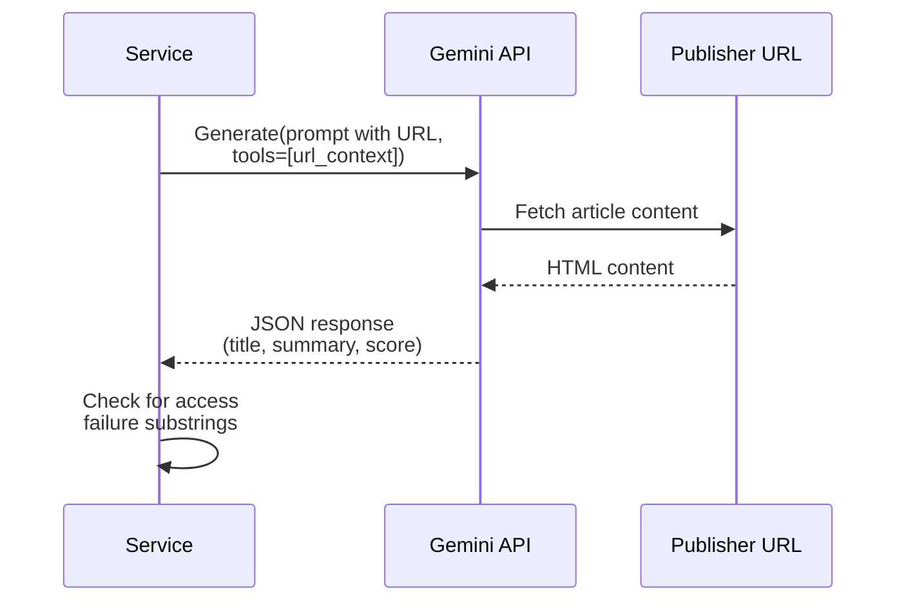
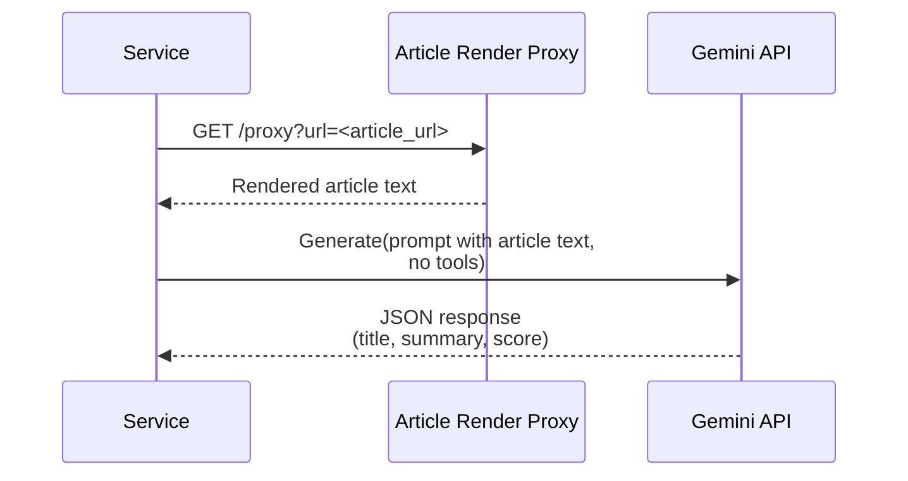
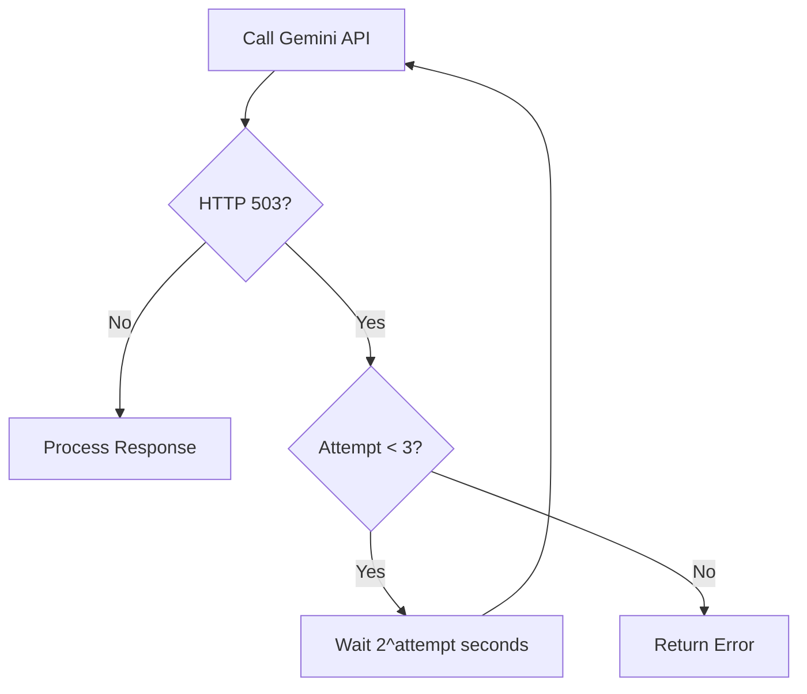
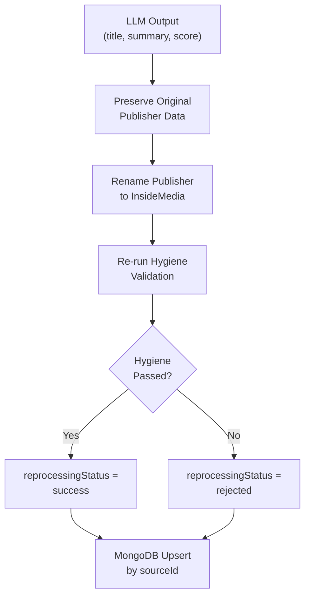

# LLM Integration -- Technical Specification

> **Document Classification:** SHARED COMPONENT -- Technical Implementation Details
> **Component:** LLM-Powered Summarization Services
> **GCP Project:** `jiox-328108` (Project Number: `266686822828`)
> **Last Updated:** 2026-03-10
> **Version:** 1.0.0

---

## Runtime Environments

### Async Summarization (`jionews-summarization-async`)

| Attribute | Value |
|---|---|
| **Platform** | Google Cloud Run |
| **Runtime** | Python |
| **Execution Model** | Persistent Pub/Sub pull subscriber |
| **Region** | `asia-south1` (inferred from proxy URL) |

### Sync Summarization (`jionews-summarization`)

| Attribute | Value |
|---|---|
| **Platform** | Google Cloud Run |
| **Runtime** | Python |
| **Framework** | FastAPI |
| **Route** | `POST /v1/jionews-summarization/summarize` |
| **Region** | `asia-south1` (inferred from proxy URL) |

---

## Dependencies

### Shared Libraries (Both Services)

| Library | Module(s) Used | Purpose |
|---|---|---|
| **google-genai** | `google.genai.Client` | Gemini API client for LLM inference |
| **google-cloud-pubsub** | `google.cloud.pubsub_v1` | Pub/Sub messaging (async: pull subscriber; sync: N/A or optional) |
| **pymongo** | `pymongo.MongoClient` | MongoDB persistence (upsert operations) |
| **requests** | `requests` | HTTP calls to proxy service |
| **json** | `json` (stdlib) | JSON serialization/deserialization |
| **re** | `re` (stdlib) | Regex-based JSON extraction (Stage 3 parsing) |
| **time** | `time` (stdlib) | Backoff delay calculation |
| **base64** | `base64` (stdlib) | Pub/Sub message decoding |

### Async-Specific Libraries

| Library | Module(s) Used | Purpose |
|---|---|---|
| **google-cloud-secret-manager** | `google.cloud.secretmanager` | Retrieve MongoDB URI and API keys |

### Sync-Specific Libraries

| Library | Module(s) Used | Purpose |
|---|---|---|
| **fastapi** | `fastapi.FastAPI`, `fastapi.Request` | HTTP API framework |
| **uvicorn** | `uvicorn` | ASGI server for FastAPI |

---

## Gemini API Configuration

### Client Initialization

```
Client: google.genai.Client(api_key=<api_key>)
```

**Authentication:** API key-based (not service account / IAM). The API key is retrieved from environment or Secret Manager.

### Model Parameters

| Parameter | Async Value | Sync Value |
|---|---|---|
| **Model** | `gemini-2.5-flash` | `gemini-2.5-flash` (default, overridable) |
| **Temperature** | `0` | `0` |
| **Thinking** | Disabled | Disabled |
| **Tools** | `[{"url_context": {}}]` (Pass 1 only) | `[{"url_context": {}}]` (Pass 1 only) |
| **Max Output Tokens** | Default | Default |

### Tool Configuration

The `url_context` tool enables Gemini to fetch and read web page content from URLs provided in the prompt. It is only used during Pass 1 (URL Mode).

```json
{
  "tools": [{"url_context": {}}]
}
```

In Pass 2 (Content Mode), the tool is NOT included -- the article content is provided directly as text in the user prompt.

---

## Prompt Engineering

### System Instruction (Async)

Full system instruction text defining the editorial role, output constraints, and format requirements. Key constraints enforced in the prompt:

| Constraint | Title | Summary |
|---|---|---|
| **Word limit** | 15 words max | 45 words max |
| **Character limit** | 105 characters max | 105 characters max |
| **Behavioral restrictions** | No reasoning, planning, steps, drafts, explanations, notes, meta comments, chain-of-thought, or analysis |

### User Prompt Output Schema

The user prompt requests a JSON response with the following structure:

| Field | Type | Constraints | Description |
|---|---|---|---|
| `title` | string | 6-18 words, 40-90 characters | Generated article title |
| `summary` | string | 45-60 words, 225-310 characters (async) / 350-360 characters (sync) | Generated article summary |
| `compliance_score` | integer | 0-100 | Self-assessed quality score |
| `error_message` | string | Empty if no error | Error description if generation failed |

---

## Two-Pass Execution Detail

### Pass 1: URL Mode



### Pass 2: Content Mode (Proxy Fallback)



### Proxy Service Details

| Attribute | Value |
|---|---|
| **Service Name** | `jn-article-render-proxy` |
| **URL** | `https://jn-article-render-proxy-266686822828.asia-south1.run.app/proxy` |
| **Platform** | Cloud Run |
| **Region** | `asia-south1` |
| **Timeout (Sync)** | 45 seconds |
| **Timeout (Async)** | Default |
| **Purpose** | Headless browser rendering of article pages that Gemini cannot access directly |

---

## Retry and Error Handling

### Async Service Retry Logic

| Parameter | Value |
|---|---|
| **Max Attempts** | 3 |
| **Retry Condition** | HTTP 503 from Gemini API |
| **Backoff Formula** | `2^attempt` seconds |
| **Backoff Sequence** | 2s, 4s, 8s |



### JSON Parsing Pipeline (Async -- 3 Stage)

| Stage | Method | Description |
|---|---|---|
| 1 | `json.loads(text)` | Direct parse of raw response |
| 2 | Strip ` ```json ... ``` ` fences, then `json.loads()` | Handle markdown-wrapped JSON |
| 3 | Regex `\{.*\}` extraction, then `json.loads()` | Extract first JSON object from mixed text |

### Pub/Sub Acknowledgment (Async)

The async service **always acknowledges** (`ack()`) the Pub/Sub message regardless of processing outcome. This means:
- Successfully processed records are acked
- Records that fail both passes are acked
- Records that fail JSON parsing are acked
- No automatic retry via Pub/Sub redelivery

**Implication:** Failed records are permanently lost unless error logging captures them for manual reprocessing.

---

## MongoDB Configuration

### Async Service

| Attribute | Value |
|---|---|
| **Connection** | URI from Secret Manager (`mongosh_de_uri`) |
| **Database** | `ingestion-data` |
| **Collection** | Configured via `MONGO_COLLECTION_NAME` env var |
| **Operation** | `update_one()` with upsert by `sourceId` |

### Sync Service

| Attribute | Value |
|---|---|
| **Connection** | URI from environment/Secret Manager |
| **Database** | `ingestion-data` |
| **Collection** | `auto_summarization` |
| **Operation** | `update_one()` with upsert |

---

## Environment Variables

### Async Service

| Variable | Type | Description |
|---|---|---|
| `SERVICE_ACCOUNT_PUBSUB` | string | Service account identity for Pub/Sub operations |
| `MONGO_COLLECTION_NAME` | string | Target MongoDB collection name |
| `SUB_NAME` | string | Pub/Sub subscription name to pull from |
| `PUB_TOPIC_NAME` | string | Pub/Sub topic for publishing processed results |
| `ENV` | string | Environment identifier (`production`, `staging`, etc.) |

### Sync Service

| Variable | Type | Description |
|---|---|---|
| Gemini API key | string | API key for Gemini model access |
| MongoDB URI | string | Connection string for MongoDB |

---

## Post-Processing (Async Only)



### Publisher Rename

When the async service processes a record, it renames the publisher to `"InsideMedia"` to indicate the content was LLM-generated, regardless of the original publisher.

### Hygiene Re-Validation

The generated title and summary are passed through the same hygiene validation rules used by the summaries ingestion pipeline. Records that fail hygiene after LLM generation are marked with `reprocessingStatus: "rejected"` but are still persisted to MongoDB.

---

## Performance Characteristics

| Metric | Typical Value |
|---|---|
| **Gemini API latency (Pass 1)** | 3-15 seconds (includes URL fetch by Gemini) |
| **Gemini API latency (Pass 2)** | 2-8 seconds (content provided directly) |
| **Proxy fetch latency** | 2-10 seconds |
| **Total per-record (Pass 1 success)** | 3-15 seconds |
| **Total per-record (Pass 1 fail + Pass 2)** | 7-33 seconds |
| **MongoDB upsert** | <50ms |
